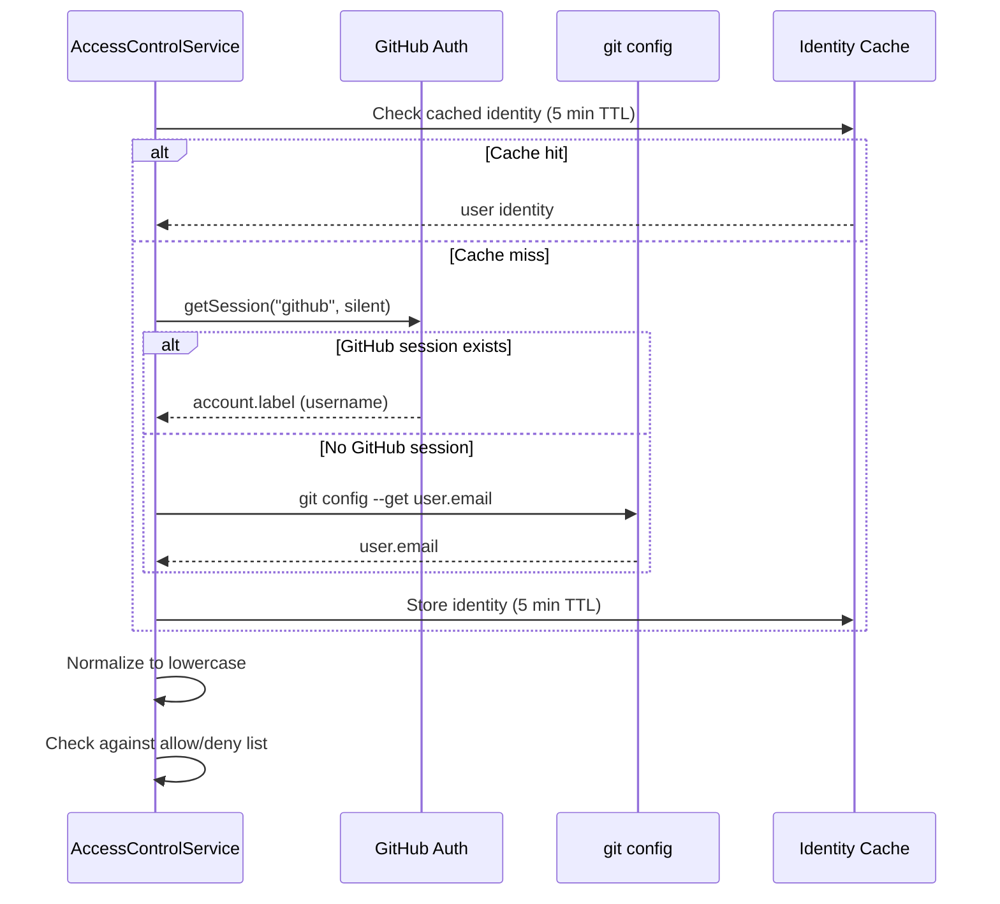

CodeBuddy includes a user-level access control system that lets teams restrict who can use the agent. Configure it via a `.codebuddy/access.json` file in your workspace root, or set a default mode in editor settings.

## Access modes

| Mode      | Behaviour                                                                |
| --------- | ------------------------------------------------------------------------ |
| **open**  | No restrictions — every user has full agent access. This is the default. |
| **allow** | Only users listed in the `users` array may use the agent.                |
| **deny**  | Users listed in the `users` array are blocked; everyone else is allowed. |

## Configuration file

Create `.codebuddy/access.json` at your workspace root:

```json
{
  "mode": "allow",
  "users": ["alice@company.com", "bob-dev"],
  "admins": ["alice@company.com"],
  "logDenied": true
}
```

| Field       | Type       | Default | Description                                                           |
| ----------- | ---------- | ------- | --------------------------------------------------------------------- |
| `mode`      | `string`   | `open`  | One of `open`, `allow`, or `deny`                                     |
| `users`     | `string[]` | `[]`    | Email addresses or GitHub usernames for the allow/deny list (max 200) |
| `admins`    | `string[]` | `[]`    | Users who bypass restrictions and skip escalation prompts (max 50)    |
| `logDenied` | `boolean`  | `true`  | Whether denied access attempts are recorded in the audit log          |

The file is limited to **64 KB** to prevent memory exhaustion from malicious payloads.

## How identity works



Identity is resolved in order:

1. **GitHub authentication session** — non-interactive, silent check for the `account.label` (username)
2. **Git config** — `git config --get user.email` with a 3-second timeout
3. **Fallback** — if neither is available, the identity is `unknown`

All identities are validated against strict patterns:

- **Email**: Basic `user@domain.tld` format (max 254 characters per RFC 5321)
- **GitHub username**: 1–39 alphanumeric/hyphen characters, no leading/trailing hyphens

The resolved identity is cached with a **5-minute TTL** to avoid repeated git/auth lookups.

## Admin privileges

Users listed in the `admins` array receive elevated access:

- **Bypass access restrictions** — admins are always allowed regardless of mode
- **Skip escalation prompts** — sensitive operations that normally require user confirmation (like destructive file operations) are auto-approved for admins
- **Always audited** — admin actions are still logged, providing a full trail

## Audit log

When `logDenied` is enabled (default), every access check is recorded in an in-memory audit log:

```json
{
  "timestamp": 1711612800000,
  "user": "bob-dev",
  "action": "agent_invoke",
  "allowed": false
}
```

The audit log is capped at **500 entries** (oldest entries are evicted). Denied-access log messages are throttled to one per 100 ms to prevent log flooding under brute-force scenarios.

## Live reload

The config file is watched with a `FileSystemWatcher`. When you edit `.codebuddy/access.json`:

1. Changes are debounced to avoid rapid reloads
2. Concurrent reload requests are serialized (only one `loadConfig` runs at a time)
3. The `onAccessChanged` event fires so other services (like the UI) can react

## Diagnostics

The service reports diagnostic codes that can be surfaced by the Doctor system:

| Code               | Severity   | Meaning                                              |
| ------------------ | ---------- | ---------------------------------------------------- |
| `no-config`        | `info`     | No `access.json` found — running in open mode        |
| `config-loaded`    | `info`     | Config loaded successfully                           |
| `no-user-identity` | `warn`     | Could not determine the current user                 |
| `empty-user-list`  | `warn`     | Mode is `allow` or `deny` but the user list is empty |
| `user-denied`      | `critical` | The current user is denied access                    |
| `user-allowed`     | `info`     | The current user is allowed access                   |

## Editor setting

You can set a default mode without a config file:

```json
{
  "codebuddy.accessControl.defaultMode": "open"
}
```

The workspace `.codebuddy/access.json` file takes priority over this setting when present.

## Security considerations

- **Path traversal protection** — the config path is resolved and verified to stay within the workspace root
- **Size limits** — files larger than 64 KB are rejected before parsing
- **Input validation** — all user identities, modes, and list entries are sanitized before use
- **No credential exposure** — identity resolution uses silent auth (no login prompts) and only reads the username/email, never tokens
