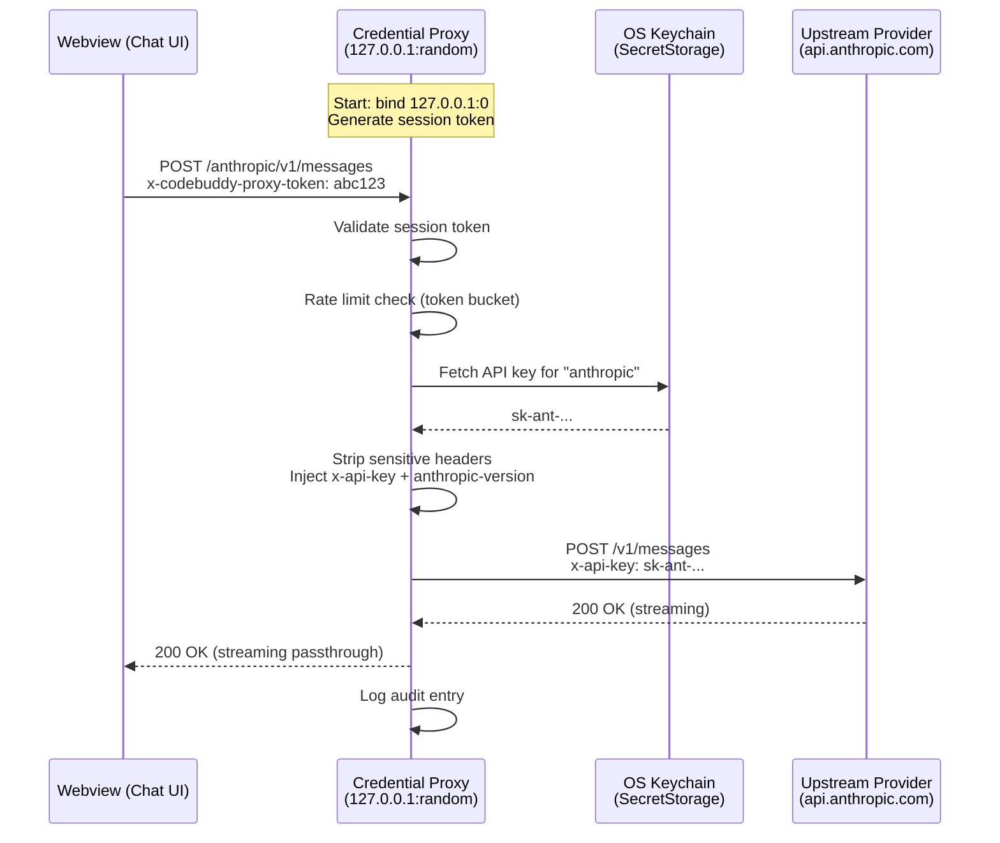
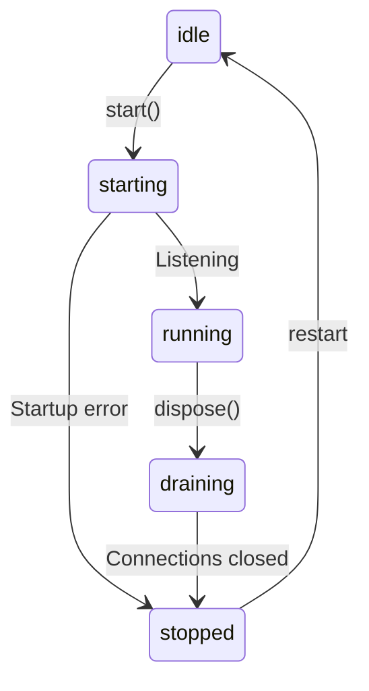

CodeBuddy includes a built-in credential proxy — a localhost HTTP server that sits between the webview and upstream LLM providers. Instead of passing API keys to the client-side code, the proxy injects credentials server-side so they never leave the extension host.

## Why a proxy?

Extensions run in two contexts: the **extension host** (Node.js, trusted) and **webviews** (browser sandbox, less trusted). Without a proxy, API keys would need to be passed to the webview for direct LLM calls. The proxy keeps credentials in the extension host and only exposes a local URL + session token.

## Architecture



## Supported providers

| Provider      | Upstream URL                                          | Auth header     | Auth format    |
| ------------- | ----------------------------------------------------- | --------------- | -------------- |
| **Anthropic** | `https://api.anthropic.com`                           | `x-api-key`     | Raw key        |
| **OpenAI**    | `https://api.openai.com`                              | `Authorization` | `Bearer {key}` |
| **Groq**      | `https://api.groq.com/openai`                         | `Authorization` | `Bearer {key}` |
| **DeepSeek**  | `https://api.deepseek.com`                            | `Authorization` | `Bearer {key}` |
| **Qwen**      | `https://dashscope-intl.aliyuncs.com/compatible-mode` | `Authorization` | `Bearer {key}` |
| **GLM**       | `https://open.bigmodel.cn/api/paas`                   | `Authorization` | `Bearer {key}` |
| **Grok**      | `https://api.x.ai`                                    | `Authorization` | `Bearer {key}` |
| **Tavily**    | `https://api.tavily.com`                              | `Authorization` | `Bearer {key}` |
| **Local**     | `http://localhost:11434`                              | `Authorization` | `Bearer {key}` |

Anthropic additionally receives the `anthropic-version: 2023-06-01` header on every request.

## Session tokens

Each time the proxy starts, it generates a **256-bit random session token** (`crypto.randomBytes(32)`). Every incoming request must include this token in the `x-codebuddy-proxy-token` header. Requests without a valid token receive `403 Forbidden`.

This prevents other processes on the machine from using the proxy — only the CodeBuddy extension (which knows the token) can make authenticated calls.

## Rate limiting

The proxy implements **per-provider token-bucket rate limiting**:

- Each provider gets its own bucket with configurable `maxTokens` and `refillRate`
- Local providers are exempt from rate limiting (no API rate caps)
- When a bucket is empty, the request receives `429 Too Many Requests` with a `Retry-After` header
- Rate limits are configurable via editor settings and live-reload on change (buckets are reset)

## Security hardening

### Localhost-only binding

The proxy binds exclusively to `127.0.0.1` — it is never exposed to the network. The listen call specifies the loopback address explicitly:

```
srv.listen(0, "127.0.0.1", callback)
```

### Header stripping

Sensitive headers from the client are **always stripped** before forwarding to upstream, preventing credential leakage:

- `authorization`
- `x-api-key`
- `x-goog-api-key`
- `host`
- `connection`, `keep-alive`, `transfer-encoding`

The proxy then injects the correct credentials from the OS keychain.

### Request body limits

- Maximum body size: **10 MB** — requests exceeding this receive `413 Payload Too Large`
- Client receive timeout: **30 seconds** — connections idle for more than 30 seconds between body chunks are terminated
- Upstream timeout: **5 minutes** — LLM streaming responses can be long, so this is generous

### Error handling

Upstream failures are mapped to safe HTTP responses without exposing internal details:

| Error code     | Proxy response | Message                       |
| -------------- | -------------- | ----------------------------- |
| `ECONNREFUSED` | 502            | Upstream refused connection   |
| `ECONNRESET`   | 502            | Upstream reset connection     |
| `ETIMEDOUT`    | 504            | Upstream connection timed out |
| `ENOTFOUND`    | 502            | Upstream host not found       |
| `ECONNABORTED` | 504            | Request timed out             |

## Audit log

Every proxied request is logged in a ring buffer (O(1) writes, capped at **1,000 entries**):

```json
{
  "timestamp": 1711612800000,
  "provider": "anthropic",
  "method": "POST",
  "path": "/v1/messages",
  "statusCode": 200,
  "latencyMs": 1523
}
```

The ring buffer overwrites the oldest entries when full — no unbounded memory growth.

## Lifecycle

The proxy has explicit lifecycle states that prevent invalid transitions:



- **Start** is promise-coalesced — multiple concurrent `start()` calls share the same promise
- **Drain** on dispose — the server stops accepting new connections and force-closes existing sockets after a grace period
- **Socket tracking** — all active connections are tracked in a `Set` and force-destroyed on dispose

## Connection tracking

The proxy tracks every active TCP socket. On dispose:

1. Server stops accepting new connections
2. All active sockets are destroyed (force-close)
3. Config watcher is disposed
4. State transitions to `stopped`

## Settings

| Setting                                | Type    | Default | Description                       |
| -------------------------------------- | ------- | ------- | --------------------------------- |
| `codebuddy.credentialProxy.enabled`    | boolean | `false` | Enable the credential proxy       |
| `codebuddy.credentialProxy.rateLimits` | object  | `{}`    | Per-provider rate limit overrides |

## How it integrates

When enabled, `getAPIKeyAndModel()` returns a proxy URL instead of the real upstream URL. The LangChain wrapper (or completion provider) makes calls to `http://127.0.0.1:{port}/{provider}/...` and the proxy transparently injects credentials and forwards to the real upstream.
