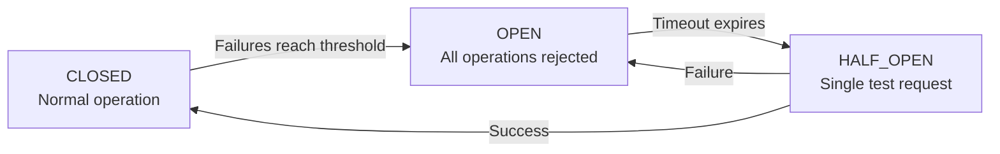

The Production Safeguards service monitors system resources during vector database operations and automatically intervenes when memory, CPU, or error rates exceed safe thresholds.

## Resource monitoring

The service tracks:

| Metric     | Source                  | What it measures                  |
| ---------- | ----------------------- | --------------------------------- |
| Heap used  | `process.memoryUsage()` | V8 heap memory consumption        |
| Heap total | `process.memoryUsage()` | V8 allocated heap size            |
| RSS        | `process.memoryUsage()` | Resident set size (total process) |
| External   | `process.memoryUsage()` | C++ objects bound to V8           |
| CPU user   | `process.cpuUsage()`    | User-mode CPU time                |
| CPU system | `process.cpuUsage()`    | Kernel-mode CPU time              |

Monitoring runs on a periodic interval, checking resource usage and triggering recovery strategies when thresholds are exceeded.

## Resource limits

| Limit              | Default  | Description                            |
| ------------------ | -------- | -------------------------------------- |
| `maxMemoryMB`      | 1,024 MB | Total RSS ceiling                      |
| `maxHeapMB`        | 512 MB   | V8 heap ceiling                        |
| `maxCpuPercent`    | 80%      | CPU usage ceiling                      |
| `gcThresholdMB`    | 256 MB   | Heap size that triggers GC suggestion  |
| `alertThresholdMB` | 400 MB   | Heap size that triggers first recovery |

## Recovery strategies

Recovery actions are tried in priority order. Each has a cooldown to prevent thrashing:

| Priority | Action                | Trigger condition                       | Cooldown | Max retries |
| -------- | --------------------- | --------------------------------------- | -------- | ----------- |
| 1        | **Clear cache**       | Heap > `alertThresholdMB`               | 30s      | 3           |
| 3        | **Reduce batch size** | Heap > 80% of alert AND indexing active | 60s      | 2           |
| 4        | **Pause indexing**    | Heap > 90% of `maxHeapMB` AND indexing  | 2min     | 1           |
| 5        | **Restart worker**    | Heap > `maxHeapMB` AND indexing         | 5min     | 1           |
| 6        | **Emergency stop**    | RSS > `maxMemoryMB`                     | —        | 1           |

Recovery is context-aware: `REDUCE_BATCH_SIZE`, `PAUSE_INDEXING`, and `RESTART_WORKER` only trigger when indexing is actually in progress (checked via `ServiceStatusChecker`). `CLEAR_CACHE` always triggers since it's safe regardless of activity.

## Circuit breaker

The service includes a circuit breaker pattern for operation execution:

Operations wrapped in `executeWithSafeguards()` benefit from:

- **Timeout** — Operations killed after a deadline
- **Retry** — Configurable retry count
- **Circuit breaker bypass** — Option to skip for critical operations

## Emergency stop

When RSS exceeds `maxMemoryMB`, the emergency stop activates:

1. Sets `emergencyStopActive = true`
2. All subsequent `executeWithSafeguards()` calls are rejected
3. Requires manual recovery or extension restart
