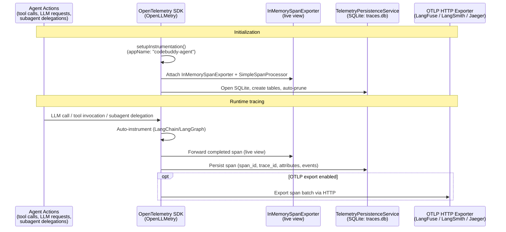

CodeBuddy includes a built-in observability stack that traces every agent action, persists traces to a local SQLite database, and optionally exports them to external platforms like LangFuse, LangSmith, or Jaeger.

## Architecture



### Initialization order

1. **`setupInstrumentation()`** — Initializes the Traceloop/OpenLLMetry SDK (`appName: "codebuddy-agent"`), creates a `BasicTracerProvider` if only a NoopTracerProvider exists
2. **`LocalObservabilityService.initialize()`** — Attaches an `InMemorySpanExporter` + `SimpleSpanProcessor` to the OpenTelemetry TracerProvider. Every completed span is also forwarded to the persistence service
3. **`TelemetryPersistenceService.initialize()`** — Opens the SQLite database, creates tables, auto-prunes old traces

## What gets traced

OpenLLMetry automatically instruments all LangChain and LangGraph operations:

- **LLM calls** — model, provider, token counts, latency, streaming status
- **Tool invocations** — tool name, input, output, duration
- **Subagent delegations** — which subagent, task description, result
- **Chain/graph steps** — LangGraph node transitions, state changes
- **Retrieval** — vector search queries, result counts

Each span includes: `span_id`, `trace_id`, `parent_id`, name, kind, start/end timestamps (nanosecond precision), status, attributes (JSON), and events (JSON).

## Trace persistence

Traces are stored in a local SQLite database at `~/.codebuddy/telemetry/traces.db` using sql.js (WASM).

### Schema

```sql
CREATE TABLE spans (
    span_id TEXT PRIMARY KEY,
    trace_id TEXT NOT NULL,
    parent_id TEXT,
    name TEXT NOT NULL,
    kind INTEGER,
    start_time_s INTEGER,
    start_time_ns INTEGER,
    end_time_s INTEGER,
    end_time_ns INTEGER,
    status_code INTEGER,
    status_message TEXT,
    attributes TEXT,  -- JSON
    events TEXT,      -- JSON
    links TEXT,       -- JSON
    session_id TEXT,
    created_at TEXT
);
```

Indexed on: `trace_id`, `created_at`, `session_id`, `name`.

### Batched writes

Spans are buffered and flushed to disk every **5 seconds** or when the buffer reaches **50 spans**, whichever comes first. Writes use transactional `INSERT OR IGNORE` for safety.

### Auto-pruning

On startup, spans older than `retentionDays` (default: 7) are automatically deleted.

## Querying traces

The `ObservabilityService` facade provides:

| Method                            | Source              | Description                                           |
| --------------------------------- | ------------------- | ----------------------------------------------------- |
| `getTraces()`                     | In-memory exporter  | Live spans from the current session                   |
| `getPersistedTraces(days, limit)` | SQLite              | Historical spans with duration calculation            |
| `getSessions()`                   | SQLite              | Distinct session IDs with span counts and date ranges |
| `getMetrics()`                    | PerformanceProfiler | Runtime performance data                              |
| `getRecentLogs()`                 | Logger              | Last 1,000 log entries from circular buffer           |

## OTLP export

To export traces to an external observability platform, set the OTLP endpoint:

```json
{
  "codebuddy.telemetry.otlpEndpoint": "https://your-langfuse-instance.com/api/public/otel"
}
```

### Compatible platforms

| Platform          | Endpoint format                     |
| ----------------- | ----------------------------------- |
| **LangFuse**      | `https://<host>/api/public/otel`    |
| **LangSmith**     | `https://api.smith.langchain.com`   |
| **Jaeger**        | `http://localhost:4318` (OTLP HTTP) |
| **Grafana Tempo** | Your Tempo OTLP endpoint            |

The export uses OTLP HTTP protocol (`@opentelemetry/exporter-metrics-otlp-http`).

## Structured logging

CodeBuddy uses a structured logging system alongside telemetry:

```typescript
interface ILogEvent {
  timestamp: string;
  level: string;
  module: string;
  message: string;
  data: any;
  sessionId: string;
  traceId: string; // Links logs to OpenTelemetry traces
}
```

Logs are written to:

- **Output Channel** — visible in the Output panel (`CodeBuddy`)
- **Log files** — `.codebuddy/logs/` directory
- **Circular buffer** — last 1,000 entries accessible via API
- **Telemetry** — optionally forwarded to the telemetry service

Every log event embeds the OpenTelemetry `traceId`, making it easy to correlate logs with traces.

## Settings

| Setting                             | Type    | Default | Description                              |
| ----------------------------------- | ------- | ------- | ---------------------------------------- |
| `codebuddy.telemetry.persistTraces` | boolean | `true`  | Persist traces to SQLite across sessions |
| `codebuddy.telemetry.retentionDays` | number  | `7`     | Auto-prune after N days (1–90)           |
| `codebuddy.telemetry.otlpEndpoint`  | string  | `""`    | OTLP HTTP endpoint. Empty = disabled     |

## Dependencies

| Package                                     | Version  | Role                                 |
| ------------------------------------------- | -------- | ------------------------------------ |
| `@opentelemetry/api`                        | ^1.9.0   | OpenTelemetry API                    |
| `@opentelemetry/sdk-trace-base`             | ^2.5.1   | Trace SDK                            |
| `@opentelemetry/exporter-metrics-otlp-http` | ^0.212.0 | OTLP export                          |
| `@traceloop/node-server-sdk`                | ^0.22.7  | Auto-instruments LangChain/LangGraph |
