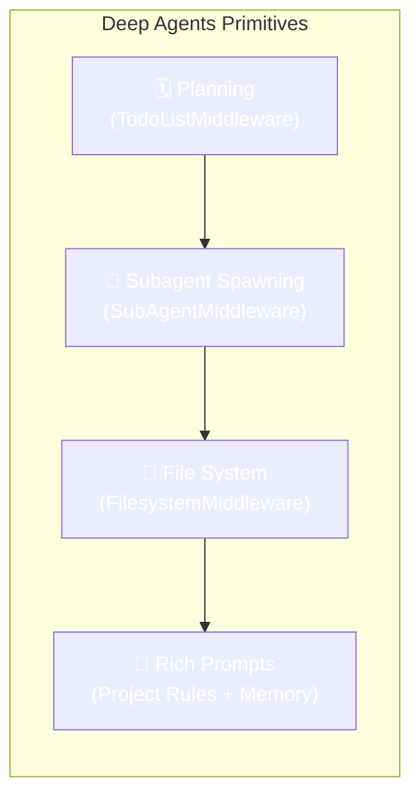
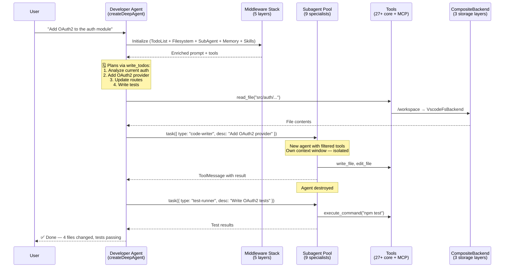

> This post accompanies my talk at [AI Salon KL – April 2026](https://luma.com/AI-Salon-Kuala-Lumpur-2026). If you're reading this after the event, welcome — the architecture hasn't changed.

---

## The single-loop trap

Most AI coding assistants follow the same pattern:

```
User message → LLM → tool call → LLM → response
```

This works for simple tasks. But ask it to "refactor the authentication module to use OAuth2" and it falls apart — the model tries to hold the entire plan, all file contents, and every decision in a single context window. It forgets steps, loses track of changes, and hallucinates file paths.

The fundamental problem: **a single LLM loop cannot reliably execute multi-step tasks**.

## The Deep Agents approach

[**Deep Agents**](https://github.com/langchain-ai/deepagentsjs) is LangChain's framework for building agents that go beyond shallow tool-calling. It provides four primitives that change the game:



**1. Planning tool** — The agent decomposes tasks into a todo list (`write_todos`). It checks off items as it works. This is externalized memory — the agent doesn't need to hold the plan in context.

**2. Subagent spawning** — Complex subtasks are delegated to specialist agents via the `task` tool. Each subagent gets its own context window, filtered tools, and middleware. When it finishes, the result flows back as a `ToolMessage`. The subagent is destroyed — no context pollution.

**3. File system access** — Instead of stuffing everything into the prompt, the agent reads and writes files. `ls`, `read_file`, `write_file`, `edit_file`, `glob`, `grep` — all backed by a pluggable storage layer. This is how the agent survives without a 1M-token context window.

**4. Detailed prompts** — System prompts composed from project rules, memories, and skills at runtime. Not a static string — a dynamic assembly of everything the agent needs to know about _your_ codebase.

## How CodeBuddy wires it together

CodeBuddy's core is a single `createDeepAgent()` call. Everything else — the IDE integration, the 27+ tools, the 9 specialized subagents — plugs into this foundation:

```typescript
const agent = createDeepAgent({
  model: buildChatModel({ provider, apiKey, modelName }),
  tools: await ToolProvider.getToolsAsync(),
  systemPrompt: basePrompt + projectRules + memories + skills,
  backend: compositeBackend,
  subagents: createDeveloperSubagents(model, tools),
  middleware: [
    createMemoryMiddleware({ sources: ["AGENTS.md"] }),
    createSkillsMiddleware({ sources: [".codebuddy/skills/"] }),
  ],
  checkpointer: sqlJsCheckpointSaver,
  store: inMemoryStore,
});
```

The returned agent is a **standard LangGraph graph** — streaming, human-in-the-loop, and LangSmith observability work out of the box.

## The architecture in one diagram



### The three key architectural decisions

**1. CompositeBackend** — One unified file system interface, three storage layers:

| Route          | Backend           | Purpose                                 |
| -------------- | ----------------- | --------------------------------------- |
| `/workspace/*` | `VscodeFsBackend` | Real IDE files — read/write actual code |
| `/docs/*`      | `StoreBackend`    | Persistent cross-session documents      |
| `/` (default)  | `StateBackend`    | Ephemeral agent state                   |

The agent doesn't know which backend serves a path. It just reads and writes files. This is how we bridge an AI framework with a real IDE.

**2. Subagent isolation** — Each subagent is a fresh `ReactAgent` with:

- Its own context window (no leakage from other tasks)
- Role-filtered tools (the `test-runner` can't delete files)
- Its own middleware stack
- A single-task lifecycle — created, used, destroyed

This is cheaper and safer than maintaining long-running specialist agents.

**3. Five-layer middleware** — Three from Deep Agents, two custom:

```
TodoListMiddleware    → Planning and progress tracking
FilesystemMiddleware  → Context offloading to files
SubAgentMiddleware    → Specialist delegation
MemoryMiddleware      → AGENTS.md injection (custom)
SkillsMiddleware      → .codebuddy/skills/ loading (custom)
```

Middleware is composable and fault-tolerant. A failing middleware logs a warning but doesn't crash the agent.

## Self-healing: when things go wrong

Production agents fail. Models hallucinate. APIs time out. Rate limits hit. CodeBuddy handles this with four layers:

| Layer              | Handles                      | Mechanism                          |
| ------------------ | ---------------------------- | ---------------------------------- |
| **Tool-level**     | Parse errors, malformed args | Auto-retry with corrected input    |
| **Provider-level** | Rate limits, API failures    | Failover to next provider in chain |
| **Context-level**  | Window overflow              | Auto-compaction via summarization  |
| **Session-level**  | Unrecoverable errors         | Checkpoint-based session restore   |

The agent doesn't just retry — it **diagnoses** the failure type and picks the right recovery strategy. An auth error doesn't trigger a retry (it would fail again). A rate limit triggers provider failover with cooldown tracking.

## What this enables

With this architecture, CodeBuddy handles real-world tasks that single-loop agents can't:

- **"Refactor the payment module"** → Plans 8 steps, delegates file analysis to code-analyzer, rewrites with code-writer, runs tests with test-runner, fixes failures in a loop
- **"Debug this production error"** → Reads stack trace, attaches to debugger (DAP), inspects variables, traces the root cause, writes the fix
- **"Add i18n support"** → Scans all user-facing strings, creates translation files, updates components, tests each locale

Each of these involves 20-50 tool calls across multiple subagents. No single context window could hold it all.

## The numbers

| Metric                         | Value                                           |
| ------------------------------ | ----------------------------------------------- |
| Agent framework                | LangGraph Deep Agents                           |
| Subagent specialists           | 9                                               |
| Core tools                     | 27+                                             |
| LLM providers supported        | 10                                              |
| Skills (external integrations) | 16                                              |
| Storage backends               | 3 (IDE files, persistent docs, ephemeral state) |
| Middleware layers              | 5                                               |
| WASM modules                   | 2 (Tree-sitter AST + SQLite)                    |
| Worker threads                 | 5 (embeddings, AST, vector DB, analysis, chat)  |

## Try it

CodeBuddy is open source and runs in VS Code, Cursor, Windsurf, and VSCodium.

```bash
ext install codebuddy.codebuddy
```

- **GitHub**: [github.com/olasunkanmi-SE/codebuddy](https://github.com/olasunkanmi-SE/codebuddy)
- **Deep Agents**: [github.com/langchain-ai/deepagentsjs](https://github.com/langchain-ai/deepagentsjs)

---

_Presented at [AI Salon KL](https://luma.com/AI-Salon-Kuala-Lumpur-2026) — April 3, 2026. Built in Kuala Lumpur. 🇲🇾_
