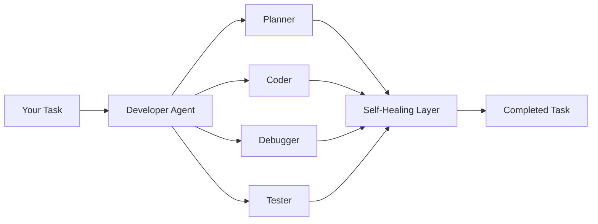

Most AI coding tools autocomplete a line and call it a day. We wanted something different — an AI that can take a task description, reason through the problem, write the code, run the tests, fix what breaks, and ship the result. All inside your editor.

Today we're releasing **CodeBuddy** as an open-source extension for **VS Code, Cursor, Windsurf, VSCodium**, and any editor on the VS Code extension API. It's also on the [Open VSX Registry](https://open-vsx.org/).

## The problem

Developers spend significant time on tasks that are repetitive but not trivial — writing boilerplate, debugging stack traces, updating tests after refactors, wiring up API endpoints, writing documentation. Current tools help with fragments, but someone still has to orchestrate the work.

We asked: _what if the AI could handle the full lifecycle of a task?_

## What CodeBuddy does differently

CodeBuddy is a **multi-agent system**, not a single-model wrapper. When you give it a task, here's what happens:

1. **The Developer Agent** — a `createDeepAgent()` instance from [deepagentsjs](https://github.com/langchain-ai/deepagentsjs) — analyzes your request and decides the approach
2. **Specialized subagents** handle the work via the Deep Agents `task` tool — one for code analysis, another for file editing, another for terminal commands
3. **27+ built-in tools** extend the Deep Agents file system primitives with IDE-native capabilities — terminal execution, web search, browser automation, debugger integration
4. **Self-healing execution** catches failures and retries with corrected approaches — up to 4 layers of recovery

The result: you describe what you want, and CodeBuddy does the rest.

## Built on Deep Agents

CodeBuddy is powered by [**deepagentsjs**](https://github.com/langchain-ai/deepagentsjs) — LangChain's batteries-included agent harness. While simple LLM tool-calling loops produce "shallow" agents that fail on complex tasks, Deep Agents implements the patterns proven by applications like Deep Research, Manus, and Claude Code:

- **TodoListMiddleware** — `write_todos` tool for planning and progress tracking
- **FilesystemMiddleware** — File system tools backed by a composable backend abstraction
- **SubAgentMiddleware** — `task` tool for spawning context-isolated specialist agents
- **CompositeBackend** — Route file paths to different storage layers (disk, store, state)

CodeBuddy extends this foundation with a custom `VscodeFsBackend`, IDE-native tools, and `MemoryMiddleware` + `SkillsMiddleware` for persistent project context.

## Architecture at a glance



## Key numbers

|                          |                                                                      |
| ------------------------ | -------------------------------------------------------------------- |
| **7 specialized agents** | Each optimized for a specific type of work                           |
| **10 AI providers**      | OpenAI, Anthropic, Google, Groq, Ollama, LM Studio, and more         |
| **27+ built-in tools**   | File editing, terminal, web search, browser, debugger, MCP           |
| **16 integrations**      | GitHub, Jira, AWS, Datadog, PostgreSQL, Sentry, and more             |
| **8 WASM grammars**      | Tree-sitter AST parsing for JS, TS, Python, Go, Rust, Java, PHP, TSX |
| **5 worker threads**     | Parallel processing for analysis, embedding, vector search           |

## Privacy and security first

Every line of CodeBuddy runs locally in your editor. There are no cloud servers, no telemetry calls home, no code leaving your machine (unless you configure an external AI provider).

Enterprise teams get:

- **Access control** with allow/deny lists and admin roles
- **Permission scoping** to restrict what the agent can do (restricted / standard / trusted profiles)
- **Credential proxy** — a localhost reverse proxy that injects API keys so they never touch the webview
- **Prompt injection detection** — 15+ pattern detectors with automatic sanitization

## Local models, zero latency

If you don't want your code touching any API, CodeBuddy works fully offline with **Ollama** and **LM Studio**. Run DeepSeek Coder, CodeLlama, Qwen, or any GGUF model locally. The inline completion engine supports model-specific FIM (Fill-in-the-Middle) tokens for each provider.

## What's next

We're actively developing:

- **More language support** for AST analysis
- **Better context selection** with relevance scoring improvements
- **Richer MCP ecosystem** with community-contributed servers
- **Team collaboration features** with shared project rules

## Try it now

```bash
# VS Code / Cursor / Windsurf
ext install codebuddy.codebuddy

# VSCodium / Open VSX editors
# Install from https://open-vsx.org/
```

Read the [quickstart guide](/getting-started/quickstart/) to build your first feature with CodeBuddy in under 5 minutes.

Star us on [GitHub](https://github.com/olasunkanmi-SE/codebuddy) if you find it useful. Contributions welcome.
