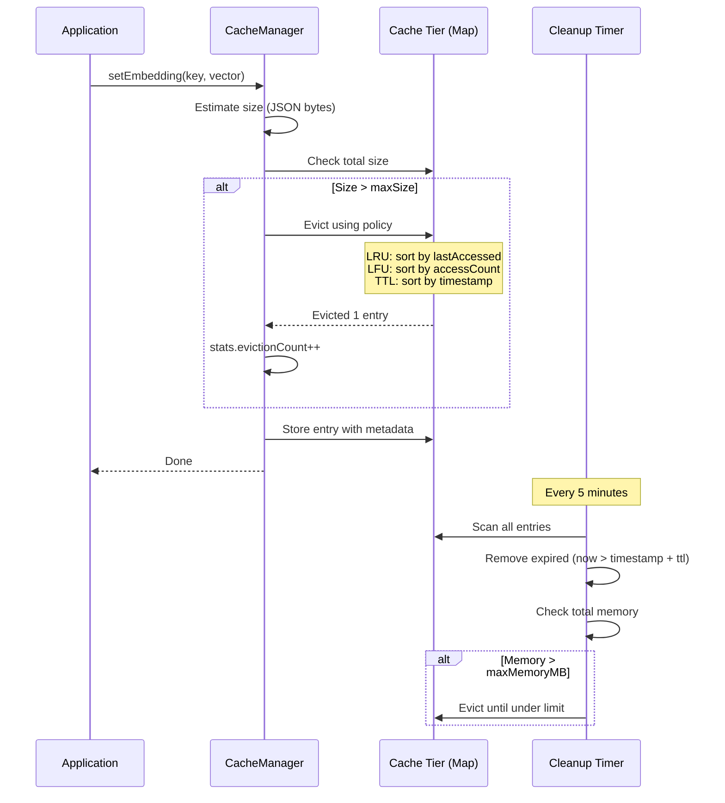

CodeBuddy uses a multi-level cache system to avoid redundant embedding computations, vector searches, and LLM calls. The `EnhancedCacheManager` provides four independent cache tiers, each optimized for a different data type.

## Cache tiers

| Tier          | Key format        | Value type     | Default TTL | Use case                                  |
| ------------- | ----------------- | -------------- | ----------- | ----------------------------------------- |
| **Embedding** | File content hash | `number[]`     | 1 hour      | Skip re-embedding unchanged files         |
| **Search**    | Query hash        | Search results | 1 hour      | Avoid duplicate vector DB lookups         |
| **Metadata**  | File path         | File metadata  | 1 hour      | Cache file stats, language detection      |
| **Response**  | Prompt hash       | `string`       | 1 hour      | Cache LLM responses for identical prompts |

Each tier is a separate `Map<string, CacheEntry<T>>` — they don't share eviction pressure.

## Cache entry structure

Every cached item carries metadata for eviction decisions:

```typescript
interface CacheEntry<T> {
  data: T; // The cached value
  timestamp: number; // When it was created
  accessCount: number; // Times accessed (for LFU)
  lastAccessed: number; // Last access time (for LRU)
  ttl: number; // Time-to-live in ms
  size: number; // Estimated memory size in bytes
}
```

## Eviction policies

| Policy  | How it works                                  | Best for                           |
| ------- | --------------------------------------------- | ---------------------------------- |
| **LRU** | Evicts the least recently accessed entry      | General use (default)              |
| **LFU** | Evicts the least frequently accessed entry    | Hot-path caching (popular queries) |
| **TTL** | Evicts the oldest entry by creation timestamp | Time-sensitive data                |

The policy is set at construction time and applies uniformly across all tiers in that cache instance.

## Configuration

```typescript
interface CacheConfig {
  maxSize: number; // Max entries per tier (default: 10,000)
  defaultTtl: number; // Default TTL in ms (default: 3,600,000 = 1 hour)
  maxMemoryMB: number; // Memory ceiling in MB (default: 100)
  cleanupInterval: number; // Cleanup timer interval (default: 300,000 = 5 min)
  evictionPolicy: "LRU" | "LFU" | "TTL"; // Default: "LRU"
}
```

## How eviction works



The cleanup timer runs every 5 minutes and performs two passes:

1. **TTL pass** — remove entries where `Date.now() > entry.timestamp + entry.ttl`
2. **Memory pass** — if total estimated memory exceeds `maxMemoryMB`, evict entries using the configured policy until under the limit

## Statistics

Every cache instance tracks per-operation statistics:

| Metric          | Description                                |
| --------------- | ------------------------------------------ |
| `hitCount`      | Total cache hits across all tiers          |
| `missCount`     | Total cache misses                         |
| `size`          | Current total entries                      |
| `maxSize`       | Configured maximum entries                 |
| `memoryUsage`   | Estimated memory consumption in bytes      |
| `avgAccessTime` | Average cache access latency (rolling)     |
| `evictionCount` | Total entries evicted since initialization |

Statistics are available via `getStats()` and are reported to the Performance Profiler when connected.

## Named instances

Multiple cache instances can coexist with different names and configurations:

```typescript
// Vector DB cache — large, LRU
const vectorCache = new EnhancedCacheManager(
  { maxSize: 10000, maxMemoryMB: 100, evictionPolicy: "LRU" },
  profiler,
  "vector-db",
);

// Response cache — smaller, TTL-based
const responseCache = new EnhancedCacheManager(
  { maxSize: 1000, maxMemoryMB: 20, evictionPolicy: "TTL" },
  profiler,
  "responses",
);
```

Each instance logs with a prefixed name (`EnhancedCacheManager:vector-db`) for debugging.

## Memory estimation

Cache entry size is estimated by JSON-serializing the value and measuring the byte length. This is an approximation (JSON serialization has overhead), but it provides a reasonable upper bound for memory budgeting.

For embeddings (`number[]`), the size is approximately `dimensions × 8` bytes (64-bit floats) plus array overhead.

## Integration points

| Consumer                 | Tier used         | Purpose                                 |
| ------------------------ | ----------------- | --------------------------------------- |
| `VectorDBService`        | Embedding, Search | Skip re-embedding, cache search results |
| `ContextRetriever`       | Search, Metadata  | Cache semantic search results           |
| `EnhancedPromptBuilder`  | Response          | Cache identical prompt responses        |
| `CodebaseAnalysisWorker` | Metadata          | Cache file language detection           |

## Disposal

The cache implements `vscode.Disposable`. On dispose:

1. The cleanup timer is cleared
2. All 4 tier maps are cleared
3. Statistics are reset

This prevents memory leaks when the extension is deactivated or reloaded.
