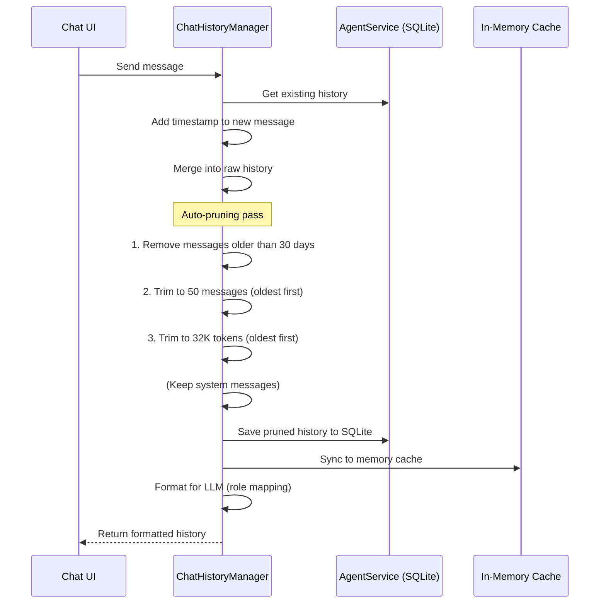

CodeBuddy automatically manages conversation history to prevent context window overflows and keep conversations relevant. The `ChatHistoryManager` prunes old messages based on count, token estimates, and age.

## Auto-pruning

Auto-pruning is **enabled by default** and runs transparently on every history read and write. It permanently removes old messages to save memory and improve response quality.

### Pruning rules

Messages are pruned in order of priority:

| Rule       | Default limit | What happens                                                 |
| ---------- | ------------- | ------------------------------------------------------------ |
| **Age**    | 30 days       | Messages older than `maxAgeHours` (720h) are removed first   |
| **Count**  | 50 messages   | If the history exceeds `maxMessages`, the oldest are removed |
| **Tokens** | 32,000 tokens | If total tokens exceed `maxTokens`, the oldest are removed   |

System messages are **preserved** regardless of pruning rules when `preserveSystemMessages` is `true` (default).

### Pruning flow



## Token estimation

Token counts are estimated at approximately **4 characters per token** — a standard approximation for code and natural language. This is conservative enough to prevent context window overflows while not being so aggressive that useful context is discarded.

## LLM format mapping

Chat history is formatted differently per LLM provider. The `LLM_CONFIGS` constant maps each provider to its role names and message format:

```typescript
formatChatHistory(role, message, model, key);
```

The history manager:

1. Retrieves the raw history from SQLite (or falls back to in-memory cache)
2. Appends the new message with a timestamp
3. Prunes the combined history
4. Saves the pruned result back to SQLite
5. Formats each message using the model's role mapping (`user`/`assistant`/`system`)
6. Returns the formatted array for the LLM call

## Conversation summaries

For long conversations, CodeBuddy can generate and store summaries:

```typescript
await chatHistory.saveSummary(key, "This conversation covered auth setup...");
const summary = await chatHistory.getSummary(key);
```

Summaries are stored alongside the full history in the `AgentService` SQLite database and can be injected into prompts when the full history is too large.

## Settings

| Setting                             | Type    | Default | Description                   |
| ----------------------------------- | ------- | ------- | ----------------------------- |
| `codebuddy.chatHistory.autoPrune`   | boolean | `true`  | Enable automatic pruning      |
| `codebuddy.chatHistory.maxMessages` | number  | `50`    | Maximum messages to keep      |
| `codebuddy.chatHistory.maxTokens`   | number  | `32000` | Maximum total tokens          |
| `codebuddy.chatHistory.maxAgeHours` | number  | `720`   | Maximum message age (30 days) |

## Storage

Chat history is persisted in SQLite via the `AgentService`. Each conversation is keyed by a unique identifier (typically derived from the workspace identity + conversation ID).

The in-memory `Memory` cache is kept in sync as a fast-path for repeated reads within the same session. On `clearHistory()`, both SQLite and the memory cache are purged.

## Why permanent pruning?

Unlike some systems that only hide old messages, CodeBuddy **permanently deletes** pruned messages. This is intentional:

- **Memory savings** — old conversation data doesn't accumulate indefinitely
- **Privacy** — sensitive code snippets and API keys in old messages are removed
- **Performance** — smaller history means faster SQLite queries and less data to format
- **Quality** — LLMs perform better with focused, recent context than with sprawling old conversations
