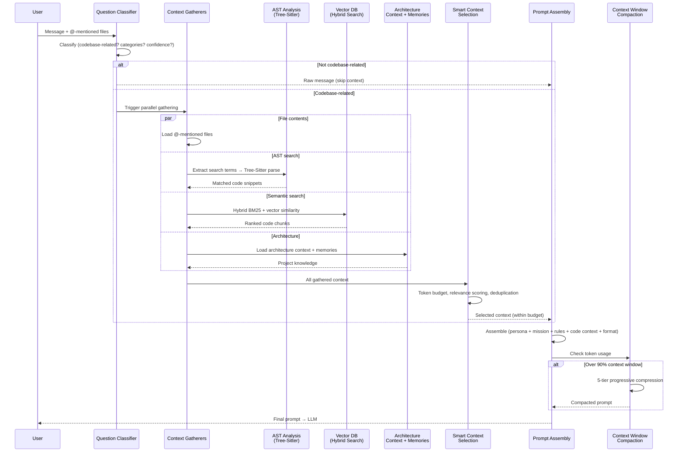

Every time you send a message, CodeBuddy assembles a **context window** — a curated set of code snippets, file contents, and architectural knowledge that grounds the AI's response in your actual codebase. This page explains how that context is gathered, selected, and managed.

## Context pipeline overview

## How context is gathered

### 1. Question classification

The `ContextEnhancementService` first classifies your question via a fast LLM call to determine if it's codebase-related. This produces:

- **`isCodebaseRelated`** — boolean, gates whether any code context is gathered
- **`categories`** — what kind of question (architecture, debugging, feature, etc.)
- **`confidence`** — how confident the classification is

Non-codebase questions (general knowledge, explanations) skip context gathering entirely, saving tokens and latency.

### 2. @-mentioned files

Files you reference with `@` in the chat input are always included at highest priority. The active editor file is also auto-prepended if not already mentioned. File contents are loaded via `FileService.getFilesContent()`.

### 3. AST-based code analysis

The `AnalyzeCodeProvider` uses Tree-Sitter to parse your codebase and extract relevant code based on search terms. If you provided `@`-files, simple keyword extraction is used. Otherwise, an LLM generates search terms from your question.

### 4. Semantic search

The `ContextRetriever` runs a 4-tier search with cascading fallback:

1. **Hybrid search** — vector similarity + BM25 keyword search via `HybridSearchService`
2. **Keyword-only** — FTS4 search if embedding generation fails
3. **Legacy vector** — brute-force cosine similarity scan
4. **Legacy keyword** — basic term counting

For broad/architectural queries, common project files (README, package.json, entry points) are appended automatically. Results are deduplicated by file path and capped at 15 items.

See [Semantic Search](/features/semantic-search/) for details on the hybrid search pipeline.

### 5. Architecture context and memories

The prompt builder also injects:

- **Architecture context** — detected patterns, framework info from [Codebase Analysis](/features/codebase-analysis/)
- **Memories** — formatted memories from the [Memory System](/concepts/memory/), sanitized against prompt injection
- **Team context** — relevant team/project knowledge if available

## Smart context selection

All gathered code goes through `SmartContextSelectorService` for budget-aware selection.

### Token budgets per model

| Model            | Token budget |
| ---------------- | ------------ |
| Claude 3 Opus    | 50,000       |
| GPT-4o           | 20,000       |
| Qwen 2.5 Coder   | 4,000        |
| Default (others) | 4,000        |

Tokens are estimated at **1 token ≈ 4 characters**.

### Relevance scoring

| Source                              | Score                               |
| ----------------------------------- | ----------------------------------- |
| User-selected files (`@`-mentioned) | 1.0 (always included first)         |
| Auto-gathered code                  | 0.1–0.9 (scored by keyword density) |

The selector uses `extractSmartSnippets()` to pull out meaningful code structures — functions, classes, interfaces, types, variables — using regex patterns for TypeScript, JavaScript, and Python.

### Selection algorithm

1. Deduplicate by `filePath:startLine`
2. Sort by relevance score (highest first)
3. Greedy fill: add snippets until the token budget is exhausted
4. Return `ContextSelectionResult` with snippet list, total tokens used, whether truncation occurred, and how many snippets were dropped

## Context window compaction

When the conversation grows long, the `ContextWindowCompactionService` progressively compresses older messages to stay within limits.

### Known model context windows

| Model family     | Context window   |
| ---------------- | ---------------- |
| Gemini 2.0 Flash | 1,000,000 tokens |
| Claude           | 200,000 tokens   |
| GPT-4o           | 128,000 tokens   |
| DeepSeek         | 64,000 tokens    |

The effective window is resolved as: **user setting** (`codebuddy.contextWindow`) → **model lookup** → **16K default**.

### 5-tier compaction strategy

When usage exceeds **90%** of the context window (warning at 80%):

| Tier | Strategy         | What happens                                                           |
| ---- | ---------------- | ---------------------------------------------------------------------- |
| 1    | `NONE`           | No compaction needed                                                   |
| 2    | `TOOL_STRIP`     | Strip tool call details from older messages                            |
| 3    | `MULTI_CHUNK`    | Combine and summarize multiple message chunks                          |
| 4    | `PARTIAL`        | Aggressively summarize all but recent messages                         |
| 5    | `PLAIN_FALLBACK` | Plain-text compression of everything except the 4 most recent messages |

The **4 most recent messages** are always preserved in full, regardless of compaction tier.

## Inline completion context

Inline completions use a separate, lighter context pipeline via `ContextCompletionService`:

| Component                   | Size limit                |
| --------------------------- | ------------------------- |
| Prefix (code before cursor) | 2,000 tokens              |
| Suffix (code after cursor)  | 500 tokens                |
| Imports                     | Extracted via Tree-Sitter |

The `FIMPromptService` formats these into Fill-in-the-Middle tokens appropriate for the model family (DeepSeek, CodeLlama, StarCoder/Codestral, Qwen).

See [Inline Completion](/features/inline-completion/) for details.

## Settings

| Setting                               | Default | Description                                               |
| ------------------------------------- | ------- | --------------------------------------------------------- |
| `codebuddy.contextWindow`             | `"16k"` | Max context window size: `4k`, `8k`, `16k`, `32k`, `128k` |
| `codebuddy.includeHidden`             | `false` | Include hidden files in context gathering                 |
| `codebuddy.maxFileSize`               | `"1"`   | Max file size in MB for context gathering                 |
| `codebuddy.hybridSearch.vectorWeight` | `0.7`   | Weight for semantic similarity in search                  |
| `codebuddy.hybridSearch.textWeight`   | `0.3`   | Weight for keyword matching in search                     |
| `codebuddy.hybridSearch.topK`         | `10`    | Max search results returned                               |
