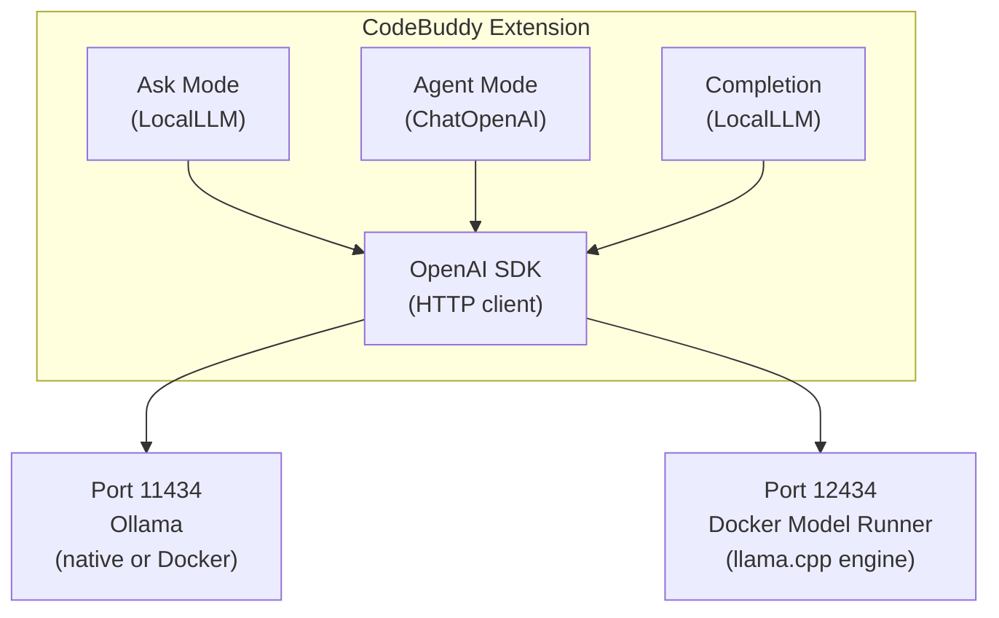

CodeBuddy supports local models as a first-class provider. The local provider uses the **OpenAI-compatible API** protocol, which means it works with Ollama, Docker Model Runner, LM Studio, vLLM, and any other server that implements the same endpoint format — no cloud API keys required.

## Architecture



**Ask mode** and **inline completion** use `LocalLLM`, which wraps the OpenAI Node.js SDK pointed at a local endpoint. **Agent mode** uses LangChain's `ChatOpenAI` class with a custom `baseURL`, giving the LangGraph pipeline full tool-calling support through the same local server.

## Supported runtimes

| Runtime                   | Default port | How CodeBuddy connects                            |
| ------------------------- | ------------ | ------------------------------------------------- |
| **Ollama** (native)       | 11434        | `http://localhost:11434/v1`                       |
| **Ollama** (Docker)       | 11434        | Same — started via bundled `docker-compose.yml`   |
| **Docker Model Runner**   | 12434        | `http://localhost:12434/engines/llama.cpp/v1`     |
| **LM Studio**             | 1234         | Set `local.baseUrl` to `http://localhost:1234/v1` |
| **vLLM**                  | 8000         | Set `local.baseUrl` to `http://localhost:8000/v1` |
| **Any OpenAI-compatible** | varies       | Set `local.baseUrl` to the server's endpoint      |

## Quick setup

### Option 1: Ollama (recommended)

Install and start Ollama, then pull a model:

```bash
# Install Ollama
curl -fsSL https://ollama.com/install.sh | sh

# Pull the recommended coding model
ollama pull qwen2.5-coder

# Ollama starts automatically on port 11434
```

In CodeBuddy settings, select **Local** as the provider. The default base URL (`http://localhost:11434/v1`) points to Ollama out of the box.

### Option 2: Docker Compose (managed by CodeBuddy)

CodeBuddy bundles a `docker-compose.yml` that starts Ollama in a Docker container with persistent storage:

1. Open Settings → Models
2. Click **Start Server** under the Ollama section
3. Select a model to pull from the predefined list
4. Click **Use** to activate it

This runs:

```bash
docker compose -f <extension-path>/docker-compose.yml up -d
```

The container is configured with a 32 GB memory limit and persistent volume (`ollama_data`). GPU support (NVIDIA) can be enabled by uncommenting the deploy section in the compose file.

### Option 3: Docker Model Runner

Docker Desktop 4.37+ includes a built-in model runner with a llama.cpp engine:

1. Open Settings → Models
2. Click **Enable Docker Model Runner**
3. Pull models directly through the Docker model registry

This exposes models at `http://localhost:12434/engines/llama.cpp/v1`. Model names are prefixed with `ai/` (e.g., `ai/qwen2.5-coder`).

**Port fallback**: If Docker Model Runner on port 12434 is unreachable, CodeBuddy automatically falls back to Ollama on port 11434 and updates your configuration.

## Recommended models

| Model                   | Size    | Best for                          |
| ----------------------- | ------- | --------------------------------- |
| **Qwen 2.5 Coder (7B)** | ~4.7 GB | Code tasks — recommended default  |
| **Qwen 2.5 Coder (3B)** | ~2 GB   | Faster, lighter coding model      |
| **DeepSeek Coder**      | ~6.7 GB | Strong code completion benchmarks |
| **CodeLlama (7B)**      | ~3.8 GB | Meta's code-focused model         |
| **Llama 3.2 (3B)**      | ~2 GB   | Efficient general-purpose model   |

The default model is `qwen2.5-coder`. You can use any model available in your local runtime — these are just the ones shown in the UI.

## Settings

| Setting               | Type   | Default                       | Description                             |
| --------------------- | ------ | ----------------------------- | --------------------------------------- |
| `local.model`         | string | `"qwen2.5-coder"`             | Model name (must match what's pulled)   |
| `local.baseUrl`       | string | `"http://localhost:11434/v1"` | API endpoint for the local server       |
| `local.apiKey`        | string | `"not-needed"`                | API key (not required for local models) |
| `generativeAi.option` | enum   | `"Groq"`                      | Set to `"Local"` to use local models    |

## Inline completion

Local models are the **default provider for inline code completion** (ghost text). This gives you fast, private completions without cloud API calls.

| Setting                            | Default           | Description                            |
| ---------------------------------- | ----------------- | -------------------------------------- |
| `codebuddy.completion.provider`    | `"Local"`         | Set to `"Local"` for local completions |
| `codebuddy.completion.model`       | `"qwen2.5-coder"` | Model for completions                  |
| `codebuddy.completion.debounceMs`  | 300               | Trigger delay in milliseconds          |
| `codebuddy.completion.maxTokens`   | 128               | Maximum tokens per completion          |
| `codebuddy.completion.triggerMode` | `"automatic"`     | `automatic` (as you type) or `manual`  |
| `codebuddy.completion.multiLine`   | `true`            | Allow multi-line completions           |

The completion engine tries two strategies:

1. **Completion API** (standard Fill-in-the-Middle) — used for models with FIM support
2. **Chat API fallback** — used if the model only supports chat

## Local embeddings

Local models can power the vector database for semantic code search:

```json
{
  "codebuddy.vectorDb.embeddingModel": "local"
}
```

This calls the local server's `/embeddings` endpoint. The default embedding model is `text-embedding-v1`. Not all local models support embeddings — if your model doesn't expose this endpoint, use `"gemini"` (default) or `"openai"` instead.

## Agent mode with local models

When you select the Local provider and use Agent mode, the LangGraph pipeline uses LangChain's `ChatOpenAI` class with your local endpoint:

```typescript
new ChatOpenAI({
  openAIApiKey: "not-needed",
  modelName: "qwen2.5-coder",
  configuration: {
    baseURL: "http://localhost:11434/v1",
  },
});
```

This gives you full agent capabilities — tool calling, subagent delegation, multi-step reasoning — powered by your local hardware. The system prompt explicitly prevents local models from hallucinating tool calls when not in agent context.

**Performance note**: Agent mode involves multiple sequential LLM calls (reasoning → tool selection → execution → reasoning). Expect slower responses with local models compared to cloud providers, especially with 3B–7B parameter models. Larger models (13B+) or GPU acceleration significantly improve agent performance.

## Model management UI

The **Settings → Models** page provides a visual interface for managing local models:

- **Status indicators**: Green/red badges showing whether Ollama or Docker Model Runner is running
- **Model cards**: Each predefined model shows Pull / Use / Delete buttons
- **Pull progress**: Loading states during model downloads
- **Active model**: The currently configured model is highlighted
- **Docker controls**: Enable Docker Model Runner, start Ollama via Docker Compose

The **model selector pill** in the sidebar header shows the active model name and polls every 30 seconds for local runtime status.

## Connecting any OpenAI-compatible server

Since `LocalLLM` uses the standard OpenAI SDK, you can point it at any compatible server:

```json
{
  "local.baseUrl": "http://localhost:8080/v1",
  "local.model": "my-custom-model",
  "local.apiKey": "not-needed",
  "generativeAi.option": "Local"
}
```

Compatible servers include Ollama, LM Studio, vLLM, text-generation-webui (with `--api`), KoboldCpp, LocalAI, and any server implementing the OpenAI chat completions endpoint (`/v1/chat/completions`).

## Next steps

- [Configuration](/getting-started/configuration/) — Full provider setup including API keys for cloud providers
- [Ask & Agent Modes](/concepts/modes/) — How mode selection affects the execution pipeline
- [Settings Reference](/reference/settings/) — All 98+ settings including vector DB and completion
