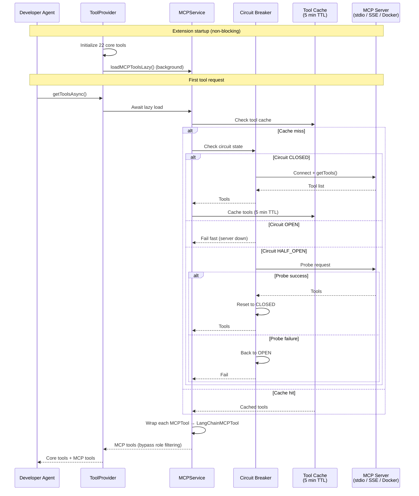
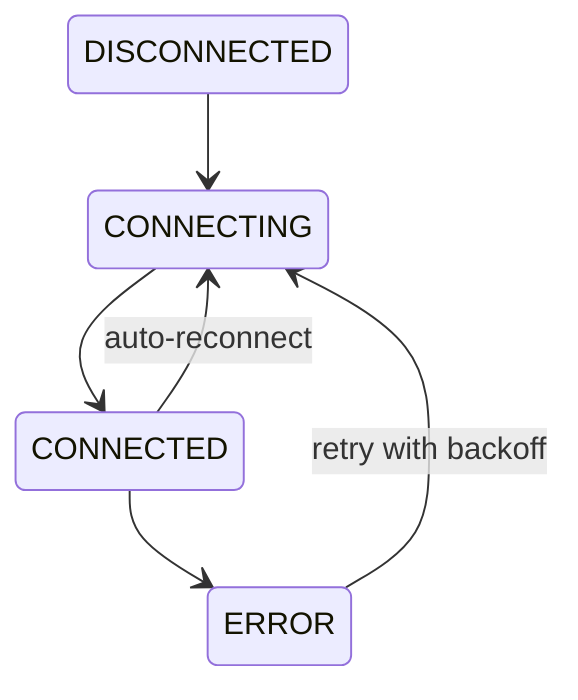
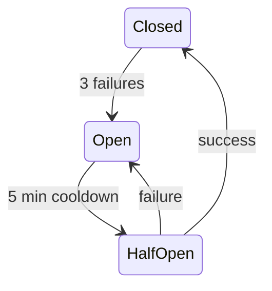

The **Model Context Protocol (MCP)** is an open standard for connecting AI agents to external tools and data sources. CodeBuddy's `MCPService` supports two deployment modes — a unified Docker gateway and direct multi-server connections — with per-server circuit breakers, tool caching, and lazy initialization that never blocks extension startup.

## Architecture overview



## Deployment modes

### Gateway mode

A single Docker-based MCP server provides a unified tool catalog. This is the simplest setup — Docker Desktop's MCP integration exposes all configured tools through one endpoint.

- **Lazy start** — The gateway only starts on the first tool request, not at extension startup.
- **Idle timeout** — Shuts down automatically after 5 minutes of inactivity to save resources.
- **Detection** — CodeBuddy runs `docker mcp --help` to verify MCP CLI availability, and `docker info --format {{.ServerVersion}}` (3-second timeout) to check the daemon.

### Multi-server mode

Multiple independent MCP servers, each with their own transport and tool set. Servers are connected on demand when their tools are first requested.

## Configuring MCP servers

Add MCP servers in `.codebuddy/mcp.json` in your workspace root:

```json
{
  "servers": [
    {
      "name": "my-database",
      "command": "npx",
      "args": ["-y", "@my-org/db-mcp-server"],
      "env": {
        "DATABASE_URL": "postgresql://localhost:5432/mydb"
      }
    },
    {
      "name": "custom-api",
      "url": "http://localhost:3001/mcp",
      "transport": "sse"
    }
  ]
}
```

### Server configuration schema

```typescript
interface MCPServerConfig {
  command: string; // Executable (e.g., "docker", "node", "npx")
  args: string[]; // Command arguments
  env?: Record<string, string>; // Environment variables
  description?: string; // Display name in UI
  enabled?: boolean; // Enable/disable without removing config
  transport?: "stdio" | "sse"; // Transport type (default: stdio)
  url?: string; // Server URL (required for SSE transport)
}
```

### Transport types

| Transport          | Config             | Use case                                                                         |
| ------------------ | ------------------ | -------------------------------------------------------------------------------- |
| **stdio**          | `command` + `args` | Local CLIs, Node.js scripts, Python tools. The server runs as a child process.   |
| **SSE**            | `url`              | Remote servers, shared team tools, hosted APIs. Connects via Server-Sent Events. |
| **Docker gateway** | Automatic          | Docker Desktop MCP integration. No manual configuration needed.                  |

## Connection management

### MCPClient lifecycle

Each MCP server is managed by an `MCPClient` instance with four states:



**Reconnection behavior:**

- Exponential backoff: `delay = 1000 × 2^(attempt-1)`, capped at 30 seconds
- Maximum 3 reconnection attempts before giving up
- Auto-reconnect triggers on unexpected transport closure
- Connection-closure detection retries tool fetches once if the connection drops mid-call

### Tool caching

Tool lists are cached per-client with a **5-minute TTL**. This avoids redundant `getTools()` calls to MCP servers during a session. The cache is invalidated when:

- The TTL expires
- `refreshTools()` is called explicitly
- The server connection is re-established after a failure

### Tool deduplication

Multiple servers can expose tools with the same name. CodeBuddy tracks tools in a `toolsByName` map that supports duplicate entries — each tool carries a `serverName` metadata field to disambiguate.

## Circuit breaker pattern

Each MCP server has an independent circuit breaker that prevents cascading failures when a server is down or unresponsive:

| State         | Behavior                                                                                                                 |
| ------------- | ------------------------------------------------------------------------------------------------------------------------ |
| **Closed**    | Normal operation. Requests flow through. Failure counter tracks consecutive failures.                                    |
| **Open**      | Too many failures (threshold: 3). All requests fail fast without attempting the server.                                  |
| **Half-open** | After a 5-minute cooldown, a single probe request is allowed through. Success resets to Closed; failure returns to Open. |



This prevents a single failing MCP server from causing timeouts and latency across the entire tool system.

## Tool loading pipeline

MCP tools are loaded lazily so they never block extension startup:

1. **Extension starts** — `ToolProvider.initialize()` creates 22 core tools immediately.
2. **Background load** — `loadMCPToolsLazy()` fires a non-blocking promise to connect to MCP servers.
3. **Agent creation** — `getToolsAsync()` awaits the MCP load promise if it hasn't completed yet.
4. **Tool discovery** — For each server, `MCPClient.getTools()` fetches the tool list via the MCP SDK.
5. **LangChain wrapping** — Each `MCPTool` is wrapped in a `LangChainMCPTool` and added to the provider.
6. **Role bypass** — MCP tools are added to every subagent regardless of role mapping.

If MCP servers are unavailable (Docker not running, network issues), the agent continues with core tools only. A warning is logged but no error is surfaced to the user.

## MCP tool interface

```typescript
interface MCPTool {
  name: string;
  description?: string;
  inputSchema: {
    type: "object";
    properties?: Record<string, any>; // JSON Schema
    required?: string[];
  };
  serverName: string;
  metadata?: {
    category?: string;
    tags?: string[];
    version?: string;
  };
}
```

Tool results follow a structured format:

```typescript
interface MCPToolResult {
  content: Array<{
    type: "text" | "image";
    text?: string;
    data?: string; // Base64 for binary content
    mimeType?: string;
  }>;
  isError?: boolean;
  metadata?: {
    duration?: number; // Execution time (ms)
    serverName?: string;
    toolName?: string;
  };
}
```

## Building custom MCP servers

You can build MCP servers using the [MCP SDK](https://modelcontextprotocol.io):

```typescript
import { McpServer } from "@modelcontextprotocol/sdk/server/mcp.js";
import { z } from "zod";

const server = new McpServer({ name: "my-tools", version: "1.0.0" });

server.tool("get_weather", { city: z.string() }, async ({ city }) => {
  const data = await fetchWeather(city);
  return { content: [{ type: "text", text: JSON.stringify(data) }] };
});
```

Some popular community servers:

- **@modelcontextprotocol/server-filesystem** — Enhanced file operations
- **@modelcontextprotocol/server-github** — GitHub API access
- **@modelcontextprotocol/server-postgres** — PostgreSQL queries
- **@modelcontextprotocol/server-brave-search** — Web search via Brave

## Next steps

- [Tools reference](/concepts/tools/) — Full list of built-in tools and their parameters
- [Multi-Agent Architecture](/concepts/architecture/) — How MCP tools are distributed to subagents
- [Skills](/features/skills/) — Higher-level integrations built on top of tools and MCP
