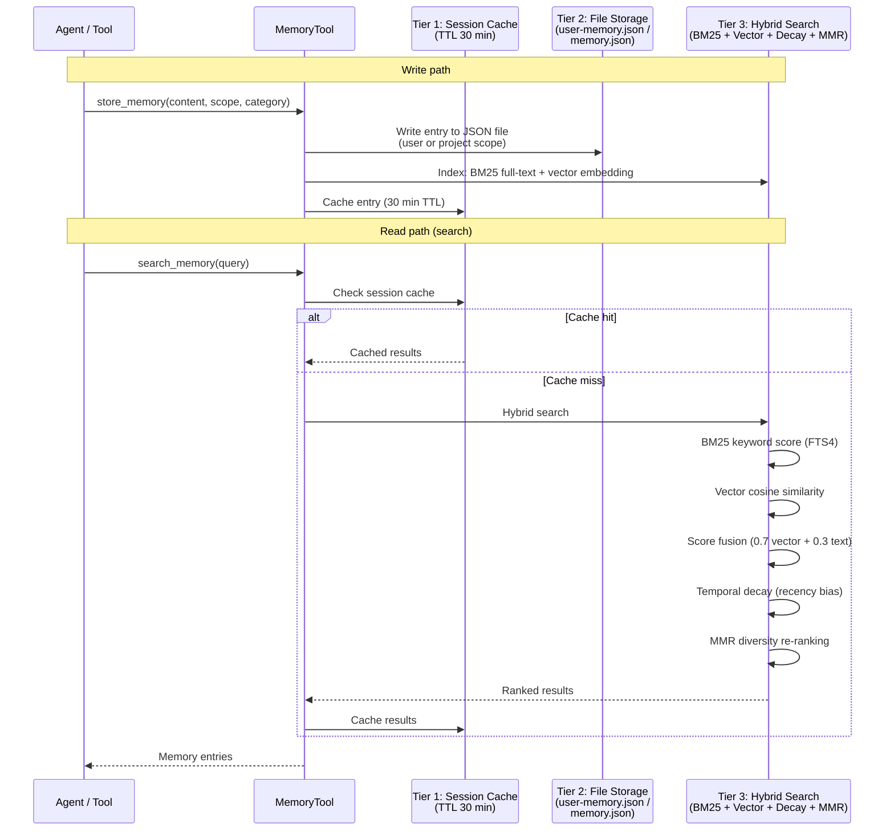
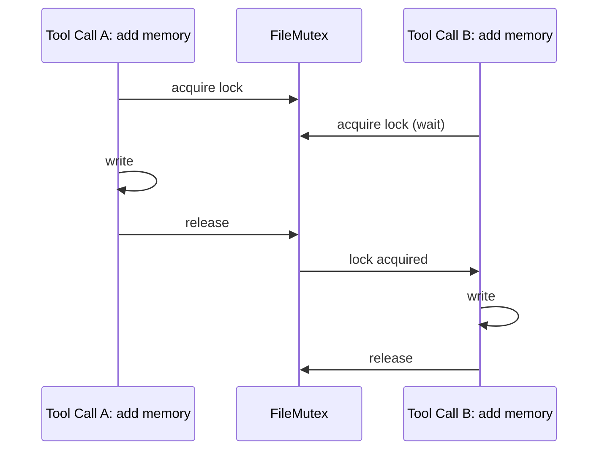

CodeBuddy includes a three-tier memory system that persists information across conversations, enabling it to learn your codebase, preferences, and project patterns over time. Memory is stored locally on your machine — it never leaves your workspace unless you explicitly configure a remote backend.

## Architecture overview



## Memory scopes

CodeBuddy distinguishes between two persistence scopes:

| Scope       | Storage path                         | Persists across                  | Use case                                                                        |
| ----------- | ------------------------------------ | -------------------------------- | ------------------------------------------------------------------------------- |
| **user**    | `~/.codebuddy/user-memory.json`      | All workspaces and conversations | Personal preferences, coding style, frequently used patterns, name/role         |
| **project** | `<workspace>/.codebuddy/memory.json` | Conversations in this workspace  | Project conventions, architecture decisions, team standards, dependency choices |

## Memory entry structure

Each memory entry is a structured record:

```typescript
interface MemoryEntry {
  id: string; // Random UUID (7 chars)
  category: "Knowledge" | "Rule" | "Experience"; // Type classification
  content: string; // Main text content
  title: string; // Short descriptive title
  keywords: string; // Pipe-separated keywords for search
  scope: "user" | "project"; // Persistence scope
  timestamp: number; // Created/updated time (ms)
}
```

### Categories

| Category       | Purpose                                    | Example                                                      |
| -------------- | ------------------------------------------ | ------------------------------------------------------------ |
| **Knowledge**  | Facts, conventions, architecture decisions | "This project uses Zod for all runtime validation"           |
| **Rule**       | Coding standards, always/never rules       | "Always use named exports in this codebase"                  |
| **Experience** | Lessons learned, past debugging outcomes   | "The auth timeout issue was caused by missing token refresh" |

## The `manage_core_memory` tool

The agent interacts with memory through the `manage_core_memory` tool, which supports four actions:

| Action   | Required fields                         | Behavior                                                                                          |
| -------- | --------------------------------------- | ------------------------------------------------------------------------------------------------- |
| `add`    | `content`, `category`, `title`, `scope` | Create a new memory entry with a random ID. Keywords are auto-extracted.                          |
| `update` | `id`, plus any fields to change         | Update an existing entry. Searches both scopes to find the entry.                                 |
| `delete` | `id`                                    | Remove an entry from whichever scope contains it.                                                 |
| `search` | `query?`                                | Search all memories by title, content, and keywords. Returns all entries if no query is provided. |

### When the agent saves memory

The agent is prompted to proactively save memory when you share:

- Your name, role, or personal details
- Coding preferences (language, framework, style)
- Project conventions or architecture decisions
- Frequently used commands or workflows
- Any explicit "remember this" request

### How memory is injected

At agent creation, `MemoryTool.getFormattedMemories()` synchronously loads all memory entries and appends them to the system prompt. This means the agent has access to all stored memories from the first message of every conversation.

## File-based storage

### Atomic writes

Memory files are written using a crash-safe atomic pattern:

1. Write to a `.tmp` file alongside the target
2. Rename the `.tmp` file to the target path (atomic on most filesystems)
3. If the rename fails, the original file is untouched

### Concurrent write protection

A per-file `FileMutex` serializes write operations. If two tool calls try to update memory simultaneously, one waits for the other to complete. This prevents data loss from race conditions.



## Hybrid search

When the agent searches memory (or when the system retrieves relevant context), CodeBuddy uses a multi-stage hybrid search pipeline:

### Stage 1 — Parallel retrieval

Two search strategies run concurrently:

| Strategy                | Implementation                                | Strength                                                                            |
| ----------------------- | --------------------------------------------- | ----------------------------------------------------------------------------------- |
| **Vector search**       | Cosine similarity against embedded chunks     | Semantic meaning — finds conceptually similar content even with different wording   |
| **BM25 keyword search** | FTS4 virtual table with `unicode61` tokenizer | Exact terms — finds precise matches for specific identifiers, names, error messages |

### Stage 2 — Score fusion

Results from both strategies are merged using weighted linear combination:

$$\text{score}_{\text{merged}} = 0.7 \times \text{score}_{\text{vector}} + 0.3 \times \text{score}_{\text{keyword}}$$

The 70/30 weighting favors semantic understanding while preserving exact-match precision.

### Stage 3 — Temporal decay

Older memories receive lower scores based on an exponential decay function:

$$\text{score}_{\text{decayed}} = \text{score} \times e^{-\lambda \cdot t}$$

where $t$ is the age of the memory and $\lambda$ is the half-life parameter. This ensures recent context is prioritized.

### Stage 4 — MMR diversity re-ranking

Maximal Marginal Relevance prevents redundant results. For each candidate, the algorithm balances relevance against similarity to already-selected results:

$$\text{MMR} = \lambda \times \text{relevance} - (1 - \lambda) \times \max(\text{similarity to selected})$$

Default $\lambda = 0.5$ gives equal weight to relevance and diversity.

### Stage 5 — Top-K selection

The final top 10 results (default) are returned to the agent.

## BM25 scoring implementation

The keyword search uses SQLite FTS4 with `matchinfo('pcx')` to compute TF-IDF relevance:

- **TF (term frequency)** — How often the term appears in the document
- **IDF (inverse document frequency)** — $\log(1 + \frac{\text{total rows}}{\text{rows with term}})$
- **Score normalization** — Results are normalized to the range $[0, 1)$

FTS4 is kept in sync with the chunks table via INSERT/DELETE/UPDATE triggers. A one-time backfill migration handles chunks added before FTS was enabled.

## Session cache

The in-process `Memory` class provides a fast key-value cache for the current session:

| Setting     | Value                     |
| ----------- | ------------------------- |
| Session TTL | 30 minutes (configurable) |
| Max items   | 3                         |
| Eviction    | TTL-based expiry          |

The session cache avoids redundant file reads during a conversation. It is cleared when the editor window is closed.

## Next steps

- [Multi-Agent Architecture](/concepts/architecture/) — How memory middleware injects context into the agent
- [Self-Healing Execution](/concepts/self-healing/) — How past error memories help the agent avoid repeated mistakes
- [Configuration](/getting-started/configuration/) — Memory-related settings
