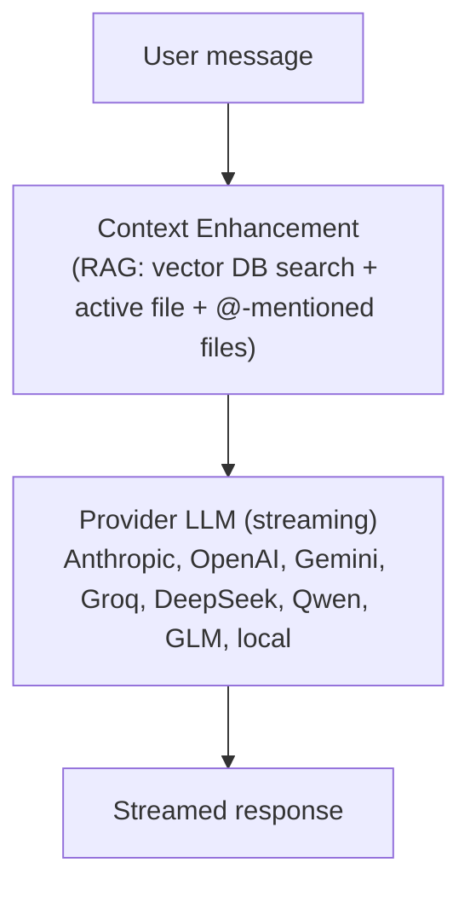
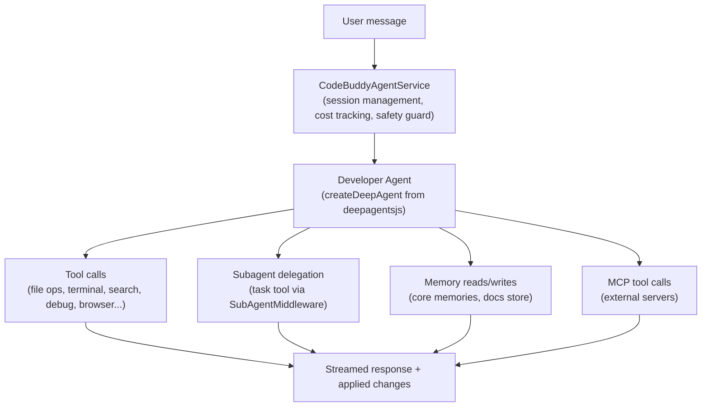

CodeBuddy operates in two distinct modes, selectable via the **mode pill** at the bottom of the chat panel. The active mode fundamentally changes how your messages are processed and what capabilities the AI has.

## Mode comparison

|                         | Ask mode                                | Agent mode                                                                       |
| ----------------------- | --------------------------------------- | -------------------------------------------------------------------------------- |
| **Purpose**             | Conversational Q&A                      | Autonomous task execution                                                        |
| **Side-effects**        | None — read-only                        | Reads/writes files, runs commands, browses the web                               |
| **Tools**               | None (pure LLM conversation)            | 25+ built-in tools + MCP tools                                                   |
| **Subagents**           | Not available                           | 9 specialized subagents                                                          |
| **Execution engine**    | Direct provider streaming               | [Deep Agents](https://github.com/langchain-ai/deepagentsjs) pipeline (LangGraph) |
| **Memory**              | Chat history (session-scoped)           | Chat history + persistent core memories                                          |
| **Cost**                | Lower (single LLM call per message)     | Higher (multi-step reasoning, tool calls)                                        |
| **Speed**               | Faster responses                        | Varies — simple tasks fast, complex tasks longer                                 |
| **Provider failover**   | Yes (Ask-mode failover)                 | Yes (agent-level failover)                                                       |
| **Context enhancement** | RAG-enhanced (vector DB + file context) | RAG + tool-based code retrieval                                                  |

## Ask mode

Ask mode is a **conversational interface** for getting answers, explanations, and code snippets without any side-effects. The AI cannot modify files, run commands, or interact with external services.

### How it works

1. Your message is enhanced with relevant codebase context via `ContextEnhancementService` — this includes vector DB search results, the currently active file, and any files you `@`-mention.
2. The enhanced message is sent directly to the configured LLM provider.
3. The response streams back token-by-token to the chat panel.
4. Chat history is persisted for context continuity within the session.

### Best for

- Quick questions about code, APIs, or concepts
- Getting code snippets and examples
- Understanding error messages
- Code review feedback (without applying changes)
- Learning and exploration

### Context compaction

When chat history grows large, Ask mode automatically compacts messages using a summarization model. This keeps the conversation within the provider's context window while preserving important context:

- Compacts from the oldest messages forward
- Falls back to legacy pruning (dropping old messages) if summarization fails
- Token budget is determined by the `codebuddy.contextWindow` setting

## Agent mode

Agent mode activates the full **[Deep Agents](https://github.com/langchain-ai/deepagentsjs) pipeline** — a `createDeepAgent()` instance with multi-step reasoning, tool use, subagent delegation, and autonomous code execution. The AI can read and write files, run terminal commands, search the web, control the debugger, and delegate to specialized subagents.

### How it works

1. Your message is wrapped with session metadata and sent to `CodeBuddyAgentService`.
2. The service creates (or reuses) a `DeveloperAgent` instance — which calls `createDeepAgent()` from the `deepagents` package with the full middleware stack.
3. The Deep Agents runtime manages the agent loop: reasoning, tool calls, subagent delegation, and planning via built-in middleware (`todoListMiddleware`, `filesystemMiddleware`, `subAgentMiddleware`).
4. Real-time events (`TOOL_START`, `TOOL_END`, `THINKING`, `PLANNING`, `TERMINAL_OUTPUT`) drive the chat panel UI.
5. Both the user message and agent response are persisted to session history.

### Capabilities

**File operations**: Read, write, edit, list, compose (atomic multi-file edits)

**Terminal**: Execute shell commands, run tests, install packages

**Search**: Ripgrep, symbol search, vector DB semantic search, web search (Tavily)

**Debugging**: Full Debug Adapter Protocol (DAP) integration — inspect state, stack traces, variables, evaluate expressions, step through code

**Browser**: Playwright-based web automation with SSRF protection

**Subagents**: Delegate to code-analyzer, debugger, tester, reviewer, architect, doc-writer, file-organizer, architecture-expert, or general-purpose agents

**Memory**: Read and write persistent core memories, save documentation to cross-session storage

### Safety controls

Agent mode includes layered safety controls:

| Control                   | Default  | Setting                                    |
| ------------------------- | -------- | ------------------------------------------ |
| **Auto-approve actions**  | Off      | `codebuddy.autoApprove`                    |
| **Allow file edits**      | On       | `codebuddy.allowFileEdits`                 |
| **Allow terminal**        | On       | `codebuddy.allowTerminal`                  |
| **Require diff approval** | Off      | `codebuddy.requireDiffApproval`            |
| **Permission profile**    | standard | `codebuddy.permissionScope.defaultProfile` |
| **Max tool invocations**  | 400      | `codebuddy.agent.maxToolInvocations`       |
| **Max events**            | 2,000    | `codebuddy.agent.maxEventCount`            |
| **Max duration**          | 10 min   | `codebuddy.agent.maxDurationMinutes`       |

With auto-approve off (the default), the agent pauses and asks for confirmation before executing tool calls. This gives you full visibility into what the agent intends to do before it does it.

### Best for

- Implementing features across multiple files
- Refactoring and restructuring projects
- Debugging with breakpoint inspection
- Writing and running tests
- Project-wide search-and-replace with context
- Setting up infrastructure, configs, and CI/CD

## Switching modes

### Chat panel

Click the **mode pill** at the bottom of the chat input. It shows a popover with both options:

- **Agent** (bolt icon) — Autonomous, runs tools, edits files, executes commands
- **Ask** (chat bubble icon) — Conversational, answers questions, no side-effects

### Settings panel

Open Settings → Agents → **CodeBuddy Mode** dropdown to set the default mode.

### Programmatic

The mode is sent as `metaData.mode` with each message. When set to `"Agent"`, the message routes through the LangGraph pipeline. Any other value routes through the direct provider streaming path (Ask mode).

## Both modes share

Despite the different execution paths, both modes share:

- **The same LLM providers** — All 9 providers work in both modes
- **Provider failover** — Automatic fallback to a healthy provider on errors
- **Chat history** — Persistent per-session conversation context
- **Codebase context** — Vector DB indexing and RAG enhancement
- **Cost tracking** — Token usage and cost estimates visible for both modes
- **Project rules** — Custom instructions from `.codebuddy/rules.md` are injected in both modes
- **News reader context** — If you're reading an article, both modes can reference it

## Next steps

- [Multi-Agent Architecture](/concepts/architecture/) — How the Agent mode pipeline is built
- [Subagent System](/concepts/subagents/) — The 9 specialized agents available in Agent mode
- [Tools](/concepts/tools/) — Full list of tools available in Agent mode
- [Security](/admin/security/) — Permission profiles and safety controls
