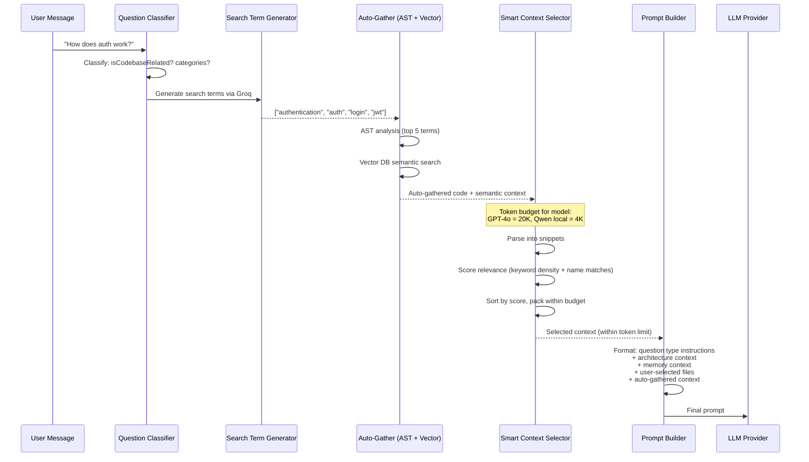

Every time you ask CodeBuddy a question, a multi-stage pipeline transforms your raw message into a rich, contextually-aware prompt. This page explains each stage.

## Pipeline overview

## Stage 1: Question classification

The `QuestionClassifierService` determines what kind of question you asked using fuzzy keyword matching:

| Category       | Example keywords                                           |
| -------------- | ---------------------------------------------------------- |
| Authentication | auth, login, jwt, oauth, passport, permissions             |
| API            | api, endpoint, routes, controllers, rest, graphql          |
| Database       | database, schema, models, migration, orm, prisma           |
| Architecture   | architecture, structure, pattern, framework, microservices |
| Configuration  | configuration, env, settings, variables, dotenv            |
| Testing        | test, spec, jest, mocha, coverage, e2e                     |
| Performance    | performance, optimization, cache, memory, profiling        |
| Error handling | error, exception, try-catch, validation, handling          |
| Deployment     | deployment, docker, ci/cd, pipeline, kubernetes, aws       |

The classifier uses three techniques:

1. **Direct keyword matching** — exact substring match against category keyword lists
2. **Fuzzy matching** — Levenshtein distance ≤ 2 catches typos (`autentication` → `authentication`)
3. **Porter stemming** — reduces words to roots (`authenticating` → `authent`) for broader matches
4. **Negation detection** — words like "not", "without", "exclude" invert the match

Categories with **strong indicators** (e.g., "jwt" → authentication) receive a higher confidence boost than generic terms.

## Stage 2: Search term generation

If the question appears codebase-related, `EnhancedPromptBuilderService` calls the Groq LLM (Llama 4 Scout) to generate 3–5 relevant search terms. These terms are:

- Used to auto-gather code via AST analysis
- Used as keywords for relevance scoring in the context selector
- Limited to the top 5 to avoid over-fetching

If the user provided explicit `@`-mention files, the pipeline extracts simple keywords from the message instead (faster, no LLM call).

## Stage 3: Auto-gathering context

Two sources contribute context automatically:

### AST analysis

The `AnalyzeCodeProvider` uses the search terms to find relevant symbols (functions, classes, types) across the codebase via Tree-Sitter AST parsing.

### Semantic search

The `ContextRetriever` queries the vector database for chunks semantically similar to the user's message. Results are formatted with file paths and content.

Both sources are merged into a single `autoGatheredCode` string.

## Stage 4: Smart context selection

The `SmartContextSelectorService` is the gatekeeper — it determines what fits within the model's token budget and selects the most relevant context.

### Token budgets per model

| Model                   | Token budget |
| ----------------------- | ------------ |
| Claude 3 Opus/Sonnet    | 50,000       |
| GPT-4 Turbo / GPT-4o    | 20,000       |
| Llama 3.3 70B / Llama 4 | 20,000       |
| Claude 3 Haiku          | 20,000       |
| GPT-4                   | 6,000        |
| Qwen 2.5 Coder          | 4,000        |
| GPT-3.5 Turbo           | 4,000        |
| Llama 3.2 / CodeLlama   | 3,000        |
| **Default fallback**    | 4,000        |

Token estimation uses the approximation: **1 token ≈ 4 characters** for code.

### Relevance scoring

Each code snippet receives a score from 0 to 1:

| Factor                          | Score impact                                    |
| ------------------------------- | ----------------------------------------------- |
| **User-selected** (`@` mention) | Always **1.0** — highest priority               |
| **Function/class name match**   | +0.2 bonus per match                            |
| **Keyword density**             | Base score = 0.1 + (matchCount / wordCount × 5) |
| **No keywords available**       | Default score of 0.5                            |

Scores are capped at 0.9 for auto-gathered content, so user-selected files always win.

### Packing algorithm

1. **User-selected files first** — always included (score = 1.0)
2. **Sort remaining by relevance score** (descending)
3. **Pack greedily** — add snippets until the token budget would be exceeded
4. **Report truncation** — the result includes `wasTruncated` and `droppedCount` for transparency

### Smart extraction

Instead of including raw file contents, the selector extracts focused snippets:

- **Function signatures** are preferred over full implementations when the budget is tight
- **Class declarations** are preferred over method bodies
- **Import blocks** are included for type context
- **Deduplication** removes redundant snippets across sources

## Stage 5: Prompt assembly

The final prompt is assembled from these sections:

1. **Question type instructions** — pre-built prompt preambles from `QUESTION_TYPE_INSTRUCTIONS` based on the classified type (implementation, architectural, debugging, code explanation, feature request)
2. **Architecture context** — persistent codebase knowledge from `PersistentCodebaseUnderstandingService`
3. **Memory context** — relevant entries from the `MemoryTool`
4. **Team context** — team graph data from `TeamGraphStore` (if available)
5. **User-selected file contents** — verbatim contents of `@`-mentioned files
6. **Auto-gathered context** — the smart-selected snippets from Stage 4
7. **The user's message** — the original question

All context is sanitized through `sanitizeForLLM()` before inclusion to prevent prompt injection.

## Question type instructions

The prompt changes based on the classified question type:

| Type             | Prompt emphasis                                                |
| ---------------- | -------------------------------------------------------------- |
| Implementation   | Focus on code patterns, suggest concrete implementations       |
| Architectural    | Bird's-eye view, component relationships, trade-offs           |
| Debugging        | Error analysis, stack traces, root cause identification        |
| Code explanation | Line-by-line walkthrough, naming conventions, design rationale |
| Feature request  | Impact analysis, where to add code, integration points         |

## Performance characteristics

- **Search term generation**: ~200ms (Groq Llama 4 Scout, single LLM call)
- **AST analysis**: 50–200ms depending on codebase size (cached after first run)
- **Semantic search**: 20–100ms (vector DB lookup, cached)
- **Context selection**: <10ms (in-memory scoring and sorting)
- **Total pipeline**: ~300–500ms for a typical question
