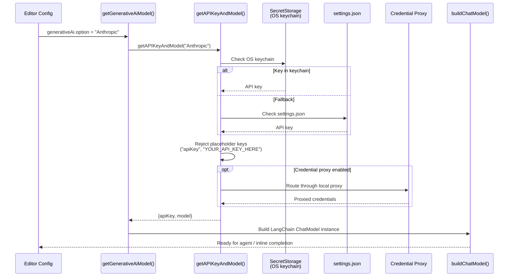
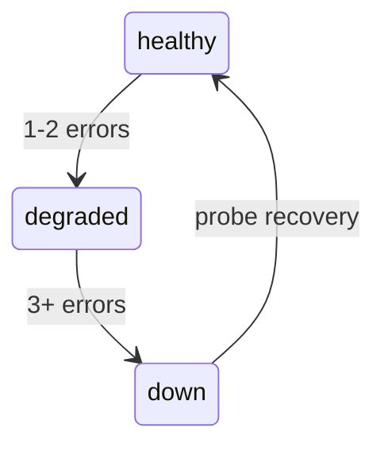

CodeBuddy supports **8 LLM providers** through a unified factory system. You can switch providers with a single setting, and the failover system automatically routes to a backup if your primary provider goes down.

## Supported providers

| Provider           | LangChain wrapper        | Default model             | Notes                              |
| ------------------ | ------------------------ | ------------------------- | ---------------------------------- |
| **Anthropic**      | `ChatAnthropic`          | `claude-sonnet-4-5`       | Native SDK                         |
| **OpenAI**         | `ChatOpenAI`             | `gpt-4o`                  | Native SDK                         |
| **Google Gemini**  | `ChatGoogleGenerativeAI` | `gemini-2.5-pro`          | Native SDK                         |
| **Groq**           | `ChatGroq`               | `llama-3.1-70b-versatile` | Native SDK                         |
| **DeepSeek**       | `ChatOpenAI`             | `deepseek-chat`           | OpenAI-compatible, custom base URL |
| **Qwen**           | `ChatOpenAI`             | `qwen-max`                | OpenAI-compatible (DashScope)      |
| **GLM (Zhipu AI)** | `ChatOpenAI`             | `glm-4`                   | OpenAI-compatible                  |
| **Local**          | `ChatOpenAI`             | `qwen2.5-coder`           | OpenAI-compatible, localhost       |

DeepSeek, Qwen, GLM, and Local all use the `ChatOpenAI` wrapper with a custom `baseURL`, since they expose OpenAI-compatible APIs.

## How provider selection works

### Two factory paths

CodeBuddy uses different provider paths depending on the mode:

| Mode                  | Factory                                   | Output                                                                                  |
| --------------------- | ----------------------------------------- | --------------------------------------------------------------------------------------- |
| **Agent mode**        | `buildChatModel()` → LangChain wrapper    | Fed into LangGraph pipeline via `AgentFactory`                                          |
| **Inline completion** | `CompletionProviderFactory.getProvider()` | Returns `ICodeCompleter` implementation (`GroqLLM`, `QwenLLM`, `GeminiLLM`, `LocalLLM`) |

### Credential management

API keys are resolved in order:

1. **SecretStorage** (OS keychain) — most secure, never written to disk
2. **Settings** — `settings.json` values
3. **Credential proxy** — if `codebuddy.credentialProxy.enabled` is `true`, API calls are routed through a local proxy that injects credentials from the OS keychain. The keys never reach the SDK clients directly.

Placeholder keys like `"apiKey"` or `"YOUR_API_KEY_HERE"` are automatically rejected.

## Automatic failover

The `ProviderFailoverService` monitors provider health and automatically switches to a backup when the primary fails.

### Error classification

The service classifies errors by inspecting HTTP status codes and error messages (walking the cause chain up to 5 levels deep):

| Reason            | Triggers             | Cooldown   |
| ----------------- | -------------------- | ---------- |
| `auth`            | HTTP 401, 403        | 10 minutes |
| `rate_limit`      | HTTP 429             | 1 minute   |
| `billing`         | Billing/quota errors | 30 minutes |
| `timeout`         | Request timeout      | 30 seconds |
| `overloaded`      | HTTP 503, 529        | 2 minutes  |
| `model_not_found` | HTTP 404             | 1 hour     |
| `format`          | Schema/format errors | —          |
| `unknown`         | Everything else      | —          |

### Health states

Probe recovery starts 30 seconds before a cooldown expires, attempting to restore the provider without waiting for the full cooldown.

### Failover resolution

When `resolveProvider(primary)` is called:

1. Check if the primary provider is healthy → use it
2. If not, iterate the candidate list (respecting cooldown timers)
3. Return the first candidate with valid credentials
4. The response includes an `isFallback` flag so the caller knows a switch occurred

Events emitted: `provider_switch`, `health_update`, `probe_recovery`.

### Settings

| Setting                        | Default | Description                                                     |
| ------------------------------ | ------- | --------------------------------------------------------------- |
| `codebuddy.failover.enabled`   | `true`  | Enable automatic failover                                       |
| `codebuddy.failover.providers` | `[]`    | Ordered fallback list. Empty = auto-detect from configured keys |

## Cost tracking

The `CostTrackingService` tracks token usage and costs across all providers.

- **30+ models** with per-million-token pricing (separate input/output rates)
- `recordUsage(threadId, provider, model, inputTokens, outputTokens)` — accumulates per conversation
- `getCostSummary()` — totals, per-provider breakdowns, per-conversation records

See [Cost Tracking](/features/cost-tracking/) for the user-facing details.

## Provider settings

Each provider has its own API key and model settings. See the [Settings Reference](/reference/settings/) for the full list under **Provider API keys & models**.

| Setting               | Description                                                                                           |
| --------------------- | ----------------------------------------------------------------------------------------------------- |
| `generativeAi.option` | Active provider: `Gemini`, `Groq`, `Anthropic`, `XGrok`, `Deepseek`, `OpenAI`, `Qwen`, `GLM`, `Local` |
| `{provider}.apiKey`   | API key for the provider                                                                              |
| `{provider}.model`    | Model name to use                                                                                     |
| `local.baseUrl`       | Base URL for local LLM (Ollama or Docker Model Runner)                                                |
