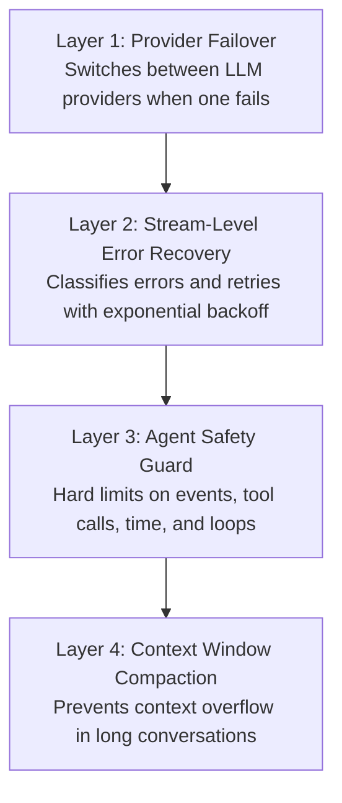
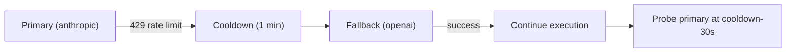
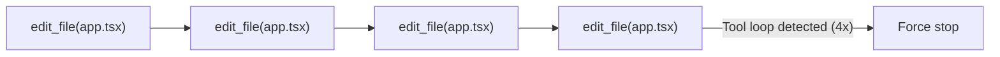
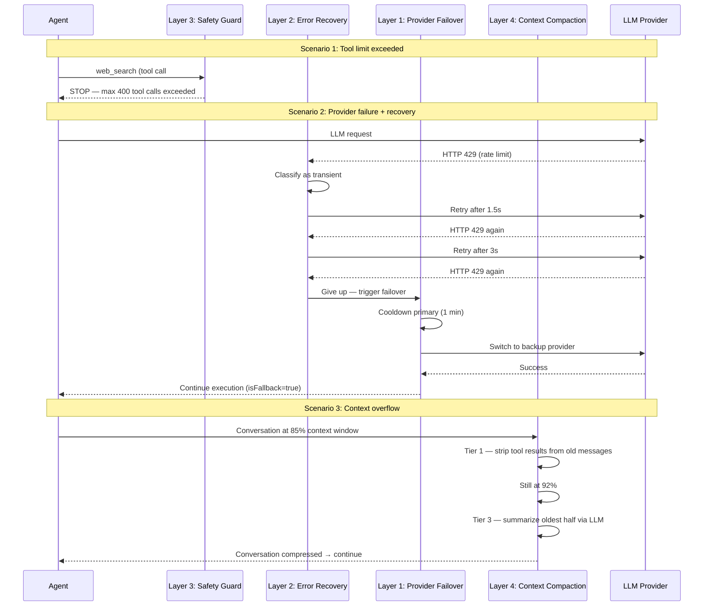

CodeBuddy doesn't stop when something goes wrong. A four-layer resilience system detects failures, classifies them, applies automatic recovery strategies, and enforces hard limits to prevent runaway execution. Each layer operates independently, so failures at one level are caught by the next.

## Resilience layers



## Layer 1 — Provider failover

The `ProviderFailoverService` monitors LLM provider health and automatically switches to a fallback provider when the primary fails.

### Error classification

Every provider error is classified into a `FailoverReason` that determines the cooldown duration:

| Reason              | Cooldown    | Trigger patterns                                |
| ------------------- | ----------- | ----------------------------------------------- |
| **auth**            | 10 minutes  | HTTP 401/403, "invalid API key", "unauthorized" |
| **rate_limit**      | 1 minute    | HTTP 429, "quota exceeded", "rate limit"        |
| **billing**         | 30 minutes  | HTTP 402, billing-related errors                |
| **timeout**         | 30 seconds  | HTTP 408, `ETIMEDOUT`, network timeout          |
| **overloaded**      | 2 minutes   | HTTP 502/503, "overloaded", "capacity"          |
| **model_not_found** | 1 hour      | HTTP 404, model doesn't exist                   |
| **format**          | No cooldown | Response format parsing errors (don't failover) |
| **unknown**         | 30 seconds  | Anything unclassified                           |

Classification walks the error cause chain (up to 5 levels deep) to find the root cause.

### Health tracking

Each provider maintains a health record:

```typescript
interface ProviderHealth {
  provider: string;
  status: "healthy" | "degraded" | "down";
  errorCount: number;
  lastError?: string;
  lastErrorReason?: FailoverReason;
  lastSuccessAt?: number;
  cooldownUntil: number;
}
```

### Failover chain

You configure a fallback chain of providers (e.g., `["anthropic", "openai", "google"]`). When the primary fails:

1. The failure reason and cooldown are recorded.
2. The next provider in the chain that is not in cooldown is selected.
3. If the new provider succeeds, execution continues seamlessly.
4. The original provider is probed again 30 seconds before its cooldown expires.



## Layer 2 — Stream-level error recovery

The `ErrorRecoveryService` evaluates individual stream errors and decides whether to retry:

### Error classification

| Class         | Behavior                | Matching patterns                                                                                                                                                   |
| ------------- | ----------------------- | ------------------------------------------------------------------------------------------------------------------------------------------------------------------- |
| **Transient** | Auto-retry with backoff | `timeout`, `ECONNRESET`, `ECONNREFUSED`, `ENOTFOUND`, `rate limit`, `429`, `502`, `503`, `internal server error`, `overloaded`, `socket hang up`                    |
| **Permanent** | Fail immediately        | `loop detected`, `infinite loop`, `same file edited`, `safety limit`, `user cancel`, `abort`, `authentication`, `unauthorized`, `invalid api key`, `quota exceeded` |

### Retry behavior

- **Maximum retries per stream**: 2 (configurable)
- **Base delay**: 1,500 ms
- **Backoff**: Exponential — `delay = baseDelay × 2^attempt`
- **Sequence**: 1.5s → 3s → 6s

Each retry includes a **nudge message** sent to the agent, providing context about the failure so it can adjust its approach.

### Safety guard override

If the error originated from the Safety Guard (Layer 3), it is **never retried**, regardless of the error pattern. This prevents the recovery system from circumventing execution limits.

## Layer 3 — Agent safety guard

The `AgentSafetyGuard` enforces hard limits to prevent runaway agent execution. These limits cannot be overridden by the agent.

### Global limits

| Guardrail               | Limit      | Purpose                         |
| ----------------------- | ---------- | ------------------------------- |
| Max events per task     | 2,000      | Prevents infinite event streams |
| Max tool calls per task | 400        | Caps total tool invocations     |
| Task timeout            | 10 minutes | Absolute time limit             |

### Per-tool limits

Certain high-risk tools have individual invocation caps:

| Tool                   | Max invocations | Rationale                            |
| ---------------------- | --------------- | ------------------------------------ |
| `edit_file`            | 8               | Prevents edit loops on the same file |
| `delete_file`          | 3               | Limits destructive operations        |
| `run_command`          | 10              | Limits non-persistent shell commands |
| `run_terminal_command` | 100             | Higher limit for persistent sessions |
| `web_search`           | 8               | Prevents search spirals              |

### Loop detection

The safety guard detects two types of loops:

**Tool loops** — When the same tool is called repetitively without progress:



**File edit loops** — When the same file is edited more than the `fileEditLoopThreshold` (default: 4):

```
Map<filepath, editCount> tracks per-file edits
If editCount > threshold → force stop with "file loop" reason
```

### Stop messages

When a limit is hit, the guard produces a human-readable message explaining what happened:

```
"Forced stop: reached maximum of 400 tool invocations.
 Events processed: 1,247 | Tool calls: 400 | Elapsed: 7m 23s.
 Please review the work completed so far."
```

## Layer 4 — Context window compaction

Long conversations can exceed the LLM's context window. The `ContextWindowCompactionService` uses a tiered strategy to keep conversations within bounds:

### Compaction tiers

| Tier | Name               | Approach                                                  | LLM required |
| ---- | ------------------ | --------------------------------------------------------- | ------------ |
| 0    | **None**           | No compaction needed                                      | No           |
| 1    | **Tool strip**     | Strip large tool results (>200 chars) from older messages | No           |
| 2    | **Multi-chunk**    | Summarize message batches with overlapping windows        | Yes          |
| 3    | **Partial**        | Summarize the oldest half of the conversation             | Yes          |
| 4    | **Plain fallback** | Plain-text description (when LLM summarization fails)     | No           |

### Trigger thresholds

| Threshold    | Token usage           | Action                              |
| ------------ | --------------------- | ----------------------------------- |
| Warning      | 80% of context window | Log warning, prepare for compaction |
| Auto-compact | 90% of context window | Automatic Tier 1+ compaction        |

### Protected messages

The most recent **4 messages** are never summarized — they contain the active working context. A minimum of **6 messages** must exist before any summarization is attempted.

### Known context windows

The service maintains a table of model context limits for accurate threshold calculation:

| Model           | Context window |
| --------------- | -------------- |
| Claude Sonnet 4 | 200K tokens    |
| Claude Opus 4   | 200K tokens    |
| GPT-4o          | 128K tokens    |
| GPT-4           | 8K tokens      |
| Gemini 1.5 Pro  | 2.1M tokens    |
| DeepSeek Chat   | 64K tokens     |
| Qwen Plus       | 131K tokens    |

## How the layers work together

A typical failure scenario flows through multiple layers:



## Next steps

- [Multi-Agent Architecture](/concepts/architecture/) — Execution guardrails and safety guard integration
- [Tools reference](/concepts/tools/) — Per-tool permission enforcement
- [Security](/admin/security/) — Permission profiles and dangerous command blocking
