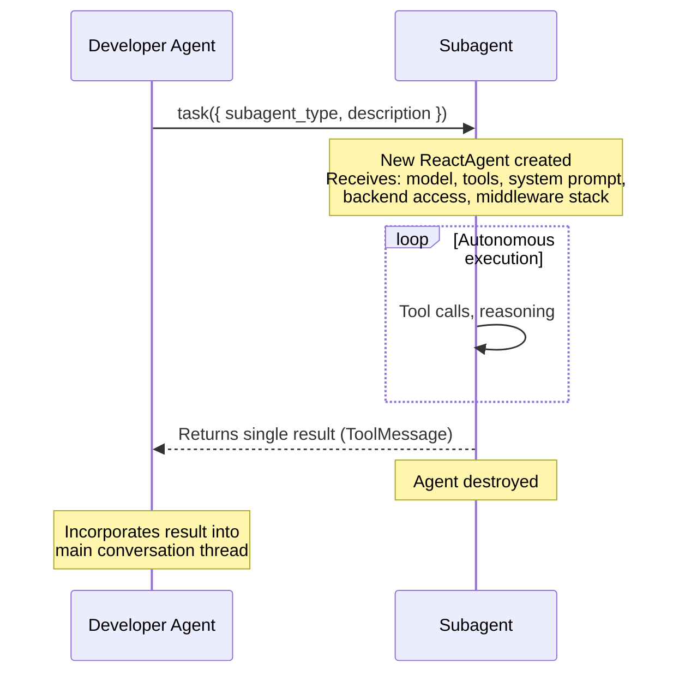

CodeBuddy's Developer Agent does not attempt every task alone. It operates as a **project manager**, delegating complex subtasks to **9 specialized subagents** — each defined using the [`SubAgent` interface](https://github.com/langchain-ai/deepagentsjs) from the `deepagents` package. Subagent spawning is a core Deep Agents primitive, implemented via `SubAgentMiddleware` which injects a `task` tool into the main agent.

This page covers the delegation mechanism, each subagent's capabilities, and how they collaborate.

## How delegation works

Delegation is **LLM-driven**, not rule-based. The `SubAgentMiddleware` from Deep Agents injects a `task` tool that the Developer Agent calls to spawn short-lived subagents on demand:

```typescript
// The task tool — provided by deepagents SubAgentMiddleware
task({
  subagent_type: "debugger",
  description:
    "Investigate the TypeError in auth.service.ts line 42. Check the stack trace, identify the root cause, and suggest a fix.",
});
```

Each subagent is defined using the Deep Agents `SubAgent` interface:

```typescript
import { SubAgent } from "deepagents";

const debuggerSubagent: SubAgent = {
  name: "debugger",
  description: "Root-cause analysis and error investigation with DAP access",
  systemPrompt: "You are a debugging expert specializing in...",
  tools: [...ToolProvider.getToolsForRole("debugger"), ...mcpTools],
  model, // Same model as the parent agent
};
```

The `task` tool accepts two parameters:

| Parameter       | Description                                                                            |
| --------------- | -------------------------------------------------------------------------------------- |
| `subagent_type` | Name of the subagent to invoke (e.g. `debugger`, `tester`, `architect`)                |
| `description`   | Self-contained instructions with enough context for the subagent to work independently |

The LLM can issue **multiple `task` calls in parallel** when subtasks are independent — for example, delegating to `tester` and `reviewer` simultaneously after implementing a feature.

### When to delegate

The Developer Agent's system prompt includes explicit guidance:

> Use the `task` tool when a task is complex and multi-step, can be fully delegated in isolation, requires focused reasoning, or when sandboxing improves reliability.

> Do **not** delegate trivial tasks (a few tool calls), tasks where you need to see intermediate steps, or where splitting adds latency without benefit.

## Subagent lifecycle



Key characteristics:

- **Ephemeral** — Each subagent is created for a single task and destroyed after returning its result.
- **Independent state** — Subagents do not share conversation state with the parent. They receive only the context passed in the `description` parameter. This is Deep Agents' **context isolation** pattern — keeping the main agent's context clean.
- **Shared infrastructure** — All subagents access the same `CompositeBackend`, giving them read/write access to the workspace filesystem (`/workspace/`), persistent docs (`/docs/`), and session storage (`/`).
- **MCP tools included** — Every subagent receives all loaded MCP tools alongside its role-specific tools.
- **Deep Agents middleware** — Each subagent automatically receives its own middleware stack from the `deepagents` runtime: `todoListMiddleware` (task planning), `filesystemMiddleware` (file access), `summarizationMiddleware` (context management), and `patchToolCallsMiddleware` (tool call normalization).
- **Skills isolation** — Per Deep Agents' design, the general-purpose subagent inherits skills from the parent agent. Custom subagents do **not** inherit skills unless explicitly configured.

## Subagent reference

### code-analyzer

Code review, bug detection, and architecture analysis. Reads code, runs diagnostics, and searches for patterns across the codebase.

**Tools**: `ripgrep_search`, `get_diagnostics`, `search_symbols`, `list_files`, `search_vector_db`, `manage_tasks`, `manage_core_memory`, `compose_files`, `browser`, `git`, + MCP tools

**System prompt directives**:

1. Always read files completely before analyzing
2. Use grep to find related code and dependencies
3. Consider edge cases and error handling
4. Provide specific, actionable recommendations
5. Save analysis results to `/docs/code-reviews/` for future reference

### doc-writer

Technical documentation specialist. Creates API references, ADRs, tutorials, and guides. Writes output to `/docs/` for cross-session persistence.

**Tools**: `edit_file`, `ripgrep_search`, `search_symbols`, `list_files`, `compose_files`, `search_vector_db`, `standup_intelligence`, `team_graph`, `git`, `browser`, + MCP tools

**System prompt directives**:

- Use markdown formatting with tables of contents for long documents
- Include code examples with explanations
- Link to related documentation and add version information
- **Always** save documentation to `/docs/` for persistence

### debugger

Root-cause analysis and error investigation. Has exclusive access to the Debug Adapter Protocol (DAP) for inspecting live debug sessions.

**Tools**: `debug_get_state`, `debug_get_stack_trace`, `debug_get_variables`, `debug_evaluate`, `debug_control`, `edit_file`, `ripgrep_search`, `get_diagnostics`, `list_files`, `browser`, + MCP tools

**Debug tools detail**:

| Tool                    | DAP request                                      | What it does                                  |
| ----------------------- | ------------------------------------------------ | --------------------------------------------- |
| `debug_get_state`       | `threads`                                        | Lists all threads and their current state     |
| `debug_get_stack_trace` | `stackTrace`                                     | Returns the call stack for a thread           |
| `debug_get_variables`   | `scopes` → `variables`                           | Reads variables in a stack frame              |
| `debug_evaluate`        | `evaluate` (REPL context)                        | Evaluates an expression against a stack frame |
| `debug_control`         | `next`, `stepIn`, `stepOut`, `continue`, `pause` | Controls execution flow                       |

All debug tools require an active debug session (`vscode.debug.activeDebugSession`). If no session is active, the tools return an error message and the subagent will inform the user.

**System prompt directives**:

1. Analyze error messages and stack traces carefully
2. Check `/docs/troubleshooting/` for known issues
3. Search the web for solutions if needed
4. Test potential fixes systematically
5. Document the solution in `/docs/troubleshooting/`

### file-organizer

Directory restructuring, file moves/renames, and import path updates.

**Tools**: `edit_file`, `manage_terminal`, `ripgrep_search`, `list_files`, `compose_files`, `git`, + MCP tools

**System prompt directives**:

1. Explore current structure with `list_files` before making changes
2. Use `ripgrep_search` to find all file references and imports
3. Plan the new structure before executing
4. Execute moves carefully, checking dependencies
5. Update all affected import paths

### architect

System design, pattern selection, and trade-off analysis. Produces Architecture Decision Records (ADRs) and design documents.

**Tools**: `think`, `ripgrep_search`, `search_symbols`, `list_files`, `search_vector_db`, `manage_core_memory`, `manage_tasks`, `standup_intelligence`, `team_graph`, `open_web_preview`, `git`, `browser`, + MCP tools

**System prompt directives**:

1. Analyze requirements and existing codebase
2. Identify architectural drivers (performance, scalability, etc.)
3. Propose high-level design and data flow
4. Document decisions using ADRs
5. Create diagrams or schemas when helpful

### reviewer

Senior code reviewer focusing on quality, security, and standards enforcement.

**Tools**: `get_diagnostics`, `ripgrep_search`, `search_symbols`, `list_files`, `search_vector_db`, `standup_intelligence`, `team_graph`, `git`, + MCP tools

**System prompt directives**:

1. Read code changes thoroughly
2. Check for potential bugs and edge cases
3. Verify adherence to project style guides
4. Provide constructive and specific feedback
5. Suggest concrete improvements or refactorings

### tester

QA automation engineer. Designs test strategies, writes tests, executes them, and analyzes failures.

**Tools**: `run_tests`, `edit_file`, `manage_terminal`, `ripgrep_search`, `get_diagnostics`, `list_files`, `search_vector_db`, `open_web_preview`, `git`, `browser`, + MCP tools

**System prompt directives**:

1. Analyze the code under test
2. Identify test cases including edge cases
3. Write or update test files
4. Run tests using the terminal
5. Analyze output and fix any failures

### architecture-expert

Codebase structure Q&A grounded in static analysis data. Unlike the `architect` (which designs new systems), this subagent answers questions about the **existing** codebase using pre-computed analysis.

**Tools**: `get_architecture_knowledge`, `ripgrep_search`, `search_symbols`, `list_files`, `search_vector_db`, `think`, + MCP tools

The `get_architecture_knowledge` tool queries `PersistentCodebaseUnderstandingService` and returns structured markdown covering:

| Section      | Data returned                                              |
| ------------ | ---------------------------------------------------------- |
| `overview`   | Project type, entry points, frameworks, file count         |
| `patterns`   | Detected architectural patterns with confidence scores     |
| `call-graph` | Import graph stats, dependency hubs, circular dependencies |
| `middleware` | Auth strategies, middleware chain, error handlers          |
| `endpoints`  | API routes with HTTP method, path, source file             |
| `models`     | Data models with property names                            |
| `all`        | Everything above (capped at 12,000 characters)             |

Output is capped to prevent context overflow (max 5 patterns, 8 hot nodes, 15 endpoints, 10 models). If no analysis is available, it suggests running the `CodeBuddy: Ask About Codebase` command.

**System prompt directives**:

- **Always** call `get_architecture_knowledge` first — never guess about architecture
- Present findings with confidence levels where available
- Use search/read tools for additional detail on specific files
- Suggest actionable improvements when relevant

### general-purpose

Auto-included by the `deepagents` runtime via `SubAgentMiddleware`. This is the default subagent that Deep Agents provides — a generalist agent that receives **all** tools from the parent agent, including skills. It is not defined in `createDeveloperSubagents()` — the runtime adds it automatically.

> General-purpose agent for researching complex questions, searching for files and content, and executing multi-step tasks. Use when you are not confident the right match will be found in the first few tries.

Per Deep Agents' skills inheritance model, the general-purpose subagent inherits all skills configured on the parent agent, while custom subagents (the 8 specialists above) do not inherit skills unless explicitly configured.

## Tool role mapping

Each subagent receives a filtered subset of tools based on pattern matching against tool names. The `ToolProvider.getToolsForRole()` method filters the full tool list:

```typescript
const TOOL_ROLE_MAPPING: Record<string, string[]> = {
  "code-analyzer": ["analyze", "lint", "security", "complexity", "quality",
    "ast", "parse", "check", "scan", "review",  "search",
    "run_tests", "edit_file", "browser", ...],
  ...
};
```

The filtering process:

1. Look up patterns for the subagent's role name
2. Filter tools where `toolName.toLowerCase()` contains any pattern (case-insensitive substring match)
3. Append all MCP tools (always included for every subagent)
4. Deduplicate by tool name
5. Apply `PermissionScopeService` filtering (respects active security profile)
6. If no matches found, fall back to all non-MCP core tools

## Collaboration playbooks

The Developer Agent follows predefined workflows depending on the task type:

### New feature development

```
Architect  →  Reviewer (optional)  →  Developer Agent  →  Tester  →  Reviewer
    │               │                        │                │           │
    Design          Validate design          Implement        Test        Final review
```

### Complex bug fix

```
Debugger  →  Developer Agent  →  Tester
    │               │                │
    Root cause      Apply fix        Regression tests
```

### Refactoring

```
Code Analyzer  →  Architect  →  File Organizer  →  Developer Agent  →  Tester
      │               │              │                     │                │
      Identify         Propose        Restructure           Update logic     Verify
```

The Developer Agent can also compose ad-hoc workflows — the playbooks are guidance, not hard constraints. The LLM decides the actual delegation sequence based on the user's request.

## Parallel execution

The Developer Agent is instructed to parallelize independent work:

> Whenever you have independent steps to complete — make tool calls, or kick off tasks (subagents) in parallel to accomplish them faster.

For example, after implementing a feature, the agent may simultaneously delegate to `tester` (write tests) and `reviewer` (review the code). Each spawned subagent is an independent `ReactAgent` instance that runs concurrently.

Top-level agent stream concurrency is managed by `ConcurrencyQueueService` (configurable via `codebuddy.agent.maxConcurrentStreams`, default 3). Subagent concurrency operates at the LLM tool-call level within a single stream.

## Error handling

Subagent errors are handled through layered mechanisms:

1. **Tool-level** — Each tool catches errors and returns descriptive error strings. The subagent sees the error and can retry or try an alternative approach.
2. **Subagent autonomy** — As full `ReactAgent` instances, subagents have their own agentic loop. They can reason about failures and adapt.
3. **Result propagation** — If a subagent fails entirely, the error is returned as the `task` tool result. The Developer Agent sees this and can:
   - Delegate to a different subagent
   - Attempt the task directly
   - Ask the user for guidance
4. **No automatic retry** — There is no programmatic retry at the delegation level. The Developer Agent's LLM decides what to do with failed results.

## Configuration

### Enable or disable subagents

Subagents are enabled by default. To disable the entire subagent system:

```typescript
// In ICodeBuddyAgentConfig
enableSubAgents: false; // Defaults to true
```

### Toggle individual subagents

Individual subagents can be toggled via settings or the webview UI:

```json
{
  "codebuddy.rules.subagents": {
    "code-analyzer": { "enabled": true },
    "doc-writer": { "enabled": true },
    "debugger": { "enabled": true },
    "file-organizer": { "enabled": false }
  }
}
```

The webview rules panel exposes toggles for code-analyzer, doc-writer, debugger, and file-organizer. The remaining subagents (architect, reviewer, tester, architecture-expert, general-purpose) are always active.

## Next steps

- [Multi-Agent Architecture](/concepts/architecture/) — System-level view of the agent, storage, and event pipeline
- [Tools](/concepts/tools/) — Complete list of built-in tools and how they are assigned
- [Self-Healing Execution](/concepts/self-healing/) — How the safety guard and error recovery interact with subagent execution
