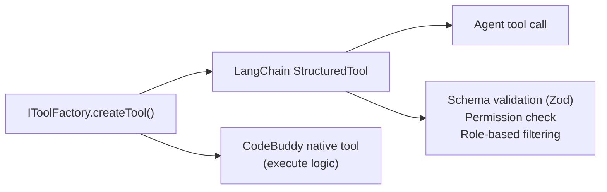

CodeBuddy ships with 27+ tools that give it the ability to read, write, search, execute, debug, and automate across your development environment. These extend the built-in [Deep Agents](https://github.com/langchain-ai/deepagentsjs) file system tools (`ls`, `read_file`, `write_file`, `edit_file`, `glob`, `grep`) provided by `FilesystemMiddleware`.

Tools are managed by the `ToolProvider` singleton, which initializes core tools at startup, lazily loads MCP tools in the background, and enforces permission scoping before any tool reaches an agent. All tools follow the LangChain `StructuredTool` format that the `deepagents` runtime expects.

## Tool provider architecture

The `ToolProvider` follows a factory pattern. Each tool is created by an `IToolFactory` implementation that produces a LangChain `StructuredTool` wrapper around a CodeBuddy-native tool class:



### Initialization flow

1. **`ToolProvider.initialize()`** — Factory pattern creates 22 core tools, deduplicating by name.
2. **`loadMCPToolsLazy()`** — Non-blocking background fetch from configured MCP servers. Does not block extension startup.
3. **`getToolsForRole(role)`** — Pattern-matches tool names against the role's allowed patterns from `TOOL_ROLE_MAPPING`.
4. **`PermissionScopeService`** — Strips tools that the active security profile disallows.
5. **Tool execution** — LangChain invokes the tool wrapper, which calls the native `execute()` method.

## Core tool reference

### File operations

| Tool            | Parameters                                                                | Description                                                                                                       |
| --------------- | ------------------------------------------------------------------------- | ----------------------------------------------------------------------------------------------------------------- |
| `read_files`    | `filePath`, `class_name?`, `function_name?`                               | Read file contents with optional symbol filtering. Validates paths stay within workspace boundaries.              |
| `edit_file`     | `filePath`, `mode: overwrite\|replace`, `content?`, `search?`, `replace?` | Edit files with safe text replacement mode or full overwrite. Search/replace mode ensures precise targeted edits. |
| `compose_files` | `label`, `edits: [{filePath, mode, content?, search?, replace?}]`         | Atomic multi-file editing. Groups edits under a label for review and applies them as a batch.                     |
| `list_files`    | `dirPath?`                                                                | List directory contents with type indicators (file/folder).                                                       |

### Search

| Tool               | Parameters                                                                         | Description                                                                                                                         |
| ------------------ | ---------------------------------------------------------------------------------- | ----------------------------------------------------------------------------------------------------------------------------------- |
| `ripgrep_search`   | Pattern, glob, extra args                                                          | Fast regex and text search across the codebase using ripgrep.                                                                       |
| `search_symbols`   | LSP-based query                                                                    | Language-aware symbol search using the editor's built-in language server protocol. Finds function definitions, classes, interfaces. |
| `search_vector_db` | `query: string`                                                                    | Semantic search over indexed codebase chunks via the embedded vector store.                                                         |
| `travily_search`   | `query`, `maxResults?` (default 5), `includeRawContent?`, `timeout?` (default 30s) | Web search via the Tavily API. Returns formatted snippets with source URLs.                                                         |

### Execution

| Tool                   | Parameters                                                                    | Description                                                                                            |
| ---------------------- | ----------------------------------------------------------------------------- | ------------------------------------------------------------------------------------------------------ |
| `run_terminal_command` | `command`, `background?`                                                      | Execute a shell command. Background mode returns immediately for long-running processes like servers.  |
| `manage_terminal`      | `action: start\|execute\|read\|terminate`, `sessionId`, `command?`, `waitMs?` | Persistent terminal sessions with state. Start a session, execute commands, read output, or terminate. |
| `run_tests`            | Test framework native args                                                    | Run test suites using the project's configured test runner. Returns structured pass/fail results.      |

### Debugging

Five tools provide full integration with the Debug Adapter Protocol (DAP):

| Tool                    | Parameters                                                         | Description                                                         |
| ----------------------- | ------------------------------------------------------------------ | ------------------------------------------------------------------- |
| `debug_get_state`       | —                                                                  | Get current debugger session state and active threads.              |
| `debug_get_stack_trace` | `threadId`, `startFrame`, `levels`                                 | Get the call stack for a specific thread.                           |
| `debug_get_variables`   | `frameId?`, `threadId?`                                            | Get scoped variables (local, closure, global) for a stack frame.    |
| `debug_evaluate`        | `expression`, `frameId?`                                           | Evaluate an expression in the context of the current debug session. |
| `debug_control`         | `action: stepOver\|stepInto\|stepOut\|continue\|pause`, `threadId` | Control debugger execution flow.                                    |

### Browser automation

| Tool               | Parameters                                                                  | Description                                                                                                                                                                                                    |
| ------------------ | --------------------------------------------------------------------------- | -------------------------------------------------------------------------------------------------------------------------------------------------------------------------------------------------------------- |
| `browser`          | `action`, `url?`, `ref?`, `text?`, `value?`, `expression?`, `key?`, `time?` | Headless browser automation via Playwright. Supports `navigate`, `click`, `type`, `screenshot`, `snapshot`, `evaluate`, `hover`, `select_option`, `press_key`, `wait`, tab management, and navigation history. |
| `open_web_preview` | `url`                                                                       | Open a URL in the editor's built-in browser panel for visual preview.                                                                                                                                          |

### Knowledge and reasoning

| Tool                         | Parameters                                                                                   | Description                                                                                                                                                      |
| ---------------------------- | -------------------------------------------------------------------------------------------- | ---------------------------------------------------------------------------------------------------------------------------------------------------------------- |
| `think`                      | `thought: string`                                                                            | Structured reasoning tool. The agent uses this to plan, reflect, and reason through complex problems before acting. Output is passed through to the LLM context. |
| `manage_core_memory`         | `action: add\|update\|delete\|search`, `memory: {content, category, title, scope}`, `query?` | Persistent cross-session memory. See [Memory system](/concepts/memory/).                                                                                         |
| `manage_tasks`               | `action: add\|update\|list`, `task: {id?, content?, status?, priority?}`                     | Task/TODO list management for tracking progress on multi-step work.                                                                                              |
| `get_architecture_knowledge` | `section?: all\|overview\|patterns\|call-graph\|middleware\|endpoints\|models`               | Retrieve codebase architecture insights from static analysis. Returns structured data about patterns, dependency graph, entry points, etc. (12K char limit).     |

### Integrations

| Tool                   | Parameters                                                                                                                                                  | Description                                                                                                                 |
| ---------------------- | ----------------------------------------------------------------------------------------------------------------------------------------------------------- | --------------------------------------------------------------------------------------------------------------------------- |
| `git`                  | Git native operations                                                                                                                                       | Git operations — status, log, diff, branch, commit, and more.                                                               |
| `get_diagnostics`      | Editor diagnostics API                                                                                                                                      | Retrieve compiler errors, linter warnings, and other diagnostics from the editor's language services.                       |
| `standup_intelligence` | `operation: ingest\|my_tasks\|blockers\|history`, `args: {notes?, person?, dateRange?}`                                                                     | Parse and query standup meeting notes. Extracts tasks, blockers, and action items.                                          |
| `team_graph`           | `operation: person_profile\|top_collaborators\|recurring_blockers\|completion_trends\|ticket_history\|team_health\|team_summary`, `args: {person?, limit?}` | Team collaboration analytics knowledge graph. Tracks who works on what, collaboration patterns, and task completion trends. |

### MCP tools

Any tool exposed by a connected MCP server is dynamically loaded and available as a `LangChainMCPTool`. MCP tools are added to every subagent unconditionally. See [MCP integration](/concepts/mcp/) for configuration details.

## Role-based tool filtering

Each [subagent](/concepts/architecture/#subagent-pool) receives a filtered subset of tools based on its role. The `TOOL_ROLE_MAPPING` maps role names to arrays of tool name patterns:

| Role                    | Tool patterns                                                                                              |
| ----------------------- | ---------------------------------------------------------------------------------------------------------- |
| **code-analyzer**       | `analyze`, `lint`, `security`, `search`, `terminal`, `ripgrep_search`, `get_diagnostics`, `git`, `browser` |
| **doc-writer**          | `search`, `read`, `web`, `edit_file`, `compose_files`, `standup_intelligence`, `team_graph`, `browser`     |
| **debugger**            | `debug_*`, `analyze`, `read`, `search`, `terminal`, `edit_file`, `get_diagnostics`, `browser`              |
| **file-organizer**      | `file`, `directory`, `terminal`, `git`, `list_files`, `edit_file`, `compose_files`                         |
| **architect**           | `search`, `think`, `standup_intelligence`, `team_graph`, `manage_core_memory`, `browser`                   |
| **reviewer**            | `analyze`, `lint`, `review`, `git`, `get_diagnostics`, `search_symbols`, `standup_intelligence`            |
| **tester**              | `terminal`, `run_tests`, `edit_file`, `get_diagnostics`, `browser`                                         |
| **architecture-expert** | `get_architecture_knowledge`, `search`, `ripgrep_search`, `search_vector_db`                               |

MCP tools bypass role filtering — they are added to all subagents regardless of role.

## Permission enforcement

Before tools are handed to any agent, the `PermissionScopeService` filters them based on the active security profile:

| Profile        | Allowed tools                 | Behavior                                                                                                                                                     |
| -------------- | ----------------------------- | ------------------------------------------------------------------------------------------------------------------------------------------------------------ |
| **restricted** | Read-only tools only          | `read_file`, `search_files`, `list_files`, `search_vector_db`, `get_diagnostics`, `think`, `travily_search` and similar. No writes, no terminal, no browser. |
| **standard**   | Read/write with safe terminal | All read-only tools plus `edit_file`, `write_file`, `git`, `run_terminal_command`, etc. Dangerous command patterns blocked. **This is the default profile.** |
| **trusted**    | All tools                     | Full access with auto-approval for all operations.                                                                                                           |

### Dangerous command patterns

The following command patterns are blocked in the `standard` profile. They are blocked unconditionally (in all profiles, including `trusted`) when they match catastrophic patterns:

| Category                  | Examples                                 |
| ------------------------- | ---------------------------------------- |
| **Destructive**           | `rm -rf /`, `rmdir /`                    |
| **Disk**                  | `mkfs`, `dd of=/dev/`                    |
| **Fork bomb**             | `:(){ :\|: & };:`                        |
| **Remote code execution** | `curl ... \| bash`, `wget ... \| python` |
| **Privilege escalation**  | `chmod 777`, `chown root`                |
| **Exfiltration**          | `eval $...`                              |

Custom deny patterns can be configured per-workspace in `.codebuddy/permissions.json`:

```json
{
  "profile": "standard",
  "commandDenyPatterns": ["docker rm", "kubectl delete"],
  "toolBlocklist": ["browser"]
}
```

## Next steps

- [Multi-Agent Architecture](/concepts/architecture/) — How tools are distributed to specialized subagents
- [MCP integration](/concepts/mcp/) — Adding custom tools via MCP servers
- [Security](/admin/security/) — Permission profiles and access control
