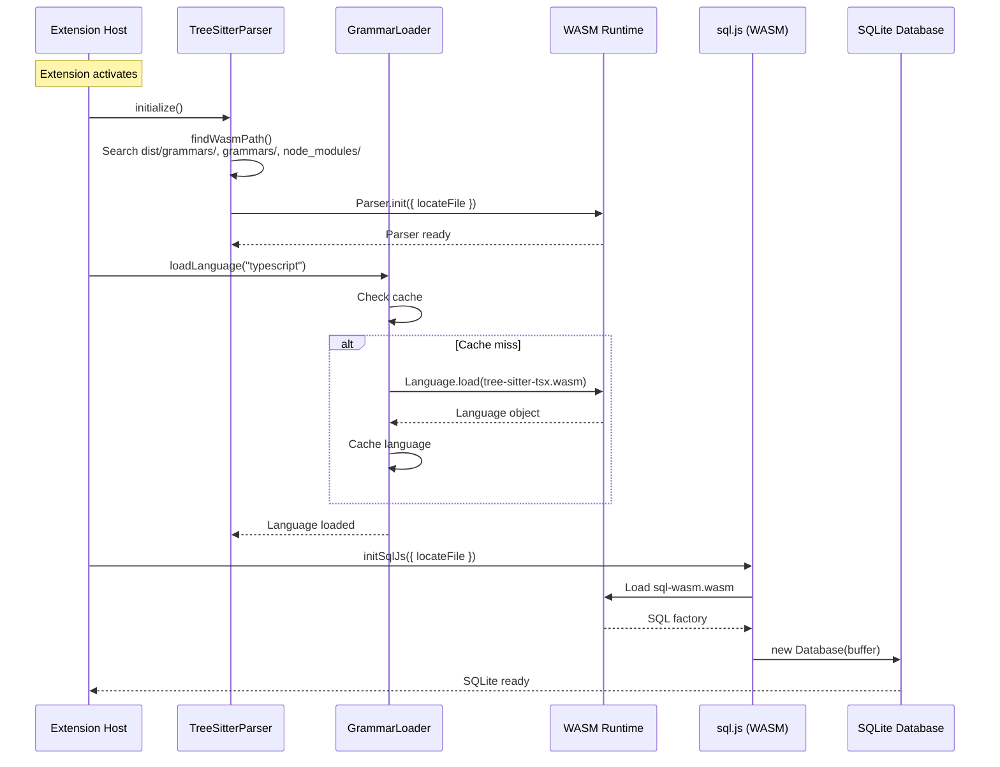
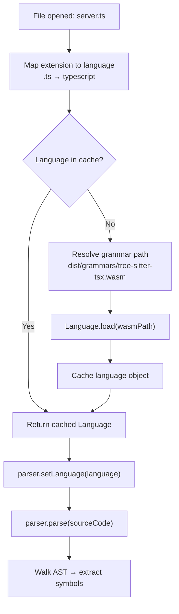
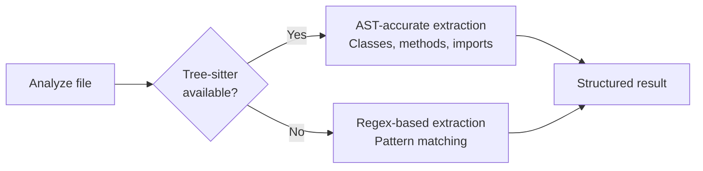
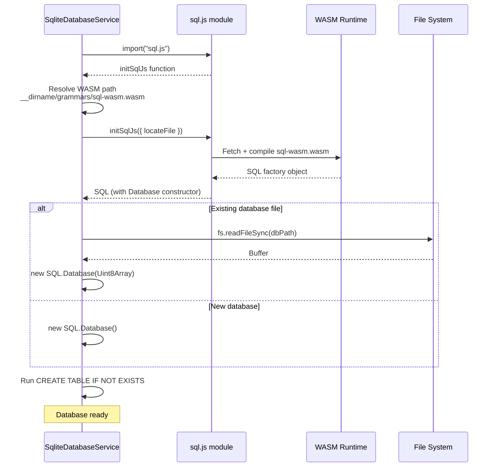

CodeBuddy uses WebAssembly in two critical subsystems: **Tree-sitter** for AST-accurate code parsing across 7 languages, and **sql.js** for in-process SQLite databases. Both run entirely in the Node.js runtime without native binary dependencies, making the extension portable across macOS, Linux, and Windows without platform-specific builds.

## Why WASM

Extensions are distributed as `.vsix` packages that must work on any platform. Native Node.js addons (`better-sqlite3`, native tree-sitter bindings) require platform-specific compilation — a non-starter for a marketplace extension.

WASM solves this:

| Approach        | Platform builds | Install friction                           | Performance                       |
| --------------- | --------------- | ------------------------------------------ | --------------------------------- |
| Native addon    | 6+ (os × arch)  | Requires `node-gyp`, Python, C++ toolchain | Fastest                           |
| Pure JavaScript | 1               | None                                       | Slowest (10–100x)                 |
| **WASM**        | **1**           | **None**                                   | **Near-native (1.2–2x overhead)** |

## Architecture



## Tree-sitter WASM grammars

[Tree-sitter](https://tree-sitter.github.io/tree-sitter/) is an incremental parsing framework that produces concrete syntax trees. CodeBuddy uses the `web-tree-sitter` WASM binding — the same Tree-sitter C library compiled to WebAssembly.

### Supported languages

| Grammar file                  | Languages       | File extensions               | Used for                                                              |
| ----------------------------- | --------------- | ----------------------------- | --------------------------------------------------------------------- |
| `tree-sitter-javascript.wasm` | JavaScript      | `.js`, `.jsx`, `.mjs`, `.cjs` | Functions, classes, methods, Express/Fastify routes                   |
| `tree-sitter-tsx.wasm`        | TypeScript, TSX | `.ts`, `.tsx`, `.mts`, `.cts` | Functions, classes, methods, NestJS decorators, React components      |
| `tree-sitter-python.wasm`     | Python          | `.py`                         | Functions, classes, FastAPI/Flask/Django routes                       |
| `tree-sitter-java.wasm`       | Java            | `.java`                       | Methods, classes, Spring/JAX-RS annotations                           |
| `tree-sitter-go.wasm`         | Go              | `.go`                         | Functions, structs, Gin/Chi/Echo handlers                             |
| `tree-sitter-rust.wasm`       | Rust            | `.rs`                         | Functions, structs, Actix/Axum/Rocket macros                          |
| `tree-sitter-php.wasm`        | PHP             | `.php`, `.phtml`              | Functions, classes, interfaces, traits, enums, Laravel/Symfony routes |

### Grammar loading

Grammars are loaded lazily — only when a file of that language is first encountered:



The `GrammarLoader` is a singleton that caches loaded `Language` objects. Once a grammar is loaded, subsequent parses for that language skip the WASM loading entirely.

### WASM path resolution

The parser searches for the core `tree-sitter.wasm` runtime in multiple locations to handle different bundling strategies:

1. `dist/grammars/tree-sitter.wasm` — standard webpack/esbuild output
2. `grammars/tree-sitter.wasm` — development layout
3. `out/grammars/tree-sitter.wasm` — alternative build output
4. `node_modules/web-tree-sitter/tree-sitter.wasm` — unbundled fallback

The `locateFile` callback ensures `Parser.init()` finds the WASM binary regardless of how the extension is packaged.

### What Tree-sitter extracts

For each parsed file, the `TreeSitterAnalyzer` walks the AST and extracts:

| Element              | Details extracted                                                                                                |
| -------------------- | ---------------------------------------------------------------------------------------------------------------- |
| **Classes**          | Name, type (class/interface/struct/trait/enum), extends, implements, methods, properties, decorators, line range |
| **Functions**        | Name, parameters, return type, exported, async, decorators, start line                                           |
| **Methods**          | Name, parameters, return type, visibility (public/private/protected), static, async, decorators                  |
| **Endpoints**        | HTTP method, path, handler function, file, line — detected via framework-specific regex patterns per language    |
| **Imports**          | Source module, specifiers, default/namespace flags                                                               |
| **Exports**          | Exported symbol names                                                                                            |
| **React components** | Detected as classes with JSX return types                                                                        |

### Parser pool

The `TreeSitterAnalyzer` maintains a **per-language parser pool** to avoid re-creating parsers:

```
ParserPool = Map<language, { available: Parser[], inUse: Set<Parser> }>
```

When analyzing multiple files of the same language concurrently, parsers are checked out from the pool and returned after use. This avoids the overhead of `new Parser()` + `setLanguage()` for every file.

### Fallback strategy

If WASM loading fails (missing file, unsupported platform, memory constraint), both the `AstAnalyzerWorker` and `TreeSitterAnalyzer` fall back to regex-based extraction. The regex analyzers cover the same languages but produce less accurate results — they can't handle nested structures, multi-line signatures, or language-specific edge cases.



This ensures CodeBuddy always produces analysis results, even in constrained environments.

## sql.js (SQLite in WASM)

CodeBuddy uses [sql.js](https://sql.js.org/) — SQLite compiled to WebAssembly — for all persistent storage. This gives full SQL capabilities without requiring a native SQLite binary.

### Databases

| Database file                     | Service                       | Purpose                                                |
| --------------------------------- | ----------------------------- | ------------------------------------------------------ |
| `.codebuddy/codebase_analysis.db` | `SqliteDatabaseService`       | Codebase snapshots, git state tracking                 |
| `.codebuddy/vector_store.db`      | `SqliteVectorStore`           | Vector embeddings, FTS4 full-text index, file metadata |
| `.codebuddy/chat_history.db`      | `ChatHistoryRepository`       | Chat messages, sessions, summaries                     |
| `.codebuddy/telemetry.db`         | `TelemetryPersistenceService` | OpenTelemetry spans, metrics                           |
| `.codebuddy/checkpoints.db`       | `SqljsCheckpointSaver`        | LangGraph state checkpoints                            |
| `.codebuddy/team_graph.db`        | `TeamGraphStore`              | Team collaboration graph (people, expertise, blockers) |

### WASM initialization



Each service is a **singleton** — initialized once on extension activation, shared across all consumers.

### Vector storage

The `SqliteVectorStore` stores embedding vectors as binary BLOBs (`Float32Array` → `Buffer`) for space efficiency:

| Column      | Type    | Purpose                                     |
| ----------- | ------- | ------------------------------------------- |
| `id`        | TEXT    | Chunk identifier (`filePath::offset`)       |
| `text`      | TEXT    | Source code chunk text                      |
| `vector`    | BLOB    | Float32 embedding (3,072 bytes for 768-dim) |
| `filePath`  | TEXT    | Source file path                            |
| `startLine` | INTEGER | Chunk start line                            |
| `endLine`   | INTEGER | Chunk end line                              |
| `chunkType` | TEXT    | `function`, `class`, `method`, `text_chunk` |
| `language`  | TEXT    | Programming language                        |

An FTS4 virtual table is auto-synced via SQLite triggers for keyword search, and cosine similarity is computed in JavaScript with event-loop yielding for large result sets.

### Persistence strategy

Databases use a **dirty-flag debounce** pattern:

1. Any write sets `isDirty = true`
2. A 5-second debounce timer starts (or resets if already running)
3. When the timer fires, the full database is serialized (`db.export()`) and written to disk
4. On extension deactivation, a final flush ensures no data is lost

This batches rapid writes (e.g., indexing 200 files) into a single disk write.

### Memory considerations

sql.js databases run entirely in memory — the WASM SQLite engine operates on an in-memory buffer. This means:

- **Fast reads**: No disk I/O for queries
- **Memory proportional to data**: A 50MB vector store uses ~50MB of heap
- **Serialization cost**: `db.export()` copies the entire database to a `Uint8Array` for disk writes
- **No WAL mode**: The in-memory model doesn't support SQLite's Write-Ahead Log; concurrency is handled at the JavaScript level via singletons and the chat history worker's concurrency guard

## WASM in worker threads

Tree-sitter WASM runs in both the main thread and worker threads:

| Context                  | Service              | WASM modules loaded                           |
| ------------------------ | -------------------- | --------------------------------------------- |
| Main thread              | `TreeSitterParser`   | `tree-sitter.wasm` + language grammars        |
| Codebase Analysis Worker | `TreeSitterAnalyzer` | `tree-sitter.wasm` + language grammars        |
| AST Analyzer Worker      | `web-tree-sitter`    | `tree-sitter.wasm` (grammar loading optional) |

Each worker initializes its own WASM instance — WASM memory is not shared across threads. The `grammarsPath` is passed via `workerData` so workers can locate the `.wasm` files relative to the extension's install directory.

### Disposal

WASM memory is not automatically garbage-collected by V8. CodeBuddy explicitly disposes Tree-sitter resources:

- `TreeSitterAnalyzer.dispose()` is called in a `finally` block after analysis completes
- Parser pool entries are cleaned up on service deactivation
- Worker termination (`worker.terminate()`) releases all WASM memory allocated by that worker

## Bundling

The `.wasm` files are included in the extension's `dist/grammars/` directory during the build:

```
dist/
  grammars/
    tree-sitter.wasm          # Core Tree-sitter runtime (~400KB)
    tree-sitter-javascript.wasm
    tree-sitter-tsx.wasm
    tree-sitter-python.wasm
    tree-sitter-java.wasm
    tree-sitter-go.wasm
    tree-sitter-rust.wasm
    tree-sitter-php.wasm
    sql-wasm.wasm              # SQLite WASM runtime (~1.2MB)
```

These are excluded from the webpack/esbuild bundle (since they're loaded at runtime via `fs.readFileSync` or `fetch`) and instead copied as static assets during the build step.
