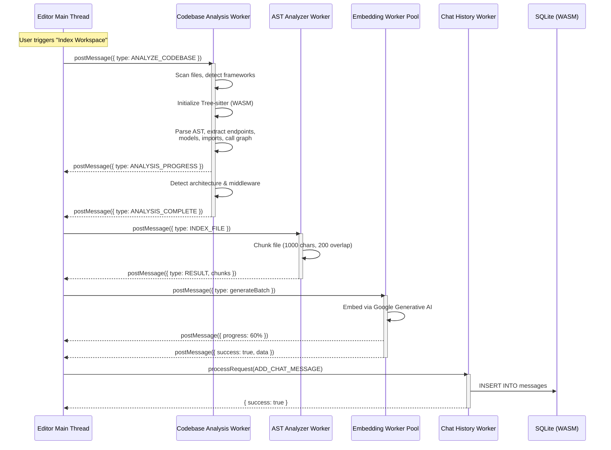
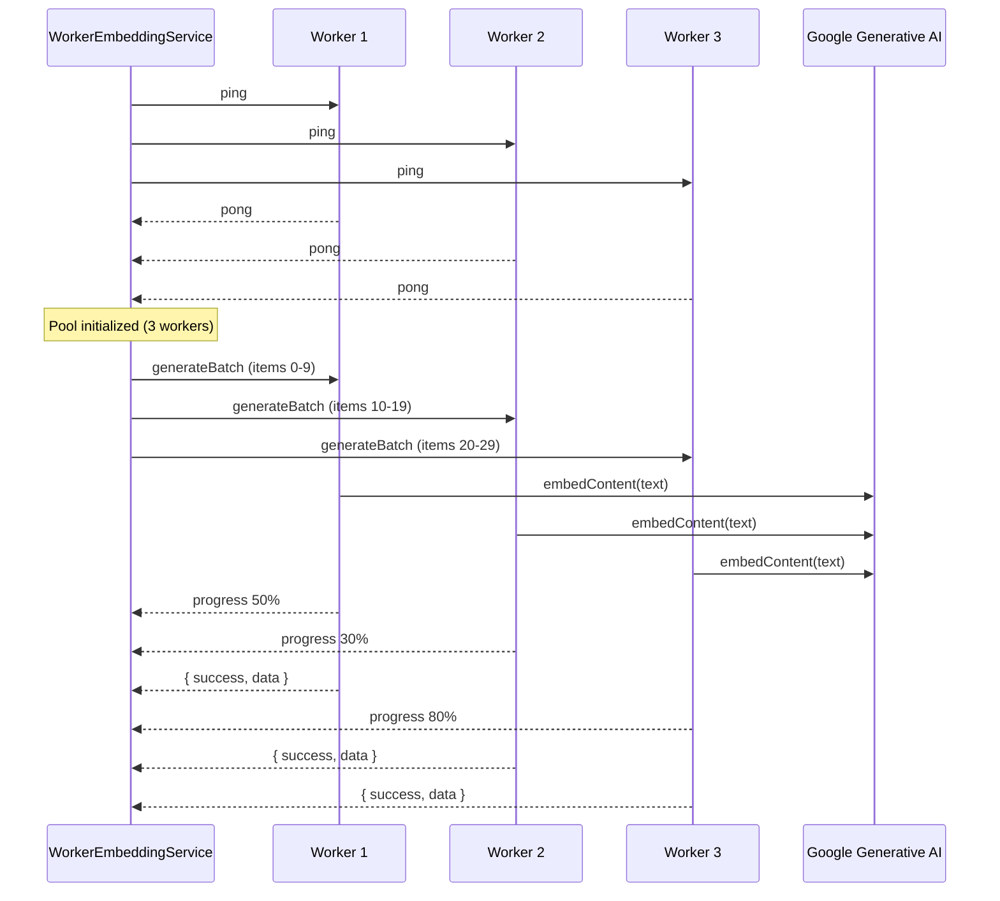
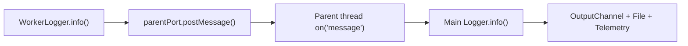

Worker threads are a core performance strategy in CodeBuddy. Every CPU-intensive operation — parsing, embedding, analysis, persistence — runs in a dedicated worker thread so the editor's extension host (main thread) never blocks.

## Why workers matter

Editors built on the VS Code extension API run on a single Node.js thread shared with language services, file watchers, and UI updates. Without workers, a codebase analysis scanning 2,000 files or an embedding pipeline processing 500 chunks would freeze the editor for seconds (or minutes).

CodeBuddy offloads all heavy computation to `worker_threads`, keeping the main thread free for:

- Responding to keystrokes and cursor movements
- Processing webview messages (chat panel)
- Handling file-system events
- Serving inline completions

## Architecture overview



## Worker inventory

CodeBuddy ships with four dedicated workers and one async-simulated worker:

| Worker                | File                                      | Thread type               | Purpose                                                                                                  |
| --------------------- | ----------------------------------------- | ------------------------- | -------------------------------------------------------------------------------------------------------- |
| **Codebase Analysis** | `src/workers/codebase-analysis.worker.ts` | `worker_threads`          | Full-project analysis: frameworks, dependencies, endpoints, models, architecture, call graph, middleware |
| **AST Analyzer**      | `src/workers/ast-analyzer.worker.ts`      | `worker_threads`          | File-level chunking for the vector index; Tree-sitter parsing with text-based fallback                   |
| **Embedding**         | `src/workers/embedding-worker.ts`         | `worker_threads` (pooled) | Embedding generation via Google Generative AI; round-robin worker pool                                   |
| **Vector DB**         | `src/workers/vector-db-worker.ts`         | Manager class             | LanceDB operations — indexing, search, deletion, stats (migrating from ChromaDB)                         |
| **Chat History**      | `src/services/chat-history-worker.ts`     | Async class               | SQLite-backed chat persistence — sessions, messages, summaries, cleanup                                  |

## Codebase Analysis Worker

The heaviest worker. Spawned when you run **CodeBuddy: Analyze Codebase** or when the auto-analysis system detects significant workspace changes.

### What it does

1. **Dependency analysis** — reads `package.json`, `requirements.txt`, `go.mod`, `Cargo.toml`, `pom.xml`, `composer.json`, `Pipfile`, `pyproject.toml`
2. **Framework detection** — identifies Express, NestJS, Fastify, Flask, Django, Spring, Gin, Actix, Laravel, and others from dependencies + code patterns
3. **File content analysis** — extracts API endpoints, data models, database schemas, code snippets, and import graphs using Tree-sitter or regex fallback
4. **Architecture detection** — classifies project type (monolith, microservices, CLI, library) and identifies patterns (MVC, hexagonal, event-driven)
5. **Call graph construction** — builds a directed graph of file imports to find entry points, hot nodes, and circular dependencies
6. **Middleware detection** — finds middleware chains, auth strategies (JWT, OAuth, Session, API Key), and error handlers

### Message protocol

```
Main Thread → Worker:
  { type: "ANALYZE_CODEBASE", payload: { workspacePath, files, grammarsPath } }
  { type: "CANCEL" }

Worker → Main Thread:
  { type: "ANALYSIS_PROGRESS", progress: { current, total, message } }
  { type: "ANALYSIS_COMPLETE", payload: AnalysisResult }
  { type: "ANALYSIS_ERROR", error: string }
  { type: "LOG", level, message, data }
```

### Memory management

The worker is careful about memory:

- Code snippets are capped at **30 files**, **75 lines**, and **3,000 characters** each
- Call graph data is explicitly disposed after extracting the summary (entry points, hot nodes, cycles)
- Import data arrays are zeroed after graph construction to reduce GC pressure
- Tree-sitter analyzer is disposed in a `finally` block to release WASM memory
- File paths are relativized at the serialization boundary to avoid leaking absolute paths into LLM context

### Cancellation

The service passes a `CancellationToken` to the worker. When the user cancels:

1. A `{ type: "CANCEL" }` message is posted
2. The worker checks `isCancelled` between analysis phases
3. The promise rejects and the worker cleans up

### Security

File path patterns use `[^\\/]*` instead of `.*` to prevent catastrophic backtracking on adversarial paths. TOML parsing uses a line-by-line state machine to avoid breaking URLs and quoted values containing `#`.

## AST Analyzer Worker

A lightweight worker that chunks files for the vector index. It receives individual files and returns an array of chunks.

### Chunking strategy

| Parameter       | Value                                        |
| --------------- | -------------------------------------------- |
| Chunk size      | 1,000 characters                             |
| Overlap         | 200 characters                               |
| Minimum chunk   | 50 characters (smaller chunks are discarded) |
| Chunk ID format | `{filePath}::{byteOffset}`                   |

Each chunk includes the start line, end line, type (`text_chunk` or AST-derived like `function`, `class`, `method`), and file path metadata.

### Tree-sitter integration

The worker initializes `web-tree-sitter` and attempts to load language-specific WASM grammars for AST-aware chunking. If WASM loading fails (path issues, unsupported language), it falls back to the text-based splitter — no data is lost, only the chunk boundaries are less precise.

### Message protocol

```
Main Thread → Worker:
  { type: "INDEX_FILE", data: { filePath, content } }

Worker → Main Thread:
  { type: "RESULT", data: { filePath, chunks[] } }
  { type: "ERROR", error: string }
```

## Embedding Worker Pool

The only worker that runs as a **pool** — up to `min(4, CPU cores)` workers running concurrently.

### Pool architecture



### How it works

1. **Initialization** — creates `min(4, os.cpus().length)` workers, each pre-loaded with the API key. All workers are pinged to verify they're alive.
2. **Task distribution** — uses **round-robin** assignment (`workerId % workers.length`). Each worker processes a batch independently.
3. **Batch processing** — each worker iterates through its batch sequentially, calling `embedContent()` with a 100ms delay between items to avoid rate-limiting.
4. **Progress reporting** — workers post progress messages during batch processing. The service aggregates these into overall progress (e.g., "batch 3/10 at 60%").
5. **Error isolation** — if one item fails, the worker logs the error and continues to the next. Only complete worker failures abort the batch.
6. **Timeout** — each task has a 30-second timeout. If a worker goes silent, the promise rejects.

### Message protocol

```
Main Thread → Worker:
  { type: "ping", payload: null }
  { type: "generateEmbeddings", payload: string }
  { type: "generateBatch", payload: IFunctionData[] }

Worker → Main Thread:
  { success: true, data: number[] | IFunctionData[] }
  { success: true, progress: number, data: { completed, total } }
  { success: false, error: string }
```

## Chat History Worker

Unlike the other workers, this doesn't use `worker_threads` — it's an async class that simulates worker semantics (request/response with request IDs, busy-checking) to keep database operations off the hot path.

### Operations

| Operation                                 | What it does                                             |
| ----------------------------------------- | -------------------------------------------------------- |
| `GET_CHAT_HISTORY`                        | Retrieve all messages for an agent                       |
| `SAVE_CHAT_HISTORY`                       | Persist an array of messages                             |
| `ADD_CHAT_MESSAGE`                        | Append a single message (with optional session/metadata) |
| `GET_RECENT_HISTORY`                      | Fetch last N messages (default: 50)                      |
| `CLEAR_CHAT_HISTORY`                      | Delete all messages for an agent                         |
| `CLEANUP_OLD_HISTORY`                     | Remove messages older than N days (default: 30)          |
| `SAVE_SUMMARY` / `GET_SUMMARY`            | Persist/retrieve conversation summaries                  |
| `GET_SESSIONS` / `CREATE_SESSION`         | List or create chat sessions                             |
| `GET_CURRENT_SESSION` / `SWITCH_SESSION`  | Session management                                       |
| `UPDATE_SESSION_TITLE` / `DELETE_SESSION` | Session CRUD                                             |
| `GET_SESSION_HISTORY`                     | Messages for a specific session                          |

### Concurrency guard

The worker enforces single-request processing — if a second request arrives while one is active, it throws immediately. This prevents SQLite write conflicts without needing WAL mode or mutex locks.

## Worker Logger

Worker threads cannot access editor extension APIs (`vscode.window`, `OutputChannel`). CodeBuddy provides `WorkerLogger` — a drop-in replacement for the main `Logger` that serializes log messages over `parentPort.postMessage()`.



The parent service (e.g., `CodebaseAnalysisWorker`) receives `LOG` messages and forwards them to the main `Logger` instance, which writes to the OutputChannel, log file, and telemetry pipeline.

## Performance impact

Benchmarks from a medium codebase (~1,500 files):

| Operation              | Without workers       | With workers        | Improvement         |
| ---------------------- | --------------------- | ------------------- | ------------------- |
| Codebase analysis      | ~12s (UI frozen)      | ~8s (UI responsive) | UI never blocks     |
| Embedding 500 chunks   | ~45s (serial)         | ~15s (4 workers)    | ~3x throughput      |
| AST chunking 200 files | ~4s (UI frozen)       | ~3s (UI responsive) | UI never blocks     |
| Chat history save      | ~200ms (blocks input) | ~200ms (async)      | Input never delayed |

The primary gain isn't raw speed (worker overhead is ~50ms per spawn) — it's **UI responsiveness**. The extension host stays at <16ms frame budgets even during heavy indexing.
