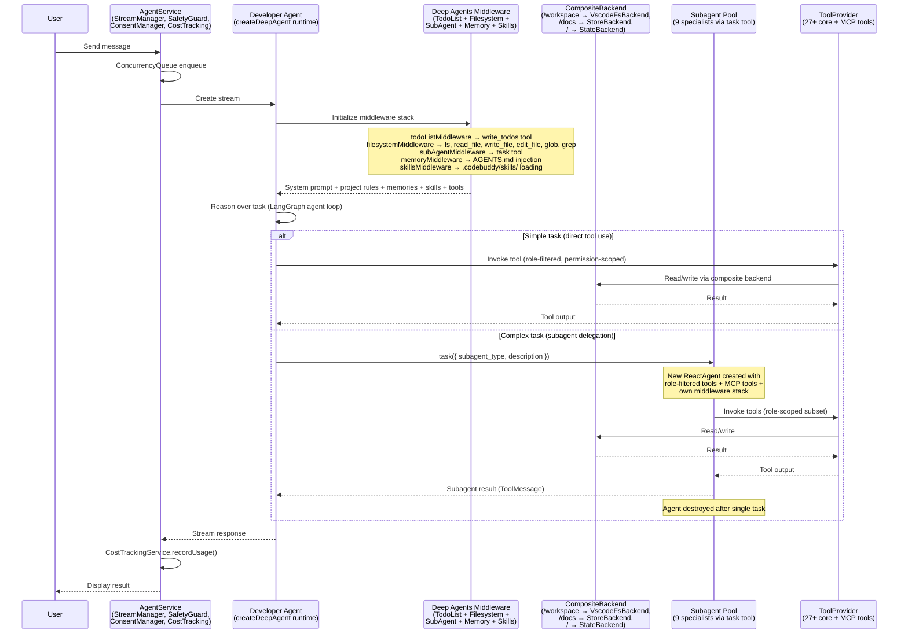

CodeBuddy is built on [**deepagentsjs**](https://github.com/langchain-ai/deepagentsjs) — the batteries-included agent harness from LangChain. Deep Agents goes beyond shallow tool-calling loops by combining four core capabilities that enable complex, multi-step autonomous work:

1. **Planning tool** — Strategic task decomposition via `write_todos` (TodoListMiddleware)
2. **Subagent spawning** — Context-isolated specialist agents via the `task` tool (SubAgentMiddleware)
3. **File system access** — Persistent state and memory via `ls`, `read_file`, `write_file`, `edit_file`, `glob`, `grep` (FilesystemMiddleware)
4. **Detailed prompts** — Context-rich system instructions with project rules, memories, and skills

CodeBuddy's **Developer Agent** is a `createDeepAgent()` instance that extends this foundation with IDE-native backends,tools, specialized subagents, MCP integration, and custom middleware for memory and skills.

This page describes how each Deep Agents primitive maps to CodeBuddy's architecture.

## Deep Agents foundation

The `deepagents` package provides the runtime that powers CodeBuddy's agent loop. Here's how CodeBuddy's architecture maps to the Deep Agents primitives:

| Deep Agents primitive | CodeBuddy implementation                                                                                                                |
| --------------------- | --------------------------------------------------------------------------------------------------------------------------------------- |
| `createDeepAgent()`   | `DeveloperAgent.create()` — constructs the full agent runnable                                                                          |
| `model`               | `buildChatModel()` — runtime-resolved from user settings (10 providers)                                                                 |
| `systemPrompt`        | Base prompt + `ProjectRulesService` + `MemoryTool.getFormattedMemories()` + `SkillManager.getSkillsPrompt()`                            |
| `tools`               | `ToolProvider.getToolsAsync()` — diverse core tools + dynamically loaded MCP tools                                                      |
| `subagents`           | `createDeveloperSubagents()` — several specialists with role-filtered tools                                                             |
| `backend`             | `CompositeBackend` routing `/workspace/` → `VscodeFsBackend`, `/docs/` → `StoreBackend`, `/` → `StateBackend`                           |
| `middleware`          | `createMemoryMiddleware()` + `createSkillsMiddleware()` (+ built-in `todoListMiddleware`, `filesystemMiddleware`, `subAgentMiddleware`) |
| `interruptOn`         | `delete_file` requires user approval; configurable per-tool                                                                             |
| `store`               | `InMemoryStore` for cross-session document persistence                                                                                  |
| `checkpointer`        | `SqlJsCheckpointSaver` (SQLite WASM) or `MemorySaver` fallback                                                                          |

```typescript
import {
  CompositeBackend,
  createDeepAgent,
  createMemoryMiddleware,
  createSkillsMiddleware,
  StateBackend,
  StoreBackend,
} from "deepagents";

return createDeepAgent({
  model: buildChatModel({ provider, apiKey, modelName }),
  tools: await ToolProvider.getToolsAsync(),
  systemPrompt: basePrompt + projectRules + memories + skills,
  backend: compositeBackendFactory,
  store,
  checkpointer,
  subagents: createDeveloperSubagents(model, tools),
  interruptOn: { delete_file: { allowedDecisions: ["approve", "reject"] } },
  middleware: [
    createMemoryMiddleware({
      backend: backendFactory,
      sources: ["/workspace/.codebuddy/AGENTS.md", "/workspace/AGENTS.md"],
    }),
    createSkillsMiddleware({
      backend: backendFactory,
      sources: ["/workspace/.codebuddy/skills/"],
    }),
  ],
});
```

> The agent returned by `createDeepAgent` is a standard LangGraph graph — streaming, human-in-the-loop, memory, and LangSmith observability all work out of the box.

## Architecture overview

The following diagram shows the complete request flow through CodeBuddy's Deep Agents pipeline:



## Deep Agents middleware stack

When `createDeepAgent()` constructs the agent, it automatically attaches three built-in middleware layers. CodeBuddy adds two custom middleware on top:

| Middleware               | Source                | What it provides                                                                                                                                                  |
| ------------------------ | --------------------- | ----------------------------------------------------------------------------------------------------------------------------------------------------------------- |
| **TodoListMiddleware**   | Built-in (deepagents) | `write_todos` tool for task planning and progress tracking. The agent decomposes complex tasks into discrete steps and updates the list as it works.              |
| **FilesystemMiddleware** | Built-in (deepagents) | `ls`, `read_file`, `write_file`, `edit_file`, `glob`, `grep` tools backed by the CompositeBackend. Enables context offloading to prevent context window overflow. |
| **SubAgentMiddleware**   | Built-in (deepagents) | `task` tool for spawning specialized subagents with context isolation. Keeps the main agent's context clean.                                                      |
| **MemoryMiddleware**     | CodeBuddy custom      | Reads `AGENTS.md` files from the workspace and injects them into the system prompt. Provides persistent project-level instructions.                               |
| **SkillsMiddleware**     | CodeBuddy custom      | Loads skill definitions from `.codebuddy/skills/` and adds their prompts and tools to the agent.                                                                  |

Each middleware is composable — you can use any combination depending on your needs. CodeBuddy initializes them defensively: a failing middleware will log a warning but won't prevent the agent from starting.

## Developer Agent

The `DeveloperAgent` class is the primary entry point. It wraps `createDeepAgent()` from the `deepagents` package, extending it with IDE-native capabilities:

| Component             | Deep Agents primitive | CodeBuddy implementation                                                                                                                                                |
| --------------------- | --------------------- | ----------------------------------------------------------------------------------------------------------------------------------------------------------------------- |
| **Chat model**        | `model`               | Resolved at runtime from user settings via `buildChatModel()`. Supports Anthropic, OpenAI, Google, Groq, DeepSeek, and OpenAI-compatible local models.                  |
| **System prompt**     | `systemPrompt`        | Composed from a base prompt, project rules (`ProjectRulesService`), core memories (`MemoryTool.getFormattedMemories()`), and skills (`SkillManager.getSkillsPrompt()`). |
| **Composite backend** | `backend`             | Three-layer storage — workspace files, persistent docs, ephemeral state. See [Storage architecture](#storage-architecture).                                             |
| **Middleware**        | `middleware`          | Built-in `todoListMiddleware` + `filesystemMiddleware` + `subAgentMiddleware` from deepagents, plus custom `MemoryMiddleware` and `SkillsMiddleware`.                   |
| **Subagents**         | `subagents`           | 9 specialized agents created by `createDeveloperSubagents()`, each with filtered tools. Uses the Deep Agents `SubAgent` interface.                                      |
| **Human-in-the-loop** | `interruptOn`         | Interrupt configuration requires user approval for destructive operations (file deletion by default).                                                                   |
| **Checkpointer**      | `checkpointer`        | `SqlJsCheckpointSaver` (SQLite WASM) enables conversation resumption across sessions. Falls back to `MemorySaver`.                                                      |
| **Store**             | `store`               | `InMemoryStore` for cross-session document persistence under `/docs/`.                                                                                                  |

## Subagent pool

The Developer Agent delegates complex subtasks to **9 specialized subagents** via the `task` tool — a built-in Deep Agents primitive provided by `SubAgentMiddleware`. Each subagent follows the `SubAgent` interface from the `deepagents` package:

```typescript
interface SubAgent {
  name: string;
  description: string;
  systemPrompt: string;
  tools?: StructuredTool[];
  model?: LanguageModelLike | string;
  middleware?: AgentMiddleware[];
  skills?: string[];
}
```

CodeBuddy creates its subagents in `createDeveloperSubagents()`, mapping each to a role with filtered tools:

| Subagent                | Focus                                                                                  |
| ----------------------- | -------------------------------------------------------------------------------------- |
| **code-analyzer**       | Code review, bug detection, architecture analysis                                      |
| **doc-writer**          | Technical documentation, API references, ADRs                                          |
| **debugger**            | Root-cause analysis via the Debug Adapter Protocol (DAP)                               |
| **file-organizer**      | Directory restructuring, file moves, import updates                                    |
| **architect**           | System design, pattern selection, trade-off analysis                                   |
| **reviewer**            | Code quality, security review, standards enforcement                                   |
| **tester**              | Test strategy, creation, execution, failure analysis                                   |
| **architecture-expert** | Codebase structure Q&A from static analysis data                                       |
| **general-purpose**     | Auto-included by deepagents runtime. Inherits all tools + skills from the parent agent |

When the main agent calls `task({ subagent_type: "debugger", description: "..." })`, Deep Agents:

1. Creates a new `ReactAgent` with the subagent's config
2. Attaches the subagent's own middleware stack (`todoListMiddleware`, `filesystemMiddleware`, `summarizationMiddleware`, `patchToolCallsMiddleware`)
3. Runs the agent to completion
4. Returns the result as a `ToolMessage` to the parent
5. Destroys the subagent instance

Subagents can run **in parallel** when tasks are independent. Each receives all MCP tools alongside its role-specific tools.

For a complete deep dive into the delegation mechanism, tool role mapping, collaboration playbooks, subagent prompts, and configuration, see [Subagent System](/concepts/subagents/).

## Storage architecture

Deep Agents uses a **backend abstraction** (`BackendProtocol`) that decouples file operations from storage implementation. CodeBuddy implements three backends and composes them via `CompositeBackend` — a deepagents primitive that routes file paths to different storage layers:

| Route         | Backend           | Deep Agents class        | Persistence                      | Use case                                                                                                       |
| ------------- | ----------------- | ------------------------ | -------------------------------- | -------------------------------------------------------------------------------------------------------------- |
| `/workspace/` | `VscodeFsBackend` | Custom `BackendProtocol` | Disk (real filesystem)           | Reading/writing actual project files. Atomic writes via in-process mutex. Ripgrep integration for fast search. |
| `/docs/`      | `StoreBackend`    | Built-in (deepagents)    | LangGraph Store (cross-session)  | Long-lived documentation, API references, ADRs, troubleshooting guides. Survives across all conversations.     |
| `/` (default) | `StateBackend`    | Built-in (deepagents)    | LangGraph State (session-scoped) | Scratch space for the current conversation. Temporary calculations, intermediate results.                      |

The `VscodeFsBackend` is CodeBuddy's custom backend that bridges Deep Agents' file system tools to the VS Code filesystem API. It implements the full `BackendProtocol` interface (`ls`, `read`, `write`, `edit`, `glob`, `grep`) with:

- **Ripgrep integration** — Uses `@vscode/ripgrep` for fast codebase search, with spawn fallback
- **Atomic writes** — `SimpleMutex` serializes write operations to prevent race conditions
- **Path security** — `resolveAgentPath()` validates all paths stay within workspace boundaries
- **Diff-based edits** — `DiffReviewService` integration for structured code modifications

```typescript
const backendFactory: BackendFactory = (stateAndStore) => {
  const defaultBackend = new StateBackend(stateAndStore);
  const routes: Record<string, BackendProtocol> = {};

  routes["/workspace/"] = createVscodeFsBackendFactory({
    rootDir: workspacePath,
    ripgrepSearch: async (opts) => execFileAsync(rgPath, [...]),
    useRipgrep: true,
  });

  if (stateAndStore.store) {
    routes["/docs/"] = new StoreBackend({
      ...stateAndStore,
      assistantId: "developer-agent",
    });
  }

  return new CompositeBackend(defaultBackend, routes);
};
```

## Tool system

Deep Agents provides built-in file system tools via `FilesystemMiddleware` — `ls`, `read_file`, `write_file`, `edit_file`, `glob`, `grep`, and optionally `execute` (with a sandbox backend). CodeBuddy extends this with 20+ additional IDE-native tools.

### Core tools

`ToolProvider` is a singleton that initializes 27+ built-in tools via the factory pattern. Each tool is a LangChain `StructuredTool` — the same format that Deep Agents expects:

| Category            | Tools                                                                                                |
| ------------------- | ---------------------------------------------------------------------------------------------------- |
| **File operations** | `read_file`, `write_file`, `edit_file`, `list_files`, `compose_files`                                |
| **Search**          | `ripgrep_search`, `search_symbols`, `search_vector_db`, `travily_search`                             |
| **Execution**       | `manage_terminal`, `deep_terminal`, `run_tests`                                                      |
| **Debugging**       | `debug_get_state`, `debug_get_stack_trace`, `debug_get_variables`, `debug_evaluate`, `debug_control` |
| **Browser**         | `browser` (Playwright-based automation)                                                              |
| **Knowledge**       | `manage_core_memory`, `manage_tasks`, `think`, `get_architecture_knowledge`                          |
| **Integrations**    | `git`, `get_diagnostics`, `open_web_preview`, `standup_intelligence`, `team_graph`                   |

### MCP tools

MCP tools are loaded lazily and non-blocking at startup. The `MCPService` supports three transport modes:

- **Gateway** — Docker-based unified MCP server
- **Direct** — Individual stdio-based MCP servers
- **SSE** — Remote servers via Server-Sent Events

Tools are cached with a 5-minute TTL and deduplicated by name. A per-server circuit breaker prevents cascading failures when an MCP server is unavailable.

### Permission enforcement

Before any tool is executed, `PermissionScopeService` filters the available tool set based on the active security profile:

| Profile        | Capabilities                                                                         |
| -------------- | ------------------------------------------------------------------------------------ |
| **restricted** | Read-only. No terminal, no file writes, no browser.                                  |
| **standard**   | Read/write with safe terminal commands. Dangerous patterns blocked. Default profile. |
| **trusted**    | Full access with auto-approval for all operations.                                   |

Catastrophic command patterns (`rm -rf /`, `mkfs`, `dd of=/dev/`, fork bombs) are blocked in **all** profiles without exception.

## Error recovery and self-healing

The `ErrorRecoveryService` classifies errors and applies automatic retry with exponential backoff:

| Error class   | Behavior                                                          | Examples                                                              |
| ------------- | ----------------------------------------------------------------- | --------------------------------------------------------------------- |
| **Transient** | Auto-retry (max 2 attempts, 1.5s base delay, exponential backoff) | Timeouts, HTTP 429/502/503, `ECONNRESET`, `socket hang up`            |
| **Permanent** | Fail immediately, no retry                                        | Loop detection, auth failures, safety limit exceeded, quota exhausted |

When a primary LLM provider fails, the `ProviderFailoverService` classifies the failure reason (`auth`, `rate_limit`, `billing`, `timeout`, `overloaded`) and can switch to an alternate provider.

### Execution guardrails

The `AgentSafetyGuard` enforces hard limits to prevent runaway execution:

- **2,000 events maximum** per task
- **400 tool calls maximum** per task
- **10 minute timeout** per task
- **Circuit breaker** — stops after repeated consecutive failures
- **Context window compaction** — when message history exceeds a threshold, older low-priority messages are summarized to free context space

## State management

The agent created by `createDeepAgent` is a standard LangGraph graph. State is managed through LangGraph annotations with checkpointing — this means all LangGraph features (streaming, human-in-the-loop, memory, LangSmith Studio) work out of the box:

```typescript
const stateAnnotation = Annotation.Root({
  ...MessagesAnnotation.spec,
  planSteps: Annotation<string[]>,
  currentStepIndex: Annotation<number>,
  userQuery: Annotation<string>,
  errorCount: Annotation<number>,
  lastLLMResponseContent: Annotation<string>,
});
```

Checkpoints are persisted via `SqlJsCheckpointSaver` (SQLite-backed) or `MemorySaver` (in-memory fallback), enabling conversation resumption across editor sessions.

## Event-driven orchestration

The `Orchestrator` class implements a pub/sub event system built on a custom `EventEmitter`:

- **Decoupled communication** — Agents emit events rather than calling each other directly. New agents can be added without modifying existing ones.
- **Stream events** — The `StreamManager` emits fine-grained events (`TOOL_START`, `TOOL_END`, `THINKING`, `PLANNING`, `TERMINAL_OUTPUT`, etc.) that drive the real-time UI in the webview panel.
- **Observability** — All events are logged through the structured `Logger` with OpenTelemetry trace IDs, session IDs, and module tags. Logs are written to `.codebuddy/logs/` with a 1,000-entry circular buffer.

## LLM provider abstraction

CodeBuddy supports 10 LLM providers through a unified `buildChatModel()` factory:

| Provider              | Models                                                             |
| --------------------- | ------------------------------------------------------------------ |
| **Anthropic**         | Claude Sonnet 4, Claude Opus 4, Claude Haiku                       |
| **OpenAI**            | GPT-4o, GPT-4o-mini, GPT-4-turbo, o3-mini                          |
| **Google**            | Gemini 2.5 Pro, Gemini 2.5 Flash, Gemini 2.0 Flash, Gemini 1.5 Pro |
| **Groq**              | Llama 3.3 70B, Llama 3.1 8B, Mixtral 8x7B                          |
| **DeepSeek**          | DeepSeek Chat, Coder, Reasoner                                     |
| **Qwen**              | Qwen Plus, Turbo, Max                                              |
| **GLM**               | GLM-4 Plus, GLM-4 Flash                                            |
| **xAI**               | Grok models                                                        |
| **Ollama**            | Any locally hosted model                                           |
| **OpenAI-compatible** | Any server implementing the OpenAI API (LM Studio, vLLM, etc.)     |

All providers share the same `ChatModel` type union, so the rest of the system is provider-agnostic. Provider switching requires only a configuration change — no code modifications.

### Cost tracking

The `CostTrackingService` records token usage per conversation and computes costs using per-model pricing tables (18+ models). It produces aggregated summaries broken down by provider, model, and conversation thread.

## Next steps

- [deepagentsjs on GitHub](https://github.com/langchain-ai/deepagentsjs) — The foundation framework CodeBuddy is built on
- [Deep Agents documentation](https://docs.langchain.com/oss/javascript/deepagents/overview) — Official LangChain docs for the deepagents package
- [Subagent system](/concepts/subagents/) — Deep dive into delegation, subagent roles, tool assignments, and collaboration playbooks
- [Memory system](/concepts/memory/) — How persistent and project-scoped memory works
- [Tools reference](/concepts/tools/) — Full list of built-in tools and their parameters
- [MCP integration](/concepts/mcp/) — Connecting external tool servers
- [Self-healing execution](/concepts/self-healing/) — Error recovery and retry strategies in depth
- [Security](/admin/security/) — Permission profiles, access control, and credential proxy
