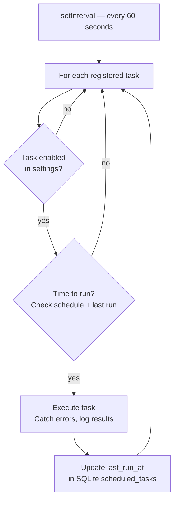

CodeBuddy runs **5 automated tasks** on a daily schedule, monitoring your codebase, git activity, and dependencies without manual intervention. Each automation can be triggered on demand or disabled individually.

## Schedule overview

| Time         | Automation         | What it does                                               |
| ------------ | ------------------ | ---------------------------------------------------------- |
| **8:00 AM**  | Daily Standup      | Git activity summary, active errors, Jira/GitLab tickets   |
| **9:00 AM**  | Code Health Check  | TODOs, large files, git hotspots, tech debt trends         |
| **11:00 AM** | Dependency Check   | Outdated packages, security vulnerabilities, lockfile sync |
| **Every 2h** | Git Watchdog       | Uncommitted changes, stale branches, upstream divergence   |
| **5:30 PM**  | End-of-Day Summary | Commits, lines changed, files touched, branch status       |

The scheduler checks every 60 seconds and uses a SQLite `scheduled_tasks` table to ensure each task runs at most once per day (or once per interval for the watchdog).

## Daily standup

Generates a morning briefing from your recent activity. Output appears in the **CodeBuddy Standup** output channel.

**Data sources**:

- **Last context** — Your 3 most recent chat messages (truncated to 100 chars)
- **Modified files** — Currently unsaved files in the workspace
- **Active errors** — Editor diagnostics at Error severity (max 50)
- **Git summary** — Current branch, commits in the last 24 hours, diff stats, uncommitted changes (max 15)
- **Jira tickets** — Your assigned tickets via the Jira CLI (`jira issue list -a me --limit 5`)
- **GitLab issues** — Your assigned issues via the GitLab CLI

**Agent tools**: The `standup_intelligence` tool lets the agent query standup data programmatically — ingest meeting notes, retrieve your tasks, find blockers, or search history by person/date/ticket. The `team_graph` tool provides team health dashboards, collaboration patterns, completion trends, and recurring blocker analysis.

## Code health check

Scans the workspace for tech debt indicators and tracks trends over time. Output appears in the **CodeBuddy Health** output channel.

**What it checks**:

- **TODO/FIXME/HACK** comments with file and line locations
- **Large files** over the configured threshold (default: 300 lines)
- **Git hotspots** — most-changed files in the last 30 days (threshold: configurable min changes)
- **Index freshness** — whether the codebase analysis index is older than 24 hours

**Trend tracking**: Results are stored in a SQLite `health_snapshots` table. Each run compares against previous snapshots to show improvement or regression ("↑ 3 new TODOs since last check").

**Notification**: Shows a summary notification with actions: **Refresh Index** and **View Report**.

## Dependency check

Audits your project dependencies for security and freshness. Auto-detects the package manager (npm, yarn, or pnpm).

**What it checks**:

- **Wildcard versions** — Dependencies using `*` or `"latest"` (unreproducible builds)
- **Outdated packages** — Sorted by major version drift
- **Security vulnerabilities** — Via `npm audit` / `yarn audit` / `pnpm audit` (critical, high, moderate, low)
- **Lockfile sync** — Whether the lockfile matches `package.json`

**Notification**: Shows a summary with actions: **View Report** and **Run npm audit fix**.

## Git watchdog

Monitors your git state every 2 hours and alerts on potential issues.

**What it checks**:

| Check                   | Trigger                                          | Action offered                                       |
| ----------------------- | ------------------------------------------------ | ---------------------------------------------------- |
| **Uncommitted changes** | No commit in >2 hours with staged/modified files | Generate Commit Message, Open Source Control, Snooze |
| **Stale branches**      | ≥3 merged branches not cleaned up                | View Branches, Dismiss                               |
| **Upstream divergence** | Behind remote after fetch                        | (informational alert)                                |

Protected branches (configurable) are excluded from the stale branch check.

## End-of-day summary

Generates a recap of the day's work at 5:30 PM. Output appears in the **CodeBuddy Daily Summary** output channel.

**What it reports**:

- Current branch
- Commits today (since midnight)
- Lines changed (+/-)
- Files touched (unique files from today's commits)
- Uncommitted changes count
- Error count (editor diagnostics, max 500)

**Actions**: **View Summary** and **Copy as Markdown**.

## Settings

| Setting                                               | Type    | Default                                                                | Description                                                            |
| ----------------------------------------------------- | ------- | ---------------------------------------------------------------------- | ---------------------------------------------------------------------- |
| `codebuddy.automations.dailyStandup.enabled`          | boolean | `true`                                                                 | Enable the 8 AM standup                                                |
| `codebuddy.automations.codeHealth.enabled`            | boolean | `true`                                                                 | Enable the 9 AM health check                                           |
| `codebuddy.automations.codeHealth.hotspotMinChanges`  | number  | `3`                                                                    | Minimum changes to flag a hotspot                                      |
| `codebuddy.automations.codeHealth.largeFileThreshold` | number  | `300`                                                                  | Lines threshold for large files                                        |
| `codebuddy.automations.codeHealth.maxTodoItems`       | number  | `50`                                                                   | Maximum TODO items to list                                             |
| `codebuddy.automations.dependencyCheck.enabled`       | boolean | `true`                                                                 | Enable the 11 AM dependency check                                      |
| `codebuddy.automations.gitWatchdog.enabled`           | boolean | `true`                                                                 | Enable the 2-hour git watchdog                                         |
| `codebuddy.automations.gitWatchdog.protectedBranches` | array   | `["main","master","develop","dev","feature/*","release/*","hotfix/*"]` | Branches excluded from stale check                                     |
| `codebuddy.automations.endOfDaySummary.enabled`       | boolean | `true`                                                                 | Enable the 5:30 PM summary                                             |
| `codebuddy.standup.myName`                            | string  | `""`                                                                   | Your name for standup filtering (falls back to `git config user.name`) |

## Manual triggers

Each automation can be triggered on demand via the command palette:

| Command                        | Fires                        |
| ------------------------------ | ---------------------------- |
| **Trigger Daily Standup**      | Standup report immediately   |
| **Trigger Code Health Check**  | Health scan immediately      |
| **Trigger Dependency Check**   | Dependency audit immediately |
| **Trigger Git Watchdog**       | Git state check immediately  |
| **Trigger End-of-Day Summary** | Daily summary immediately    |

## Settings UI

Open Settings → **Co-Worker** to see all automations with toggle switches and **Trigger Now** buttons. The panel groups automations into:

- **Morning Briefing** — Daily Standup (8:00 AM)
- **Codebase Pulse** — Code Health (9:00 AM) and Dependency Guardian (11:00 AM)
- **Git Guardian** — Git Watchdog (every 2 hours)
- **Daily Wrap-up** — End-of-Day Summary (5:30 PM)

## Scheduler internals

All automations are managed by the `SchedulerService`, which runs a **60-second tick loop**.

### How the tick loop works

### Task deduplication

Each task's last execution time is stored in a SQLite `scheduled_tasks` table. The scheduler compares the current time against `last_run_at` to determine eligibility:

- **Daily tasks** (standup, health, dependency, summary): run once per calendar day
- **Interval tasks** (git watchdog): run once per interval period (2 hours)

This prevents duplicate runs if the editor is restarted multiple times in a day.

### Cleanup

When the extension deactivates:

1. The 60-second interval timer is cleared
2. Any in-flight task is allowed to complete (not cancelled)
3. The SQLite connection is closed
