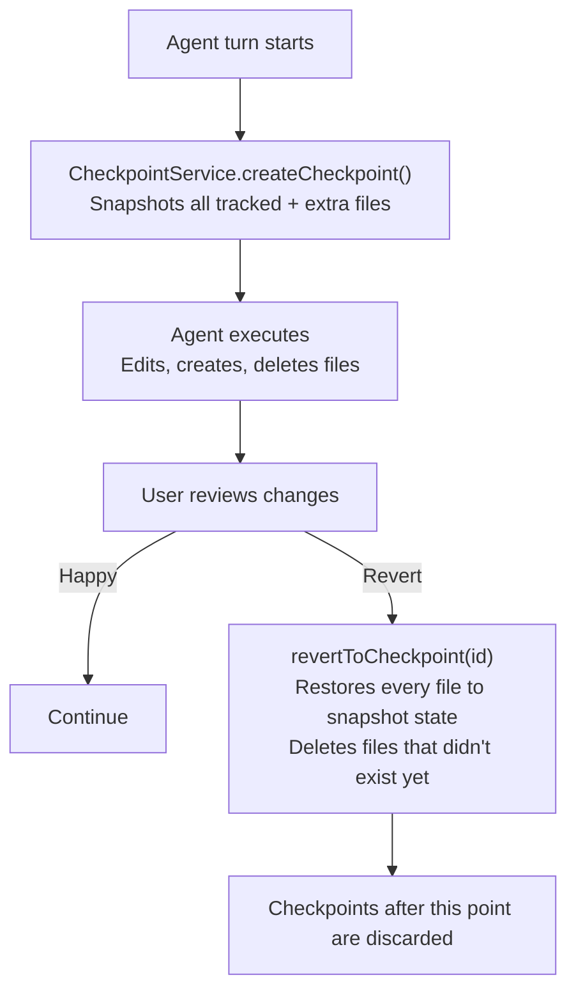

CodeBuddy automatically snapshots your workspace before each agent turn so you can revert to any previous state. Checkpoints capture file contents on disk, not just editor buffers, so even files you haven't opened are protected.

## How it works

Before the agent writes any file, it calls `trackFile()` to register the path. When `createCheckpoint()` runs, every tracked file is read from disk and stored in memory. Files that don't exist yet are recorded with a `didNotExist` flag — reverting will delete them.

## What gets captured

Each checkpoint stores:

| Field            | Description                                                 |
| ---------------- | ----------------------------------------------------------- |
| `id`             | Unique ID (`ckpt-{timestamp}-{random}`)                     |
| `label`          | Human-readable label (e.g. "Before turn 3")                 |
| `timestamp`      | Unix timestamp of creation                                  |
| `conversationId` | Thread ID the checkpoint belongs to                         |
| `files`          | Array of file snapshots — path, content, and existence flag |

## Reverting

When you revert to a checkpoint:

1. Files that existed at checkpoint time have their content restored
2. Files that **didn't exist** at checkpoint time are deleted (the agent created them)
3. All checkpoints created **after** the target are discarded — you can't redo past a revert
4. Directories are created as needed if a restored file's parent was deleted

## Limits

- **50 checkpoints** maximum per session. Once the cap is reached, the oldest checkpoint is evicted.
- Checkpoints are **in-memory only** — they don't survive editor restarts. This keeps the feature lightweight and avoids disk bloat.
- Only files the agent has touched are tracked. Your own manual edits outside the agent flow are not captured.

## Commands

| Command                  | What it does                                                |
| ------------------------ | ----------------------------------------------------------- |
| **Revert to Checkpoint** | Shows a list of checkpoints and reverts to the selected one |

## Relationship to editor undo

Checkpoints are separate from the editor's built-in undo (`Cmd+Z`). Use `Cmd+Z` for single-file undo of your own edits. Use checkpoints to revert multi-file agent changes atomically.
