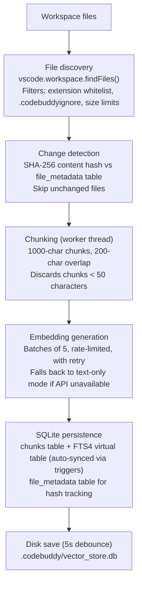

Code indexing is the pipeline that turns your workspace into a searchable vector database. Once indexed, both [Ask and Agent](/concepts/modes/) modes automatically retrieve relevant code as context, and you can search explicitly via the `search_vector_db` tool.

For how the search pipeline queries the index, see [Semantic Search](/features/semantic-search/).

## Quick start

```
CodeBuddy: Index Workspace for Semantic Search
```

This scans your workspace, chunks every supported file, generates embeddings, and stores everything in a local SQLite database. A progress notification tracks file count, chunk count, and whether embeddings are available.

## Indexing pipeline



## File discovery

### Supported languages

The indexer scans for files matching these extensions:

`.ts` `.tsx` `.js` `.jsx` `.py` `.java` `.go` `.rs` `.cpp` `.c` `.h` `.cs` `.rb` `.php`

### Exclusions

Files are excluded at multiple levels:

| Layer                  | What's excluded                                                                                              |
| ---------------------- | ------------------------------------------------------------------------------------------------------------ |
| **Base excludes**      | `node_modules`, `.git`, `dist`, `out`, `build`, `coverage`, `.codebuddy`                                     |
| **`.codebuddyignore`** | Custom patterns (`.gitignore` syntax — globs, `**`, negation with `!`, directory patterns with trailing `/`) |
| **Sync excludes**      | `*.min.js`, `*.bundle.js`, `*.d.ts`, `.DS_Store`, `.vscode-test`                                             |
| **File size**          | Varies by performance mode (see below)                                                                       |

Run `CodeBuddy: Init .codebuddyignore` to create a starter ignore file.

The `.codebuddyignore` watcher automatically reloads patterns when the file changes — no restart required.

### `.codebuddyignore` syntax

The file uses `.gitignore` syntax. Place it in the workspace root.

```gitignore
# Ignore test fixtures
tests/fixtures/**

# Ignore generated code
src/generated/

# Ignore large data files
*.csv
*.parquet

# Re-include a specific fixture needed for indexing
!tests/fixtures/sample.ts

# Ignore a specific directory (trailing / = directory only)
tmp/

# Anchored pattern (only matches at root, not nested)
/scripts/legacy/
```

| Syntax         | Meaning                                             | Example             |
| -------------- | --------------------------------------------------- | ------------------- |
| `*`            | Match any characters except `/`                     | `*.log`             |
| `**`           | Match any path depth                                | `tests/**/snap*`    |
| `!`            | Negation — re-include a previously excluded pattern | `!src/important.ts` |
| `/` (trailing) | Match directories only                              | `build/`            |
| `/` (leading)  | Anchored to root — won't match in subdirectories    | `/scripts/`         |
| `#`            | Comment line                                        | `# Ignore logs`     |

### File size limits

| Performance mode     | Max file size |
| -------------------- | ------------- |
| `balanced` (default) | 1 MB          |
| `performance`        | 2 MB          |
| `memory`             | 512 KB        |

Set via `codebuddy.vectorDb.performanceMode`.

## Chunking

Chunking runs in a **dedicated worker thread** to avoid blocking the editor UI.

| Parameter     | Value                                        |
| ------------- | -------------------------------------------- |
| Chunk size    | 1,000 characters                             |
| Overlap       | 200 characters                               |
| Minimum chunk | 50 characters (smaller chunks are discarded) |

Each chunk records:

- **ID** — `{filePath}::{charOffset}`
- **Text** — the chunk content
- **Line range** — approximate start/end line numbers
- **Type** — `text_chunk`, `function`, `class`, `method`, or `block`
- **Language** — detected from the file extension

The worker uses [Tree-sitter](https://tree-sitter.github.io/tree-sitter/) for AST-aware chunking with a text-based fallback splitter. Language detection maps extensions to parsers: `.ts/.tsx` → TypeScript, `.py` → Python, `.java` → Java, `.go` → Go, `.rs` → Rust, `.cpp` → C++, `.c/.h` → C, `.cs` → C#, `.rb` → Ruby, `.php` → PHP.

### Tree-sitter AST analysis

CodeBuddy ships 8 pre-compiled WASM grammars for AST-aware chunking:

| Grammar    | Extensions         | What it extracts                                      |
| ---------- | ------------------ | ----------------------------------------------------- |
| TypeScript | `.ts`, `.tsx`      | Functions, classes, methods, interfaces, type aliases |
| JavaScript | `.js`, `.jsx`      | Functions, classes, arrow functions, exports          |
| Python     | `.py`              | Functions, classes, methods, decorators, docstrings   |
| Java       | `.java`            | Classes, methods, interfaces, annotations             |
| Go         | `.go`              | Functions, methods, structs, interfaces               |
| Rust       | `.rs`              | Functions, impl blocks, structs, enums, traits        |
| PHP        | `.php`             | Functions, classes, methods, namespaces               |
| C/C++      | `.c`, `.h`, `.cpp` | Functions, structs, classes, macros                   |

For languages with dedicated analyzers (TypeScript, JavaScript, Python), the AST parser extracts:

- **Function boundaries** — splits at function/method definitions instead of arbitrary character offsets
- **Class grouping** — keeps class bodies together when they fit within a chunk
- **Import regions** — groups import statements into a single chunk
- **Docstring preservation** — attaches docstrings/JSDoc comments to their associated function

Languages without a WASM grammar fall back to the text-based splitter (character offset + overlap).

## Embedding generation

### Providers

| Provider             | Model                    | Notes                                                                 |
| -------------------- | ------------------------ | --------------------------------------------------------------------- |
| **Gemini** (default) | `text-embedding-004`     | Default when `codebuddy.vectorDb.embeddingModel` = `"gemini"`         |
| **OpenAI**           | `text-embedding-3-small` | OpenAI-compatible endpoint                                            |
| **Local**            | Configurable             | Uses local server's `/embeddings` endpoint (e.g., `nomic-embed-text`) |
| **Deepseek / Groq**  | OpenAI-compatible        | Same SDK, different base URL                                          |

Anthropic does **not** support embeddings — automatically falls back to Gemini.

### Batching and rate limiting

| Parameter   | Default                                            |
| ----------- | -------------------------------------------------- |
| Batch size  | 5 chunks per batch                                 |
| Rate limit  | 1,500 requests/min (40ms minimum interval)         |
| Retries     | 3, with exponential backoff (`delay × retryCount`) |
| Retry delay | 1,000ms base                                       |

Between batches, the indexer yields to the event loop via `setImmediate()` to keep the editor responsive.

### Smart embedding phases

The embedding system uses different configurations depending on context:

| Phase                      | Batch size | Max files | Delay between batches | Timeout | Retries |
| -------------------------- | ---------- | --------- | --------------------- | ------- | ------- |
| **Immediate** (on-save)    | 5          | 20        | 100ms                 | 30s     | 3       |
| **On-demand** (user query) | 3          | 15        | 200ms                 | 20s     | 2       |
| **Background** (idle)      | 10         | 100       | 1,000ms               | 60s     | 1       |
| **Bulk** (full index)      | 20         | Unlimited | 500ms                 | 120s    | 2       |

### Pre-flight check

Before bulk indexing, the system runs a test embedding to verify the API is reachable. If the check fails, indexing continues in **text-only mode** — chunks are stored without vectors, enabling keyword search but not semantic search. Re-run the index command after fixing your API key to generate embeddings.

## Incremental indexing

CodeBuddy uses **content hashing** for efficient incremental updates:

1. On file save, the `onDidSaveTextDocument` listener fires
2. SHA-256 hash of the file content is compared against the `file_metadata` table
3. If unchanged → skip (no work done)
4. If changed → remove old chunks for this file → re-chunk → re-embed → persist

This means saving a file you didn't actually change costs almost nothing — just a hash comparison.

### What triggers re-indexing

| Trigger                     | Scope            | Behavior                          |
| --------------------------- | ---------------- | --------------------------------- |
| **File save**               | Single file      | Immediate incremental index       |
| **Index Workspace command** | Entire workspace | Bulk index, skips unchanged files |
| **Background processing**   | Changed files    | Debounced (default 1,000ms)       |

Filtered out automatically: git commit messages, log files, and paths containing `node_modules`, `.git`, or `.codebuddy`.

## Storage

### SQLite database

The index is stored in a SQLite database powered by `sql.js` (SQLite compiled to WASM). Location: `<workspace>/.codebuddy/vector_store.db` (falls back to the editor's global storage).

**Schema:**

```sql
-- Chunk storage with optional vector embeddings
CREATE TABLE chunks (
    id TEXT PRIMARY KEY,
    text TEXT NOT NULL,
    vector BLOB,              -- Float32Array as binary (NULL in text-only mode)
    file_path TEXT NOT NULL,
    start_line INTEGER NOT NULL,
    end_line INTEGER NOT NULL,
    chunk_type TEXT NOT NULL DEFAULT 'text_chunk',
    language TEXT NOT NULL DEFAULT '',
    indexed_at TEXT NOT NULL
);

-- File change tracking
CREATE TABLE file_metadata (
    file_path TEXT PRIMARY KEY,
    file_hash TEXT NOT NULL,  -- SHA-256
    chunk_count INTEGER NOT NULL DEFAULT 0,
    indexed_at TEXT NOT NULL
);
```

### FTS4 full-text index

A [FTS4](https://www.sqlite.org/fts3.html) virtual table is maintained in sync with the `chunks` table via SQL triggers:

- **INSERT** trigger — adds chunk text to FTS on insert
- **DELETE** trigger — removes from FTS on delete
- **UPDATE** trigger — delete + re-insert on update

On startup, if the FTS row count falls behind the chunks table (e.g., after a crash), a back-fill runs automatically. Small gaps (< 100 rows) use an anti-join INSERT; larger gaps use FTS4's `rebuild` command.

### Persistence

The database uses a dirty flag with a **5-second debounce** save timer. Changes accumulate in memory and flush to disk periodically. On extension deactivation, any pending changes are saved immediately.

## Initialization order

When the editor starts with CodeBuddy:

1. `SqliteVectorStore` singleton — loads or creates the SQLite database
2. `HybridSearchService` singleton — creates and initializes the FTS4 virtual table
3. `AstIndexingService` singleton — spawns the worker thread, wires the embedding service
4. `ContextRetriever` — wires the search pipeline
5. `onDidSaveTextDocument` listener — enables incremental indexing on file save
6. `codebuddy.indexWorkspace` command — registered for manual full re-index

## Settings

All indexing settings are documented in the [Settings Reference](/reference/settings/) under **Vector database** and **Hybrid search**.

Key settings for indexing behavior:

| Setting                                         | Default      | Effect                                                 |
| ----------------------------------------------- | ------------ | ------------------------------------------------------ |
| `codebuddy.vectorDb.enabled`                    | `true`       | Master toggle for the entire indexing system           |
| `codebuddy.vectorDb.performanceMode`            | `"balanced"` | Controls file size limits and resource usage           |
| `codebuddy.vectorDb.enableBackgroundProcessing` | `true`       | Index changes in the background                        |
| `codebuddy.vectorDb.debounceDelay`              | `1000`       | Milliseconds to wait before re-indexing a changed file |
| `codebuddy.vectorDb.batchSize`                  | `10`         | Files per embedding batch                              |
| `codebuddy.indexCodebase`                       | `false`      | Feature flag for automatic indexing on startup         |
