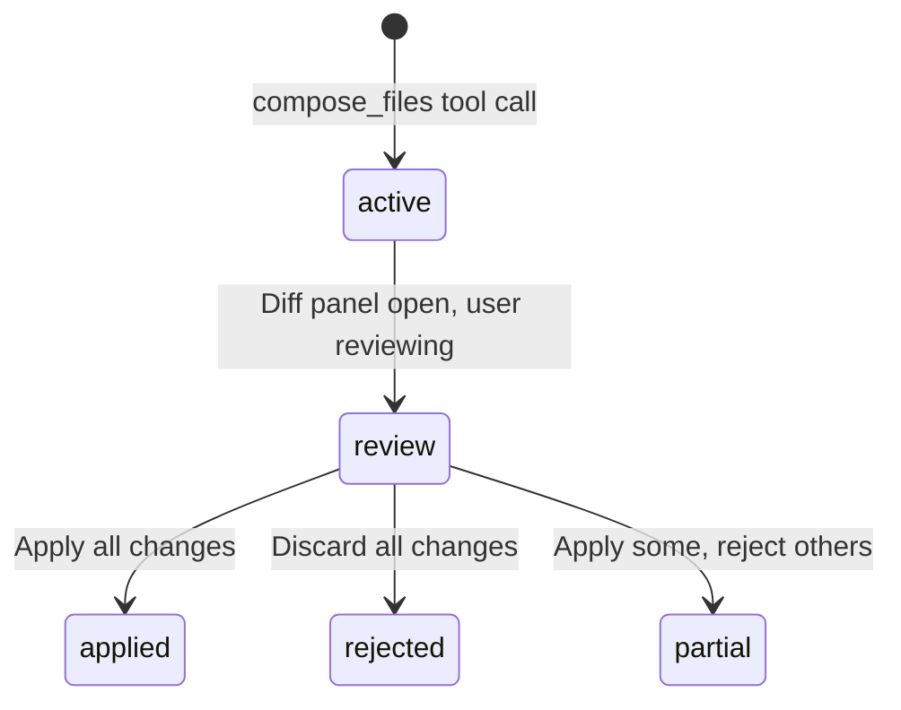

The **Composer** lets CodeBuddy make coordinated edits across multiple files in a single operation. Instead of modifying files one at a time, Composer groups related changes into a **session** that you can review as a unified diff, then apply or reject atomically.

## When Composer is used

In Agent mode, CodeBuddy automatically uses Composer (the `compose_files` tool) when it needs to:

- Scaffold a new feature touching multiple files (component, tests, types, styles)
- Refactor a function signature and update all callers
- Apply a pattern consistently across the codebase
- Create or restructure project boilerplate

You don't invoke Composer directly — the agent decides when multi-file edits are the right approach.

## How it works

### 1. Agent creates a Composer session

The `compose_files` tool accepts a list of file operations:

```json
{
  "files": [
    {
      "filePath": "src/auth/login.ts",
      "mode": "replace",
      "search": "function login(user: string)",
      "content": "function login(user: string, mfa?: string)"
    },
    {
      "filePath": "src/auth/login.test.ts",
      "mode": "replace",
      "search": "login('admin')",
      "content": "login('admin', '123456')"
    },
    {
      "filePath": "src/types/auth.ts",
      "mode": "overwrite",
      "content": "export interface LoginOptions {\n  user: string;\n  mfa?: string;\n}"
    }
  ]
}
```

Each file operation uses one of two modes:

| Mode        | Behavior                                                           |
| ----------- | ------------------------------------------------------------------ |
| `overwrite` | Replace the entire file content (or create a new file)             |
| `replace`   | Find the `search` string in the file and replace it with `content` |

### 2. Review in the Composer panel

After the agent creates a session, the **Composer Panel** opens in the sidebar showing:

- Session status badge (active, applied, rejected, partial)
- Each file in the session with an expandable diff view
- Per-file and whole-session actions

The diff view uses the same `DiffReviewService` that powers CodeBuddy's [Diff Review](/features/diff-review/) feature, so you get the same syntax-highlighted, inline diff experience.

### 3. Apply or reject

| Action             | Effect                                                                |
| ------------------ | --------------------------------------------------------------------- |
| **Apply session**  | Writes all file changes to disk atomically                            |
| **Reject session** | Discards all pending changes, no files are modified                   |
| **Partial**        | Apply some files and reject others (session status becomes `partial`) |

## Session lifecycle



Sessions are managed by the `ComposerService` and persisted for the duration of the editor window. Each session has a unique ID and tracks the status of every file operation independently.

## Commands

| Command                              | Description                                 |
| ------------------------------------ | ------------------------------------------- |
| `CodeBuddy: Review Composer Session` | Open the diff panel for the current session |
| `CodeBuddy: Apply Composer Session`  | Apply all pending changes to disk           |
| `CodeBuddy: Reject Composer Session` | Discard all pending changes                 |

## Tips

- **Large refactors**: Ask the agent to "refactor X and update all references" — it will naturally use Composer to coordinate changes across files
- **Review before applying**: The diff panel shows exactly what will change. Take time to review, especially for `overwrite` mode operations that replace entire files
- **Partial applies**: If most changes look good but one file needs tweaking, apply the good files and reject the problematic one, then ask the agent to fix just that file
