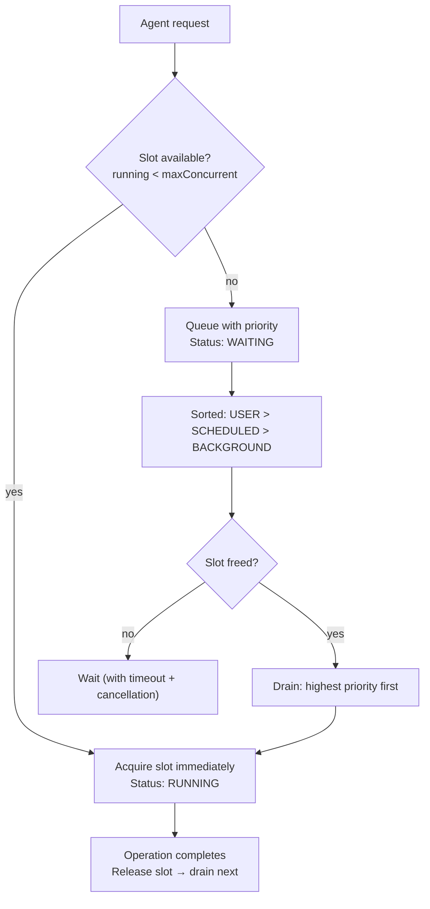

CodeBuddy limits the number of concurrent agent operations to prevent resource exhaustion. When the limit is reached, additional requests are queued with priority-aware ordering and starvation prevention.

## How it works

## Priority levels

| Priority       | Value | Use case                                  |
| -------------- | ----- | ----------------------------------------- |
| **USER**       | 2     | Direct user actions (chat, commands)      |
| **SCHEDULED**  | 1     | Automated tasks (standups, health checks) |
| **BACKGROUND** | 0     | Background indexing, embedding generation |

Higher-priority items are dequeued first. Within the same priority level, items are processed in FIFO order.

## Starvation prevention

A background timer runs every **15 seconds**. Any item that has been waiting for more than **60 seconds** gets its priority boosted by 1 level. This ensures that `BACKGROUND` items eventually get promoted to `SCHEDULED`, and `SCHEDULED` items to `USER`, preventing indefinite starvation under sustained load.

## Queue depth

The maximum queue depth scales with the concurrency limit:

$$\text{maxQueueDepth} = \text{maxConcurrent} \times 10$$

For example, with `maxConcurrentStreams = 3`, the queue holds up to 30 waiting items. Requests beyond this limit are rejected immediately.

## Cancellation

Queued items support two cancellation mechanisms:

- **AbortSignal** — Pass an `AbortSignal` for cooperative cancellation
- **Timeout** — Set a `timeoutMs` deadline; the item is rejected if it hasn't acquired a slot by then

## Commands

| Command                              | What it does                                                       |
| ------------------------------------ | ------------------------------------------------------------------ |
| **Show Agent Queue Status**          | Shows running and waiting items with cancel options                |
| **Cancel All Queued Agent Requests** | Cancels all waiting items (running operations are not interrupted) |

## Status bar

The queue emits `onDidChange` events with a snapshot of `{ running, waiting, maxConcurrent }`. The status bar shows:

- `Agent: 2/3` — 2 slots in use out of 3
- `Agent: 3/3 (2 queued)` — all slots full, 2 items waiting

## Settings

| Setting                                | Type   | Default | Range | Description                  |
| -------------------------------------- | ------ | ------- | ----- | ---------------------------- |
| `codebuddy.agent.maxConcurrentStreams` | number | `3`     | 1–10  | Max concurrent agent streams |

Changes to `maxConcurrentStreams` take effect immediately. If the limit increases, waiting items are drained into the newly available slots.
