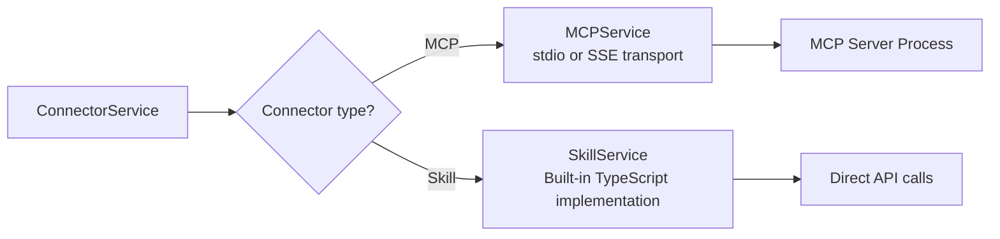

Connectors provide a unified interface to external integrations, whether backed by [MCP servers](/concepts/mcp/) or built-in [skills](/features/skills/). Each connector tracks its connection status and configuration, giving you a single place to manage all integrations.

## Built-in connectors

| Connector           | Type | Backend                      |
| ------------------- | ---- | ---------------------------- |
| **Google Drive**    | MCP  | `mcp/gdrive` Docker image    |
| **GitHub**          | MCP  | `mcp/github` Docker image    |
| **Gmail**           | MCP  | `mcp/gmail` Docker image     |
| **Google Calendar** | MCP  | `mcp/google-calendar` Docker |
| **PostgreSQL**      | MCP  | `mcp/postgres` Docker image  |
| **MySQL**           | MCP  | `mcp/mysql` Docker image     |
| **Redis**           | MCP  | `mcp/redis` Docker image     |
| **MongoDB**         | MCP  | `mcp/mongodb` Docker image   |
| **n8n**             | MCP  | `mcp/n8n` Docker image       |
| **Slack**           | MCP  | `mcp/slack` Docker image     |
| **Jira**            | MCP  | `mcp/jira` Docker image      |
| **Linear**          | MCP  | `mcp/linear` Docker image    |
| **Sentry**          | MCP  | `mcp/sentry` Docker image    |
| **Datadog**         | MCP  | `mcp/datadog` Docker image   |
| **Notion**          | MCP  | `mcp/notion` Docker image    |

## Connection status

Each connector has one of four states:

| Status           | Meaning                                             |
| ---------------- | --------------------------------------------------- |
| **connected**    | Running and responding to requests                  |
| **disconnected** | Not configured or not started                       |
| **configuring**  | Setup in progress (e.g., waiting for API key)       |
| **error**        | Started but failed (bad credentials, network issue) |

Status is persisted in the `codebuddy.connectors.states` setting so your connector states survive editor restarts.

## How connectors work

The `ConnectorService` syncs with the `MCPService` on initialization:

1. Reads built-in connector definitions
2. Checks which MCP servers are currently running
3. Updates connector statuses to match MCP server states
4. Monitors MCP server events (connect, disconnect, error)

## Configuration

### Connecting a connector

When you connect a connector:

1. The service generates the MCP server configuration (Docker image, args, env vars)
2. Injects configuration into `codebuddy.mcp.servers`
3. Starts the MCP server via `MCPService`
4. Updates the connector status to `connected`

### Disconnecting

Disconnecting a connector:

1. Stops the MCP server process
2. Removes the server from `codebuddy.mcp.servers`
3. Sets connector status to `disconnected`

## Settings

| Setting                       | Type   | Default | Description                               |
| ----------------------------- | ------ | ------- | ----------------------------------------- |
| `codebuddy.connectors.states` | object | `{}`    | Persisted connection states per connector |
