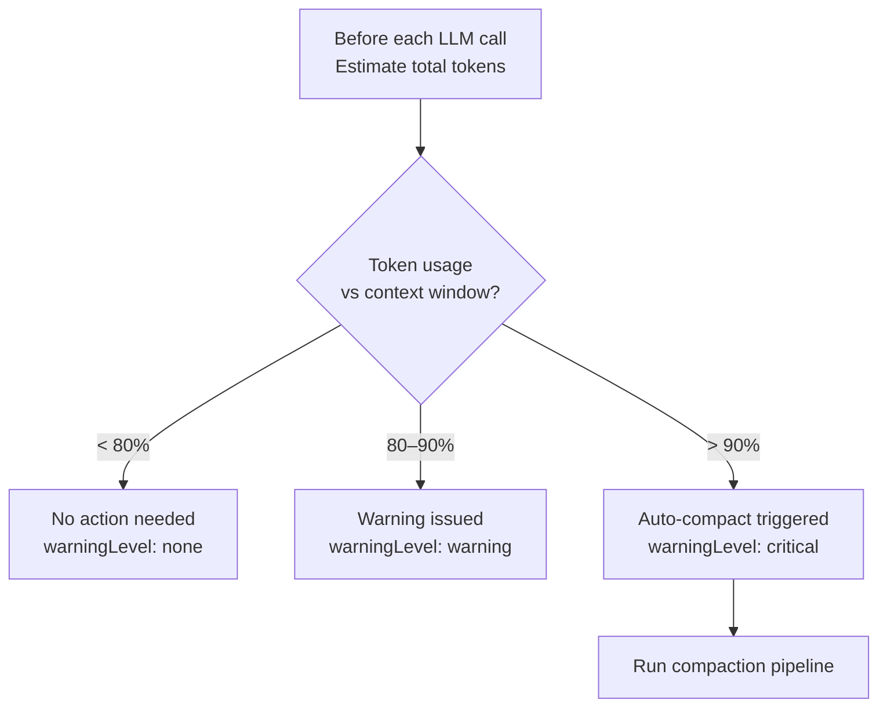

When conversations grow long, they can exceed the LLM's context window. The Context Window Compaction Service automatically summarizes older messages to reclaim space while preserving conversational context.

## How it triggers

## Compaction tiers

The service uses a 4-tier fallback strategy. Each tier is tried in order; the first tier that fits the context window wins.

| Tier | Name               | Strategy                                                                                  |
| ---- | ------------------ | ----------------------------------------------------------------------------------------- |
| 1    | **Tool strip**     | Remove large tool result content (>200 chars) from older messages. Cheapest, no LLM call. |
| 2    | **Multi-chunk**    | Split older messages into chunks, summarize each chunk with the LLM, replace originals.   |
| 3    | **Partial**        | Summarize only the oldest half of the conversation.                                       |
| 4    | **Plain fallback** | No LLM available — generate a plain-text description of the conversation shape.           |

## What's preserved

The **4 most recent messages** are never summarized. This ensures the LLM always has the latest user request and its own most recent response, maintaining coherent conversation flow.

The **system prompt** is always preserved and its tokens are accounted for in the budget.

## Chunk sizing

The compaction service calculates chunk sizes dynamically:

$$\text{chunkTokens} = \min(\text{contextWindow} \times 0.4, \; 12000)$$

The ratio decreases to a minimum of 0.15 for very large context windows. Each chunk includes structural wrapping (`User:`, `Assistant:`, `Tool:` labels) and individual messages are capped at 10,000 characters before being sent to the summarizer.

## Known model context windows

The service includes built-in context window sizes for popular models:

| Model family   | Context window |
| -------------- | -------------- |
| Claude 3.5/4   | 200,000        |
| GPT-4o / mini  | 128,000        |
| o1             | 200,000        |
| Gemini 2.0     | 1,048,576      |
| Gemini 1.5 Pro | 2,097,152      |
| Llama 3.3 70B  | 128,000        |
| DeepSeek Chat  | 64,000         |
| Qwen Plus      | 131,072        |
| GLM-4 Plus     | 128,000        |

Override with the `codebuddy.contextWindow` setting (e.g., `"128k"`).

## Compaction result

After compaction, the service returns:

| Field            | Description                          |
| ---------------- | ------------------------------------ |
| `compacted`      | Whether compaction was performed     |
| `originalCount`  | Messages before compaction           |
| `finalCount`     | Messages after compaction            |
| `originalTokens` | Estimated tokens before              |
| `finalTokens`    | Estimated tokens after               |
| `tier`           | Which compaction tier was used (0–4) |
| `warningLevel`   | `none`, `warning`, or `critical`     |

## Settings

| Setting                   | Type | Default | Description                                           |
| ------------------------- | ---- | ------- | ----------------------------------------------------- |
| `codebuddy.contextWindow` | enum | `"16k"` | Context window size: `4k`, `8k`, `16k`, `32k`, `128k` |
