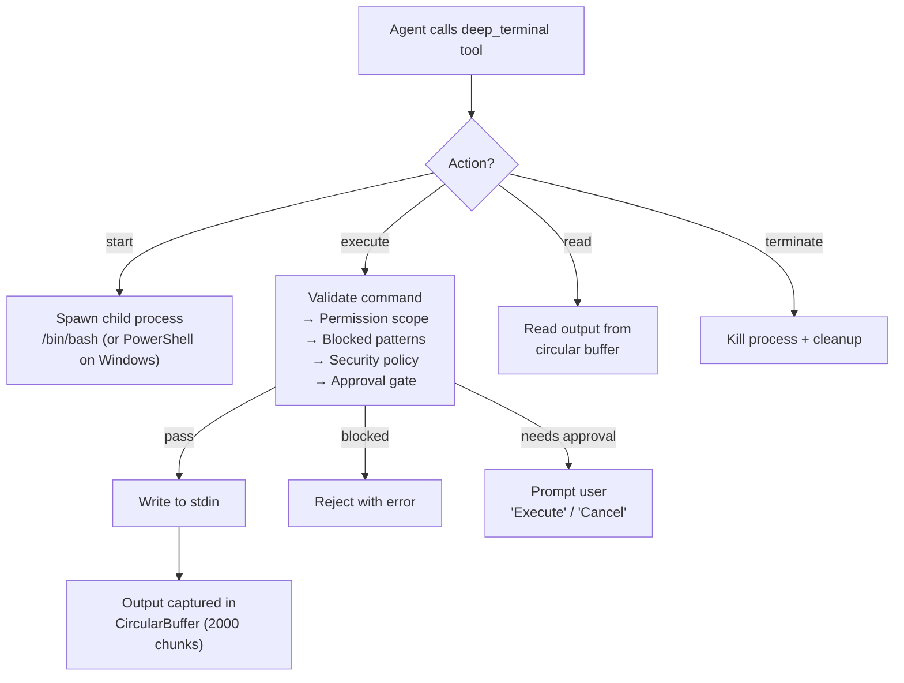

Deep Terminal gives the agent persistent shell sessions that survive across multiple tool calls. Unlike one-shot terminal commands, a deep terminal session maintains state — environment variables, working directory, and shell history persist for the session's lifetime.

## Architecture



## Session lifecycle

### Starting a session

```
deep_terminal: start session_id="build" shell="/bin/bash"
```

Spawns a child process in the workspace root with `TERM=xterm-256color`. The shell defaults to `/bin/bash` on Unix and `powershell.exe` on Windows. You can override with the `shell` parameter.

### Executing commands

```
deep_terminal: execute session_id="build" command="npm run build"
```

The command is validated through three layers before reaching the shell:

1. **Permission scope** — In `restricted` profile, all commands are blocked
2. **Blocked patterns** — Hard-blocked destructive commands (see below)
3. **External security policy** — Patterns from `.codebuddy/security.json`
4. **Approval gate** — Deletion commands (`rm`, `rmdir`, `unlink`) prompt the user

### Reading output

```
deep_terminal: read session_id="build"
```

Returns new output since the last read. Output is stored in a circular buffer of 2,000 chunks — once full, the oldest chunks are overwritten.

### Terminating

```
deep_terminal: terminate session_id="build"
```

Kills the child process and removes the session.

## Command validation

### Hard-blocked commands

These are always rejected, regardless of permission profile:

| Category                 | Examples                                               |
| ------------------------ | ------------------------------------------------------ | -------- |
| **Root filesystem wipe** | `rm -rf /`                                             |
| **Disk destruction**     | `mkfs`, `dd of=/dev/sda`                               |
| **Fork bomb**            | `:(){ :                                                | : & };:` |
| **Remote code exec**     | `curl ... \| bash`, `wget ... \| python`               |
| **Privilege escalation** | `sudo mkfs`, `sudo dd`, `sudo shutdown`, `chmod 777 /` |
| **Credential exfil**     | `cat ~/.ssh/... \| curl`, `history \| curl`            |
| **Encoded payloads**     | Hex/base64 pipe chains into `sh`                       |

### Approval-required commands

These prompt the user before execution:

- `rm`, `rmdir`, `unlink`
- `sudo rm`, `sudo rmdir`, `sudo unlink`
- `find ... -delete`, `find ... -exec rm`

### Extending patterns at runtime

Administrators can add patterns via the API:

```typescript
deepTerminal.addBlockedPatterns([/docker\s+system\s+prune/]);
deepTerminal.addApprovalPatterns([/kubectl\s+delete/]);
```

Or declaratively in `.codebuddy/security.json`:

```json
{
  "commandDenyPatterns": ["docker\\s+system\\s+prune"]
}
```

## Synchronous execution

For commands where the agent needs the output before proceeding, use `sendCommandAndWait`:

- Writes the command to stdin and waits for output
- Default timeout: 10 seconds (configurable per call)
- Output hard-capped at 10 MB to prevent memory abuse
- Returns `{ output, exitCode, success }`

## Output buffer

Each session uses a `CircularBuffer<string>` with capacity of 2,000 chunks. This provides:

- **Bounded memory** — output never grows unbounded
- **Fast append** — O(1) write, overwrites oldest entry when full
- **Incremental reads** — `lastReadIndex` tracks what the agent has already seen
