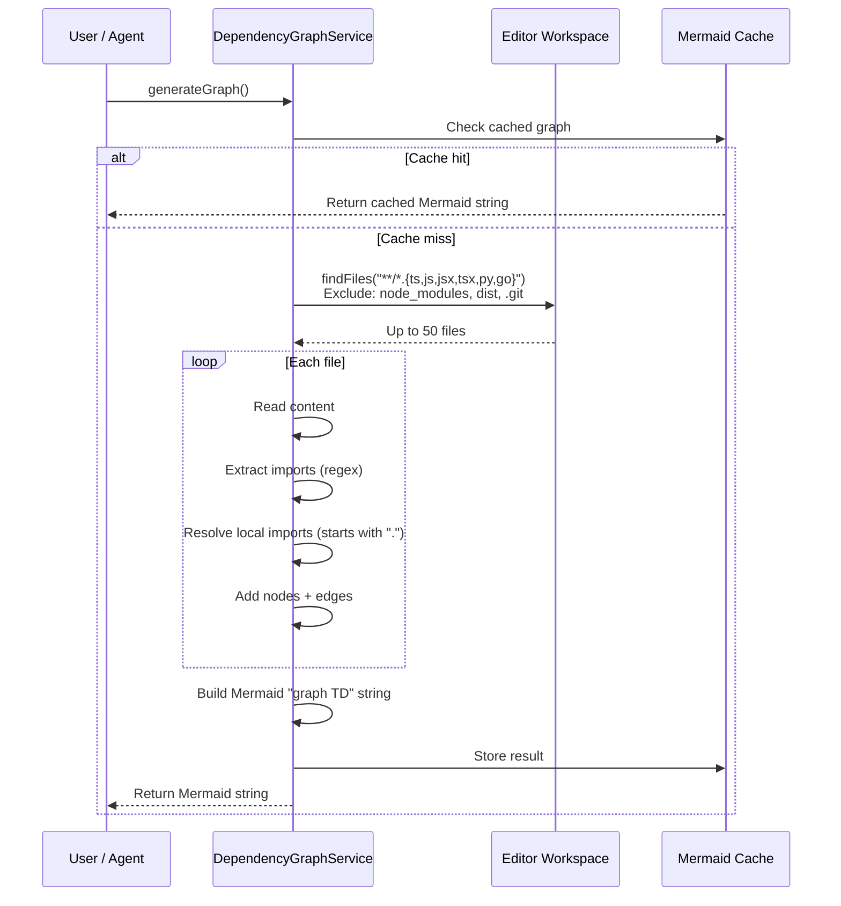
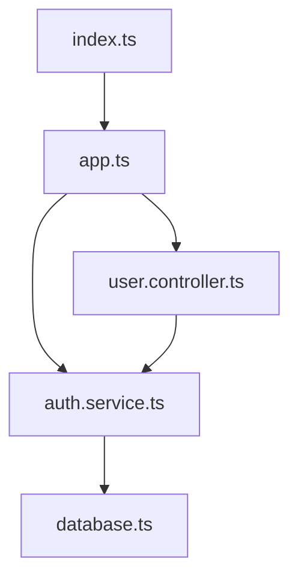

CodeBuddy can generate a visual dependency graph of your workspace, showing how files import from each other. The graph is output as a Mermaid flowchart that renders directly in the chat or can be copied into documentation.

## Supported languages

| Language               | Import pattern detected                 |
| ---------------------- | --------------------------------------- |
| **TypeScript** (`.ts`) | `import ... from '...'`                 |
| **JavaScript** (`.js`) | `import ... from '...'`                 |
| **TSX** (`.tsx`)       | `import ... from '...'`                 |
| **JSX** (`.jsx`)       | `import ... from '...'`                 |
| **Python** (`.py`)     | Planned (regex-based `import` / `from`) |
| **Go** (`.go`)         | Planned (regex-based `import`)          |

Currently, JS/TS imports are fully parsed. Python and Go file types are watched and included as nodes, but import edge detection is focused on the ES module `import ... from '...'` syntax.

## How it works



## Features

### Automatic cache invalidation

The service watches all supported file types (`**/*.{ts,js,jsx,tsx,py,go}`) with a `FileSystemWatcher`. When any file is created, changed, or deleted, the cached graph is invalidated. The next call to `generateGraph()` rebuilds it.

### Local imports only

Only **relative imports** (paths starting with `.`) are included as edges. Third-party package imports (`lodash`, `react`, etc.) are excluded to keep the graph focused on your code.

### File limit

The service queries up to **50 files** per workspace to prevent excessively large graphs. Files in `node_modules`, `dist`, `out`, `.git`, and `.vscode` are excluded.

### Node sanitization

File names are sanitized for Mermaid compatibility — non-alphanumeric characters are replaced with underscores for node IDs, while the human-readable label preserves the original filename.

## Example output

For a small TypeScript project:



## Force regeneration

Pass `force: true` to bypass the cache:

```typescript
const graph = await dependencyGraph.generateGraph(true);
```

This is useful after bulk file operations where the file watcher may not have caught all changes.

## Usage

The dependency graph is available as an agent tool. Ask CodeBuddy:

> "Show me the dependency graph for this project"

The agent calls `DependencyGraphService.generateGraph()` and renders the Mermaid output in the chat.
