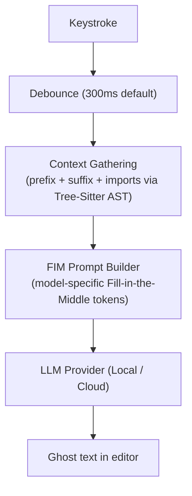

CodeBuddy provides inline code completions (ghost text) as you type, powered by the same LLM providers available for chat and agent mode. Completions are **local-first by default** — using Ollama with `qwen2.5-coder` — so you get fast, private suggestions with zero cloud API costs.

## How it works

1. **Debounce** — After you stop typing, CodeBuddy waits the configured delay (default 300ms) before requesting a completion. This prevents excessive API calls during rapid typing.

2. **Context gathering** — `ContextCompletionService` captures:
   - **Prefix**: Up to ~8,000 characters before the cursor (~2,000 tokens)
   - **Suffix**: Up to ~2,000 characters after the cursor (~500 tokens)
   - **Imports**: Extracted via Tree-Sitter AST parsing (TypeScript, JavaScript, Python) to provide type context

3. **FIM prompt building** — `FIMPromptService` constructs a Fill-in-the-Middle prompt using model-specific tokens. If the model doesn't support FIM, it falls back to a standard prefix-only prompt.

4. **Completion** — The prompt is sent to the configured provider. Results are cached (LRU, 50 entries) to avoid duplicate requests for the same context.

5. **Display** — The completion appears as ghost text in the editor. Press `Tab` to accept.

## Fill-in-the-Middle tokens

FIM-capable models use special tokens to mark the prefix, suffix, and fill position:

| Model family              | Prefix token       | Suffix token       | Middle token       | EOT token           |
| ------------------------- | ------------------ | ------------------ | ------------------ | ------------------- |
| **Qwen** (default)        | `<\|fim_prefix\|>` | `<\|fim_suffix\|>` | `<\|fim_middle\|>` | `<\|endoftext\|>`   |
| **DeepSeek**              | `<\|fim_begin\|>`  | `<\|fim_hole\|>`   | `<\|fim_end\|>`    | `<\|end_of_text\|>` |
| **CodeLlama**             | `<PRE>`            | `<SUF>`            | `<MID>`            | `<EOT>`             |
| **StarCoder / Codestral** | `<fim_prefix>`     | `<fim_suffix>`     | `<fim_middle>`     | `<\|endoftext\|>`   |

Models without FIM support receive only the prefix text and generate the next likely tokens.

## Settings

| Setting                            | Type    | Default           | Description                                                           |
| ---------------------------------- | ------- | ----------------- | --------------------------------------------------------------------- |
| `codebuddy.completion.enabled`     | boolean | `true`            | Enable or disable inline completions                                  |
| `codebuddy.completion.provider`    | enum    | `"Local"`         | Provider: Gemini, Groq, Anthropic, Deepseek, OpenAI, Qwen, GLM, Local |
| `codebuddy.completion.model`       | string  | `"qwen2.5-coder"` | Model name                                                            |
| `codebuddy.completion.apiKey`      | string  | `""`              | API key (falls back to the main provider key)                         |
| `codebuddy.completion.debounceMs`  | number  | `300`             | Trigger delay in milliseconds (min: 50)                               |
| `codebuddy.completion.maxTokens`   | number  | `128`             | Maximum tokens per completion                                         |
| `codebuddy.completion.triggerMode` | enum    | `"automatic"`     | `automatic` (as you type) or `manual` (explicit trigger)              |
| `codebuddy.completion.multiLine`   | boolean | `true`            | Allow multi-line completions                                          |

## Commands

| Command                           | What it does                                             |
| --------------------------------- | -------------------------------------------------------- |
| **Toggle Inline Completions**     | Toggles `codebuddy.completion.enabled` on or off         |
| **Configure Completion Settings** | Opens editor settings filtered to `codebuddy.completion` |

## Status bar

The completion status bar item shows the active state:

- `$(zap) CodeBuddy: qwen2.5-coder` — completions enabled, showing the active model
- `$(circle-slash) CodeBuddy: Off` — completions disabled

Click the status bar item to open completion settings.

## Supported providers

All 8 providers work for completions. The factory routes each provider to the appropriate SDK:

| Provider            | Endpoint                      | FIM support                                |
| ------------------- | ----------------------------- | ------------------------------------------ |
| **Local** (default) | `http://localhost:11434/v1`   | Yes (Qwen, DeepSeek, CodeLlama, StarCoder) |
| **Groq**            | `api.groq.com`                | Depends on model                           |
| **OpenAI**          | `api.openai.com`              | No (chat fallback)                         |
| **Anthropic**       | Via Anthropic SDK             | No (chat fallback)                         |
| **Gemini**          | Via Google AI SDK             | No (chat fallback)                         |
| **DeepSeek**        | `api.deepseek.com`            | Yes                                        |
| **Qwen**            | `dashscope-intl.aliyuncs.com` | Yes                                        |
| **GLM**             | `open.bigmodel.cn`            | Depends on model                           |

## File type support

Completions work in **all file types** — the provider is registered with `{ pattern: "**" }`. Import extraction via Tree-Sitter currently supports TypeScript, JavaScript, and Python. Other languages get prefix/suffix context without import signatures.
