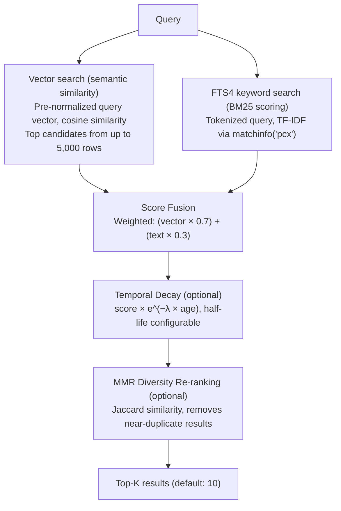

CodeBuddy can index your workspace into a vector database for **semantic code search** — finding code by meaning rather than exact text matches. This powers context retrieval for both Ask and Agent modes, automatically including relevant code snippets in every conversation.

## Quick start

Index your workspace:

```
CodeBuddy: Index Workspace for Semantic Search
```

Once indexed, both Ask and Agent modes automatically use the index for context retrieval. You can also search directly via the `search_vector_db` tool in Agent mode.

## How indexing works

1. Files in the workspace are chunked and embedded into vectors using the configured embedding model
2. Vectors are stored in a local SQLite-backed vector database (sql.js WASM)
3. An FTS4 full-text index is maintained in sync via SQL triggers for keyword search
4. The index updates automatically when files change (debounced, background processing)

**Excluded**: Files matching `.codebuddyignore` patterns (similar to `.gitignore` syntax). Run `CodeBuddy: Init .codebuddyignore` to create one with sensible defaults.

## Hybrid search pipeline

When you ask a question, the `ContextRetriever` runs a 5-stage hybrid search pipeline:



### Fallback chain

If hybrid search fails or returns no results, the system falls back through 5 tiers:

1. **Hybrid search** (vector + FTS4)
2. **FTS4 keyword search only**
3. **Legacy vector search** (simpler cosine scan)
4. **Legacy keyword search** (basic text matching)
5. **Common files** (README, package.json, entry points)

## Embedding providers

| Provider                    | Setting value | Notes                                          |
| --------------------------- | ------------- | ---------------------------------------------- |
| **Google Gemini** (default) | `"gemini"`    | Uses `gemini-2.0-flash`                        |
| **OpenAI**                  | `"openai"`    | Uses `text-embedding-ada-002`                  |
| **Local**                   | `"local"`     | Uses the local server's `/embeddings` endpoint |

Set via `codebuddy.vectorDb.embeddingModel`. Local embedding requires a model that supports the OpenAI embeddings API (e.g., `nomic-embed-text` in Ollama).

## Settings

### Vector database

| Setting                                          | Type    | Default          | Description                                     |
| ------------------------------------------------ | ------- | ---------------- | ----------------------------------------------- |
| `codebuddy.vectorDb.enabled`                     | boolean | `true`           | Enable the vector database                      |
| `codebuddy.vectorDb.embeddingModel`              | enum    | `"gemini"`       | Embedding provider: `gemini`, `openai`, `local` |
| `codebuddy.vectorDb.maxTokens`                   | number  | `6000`           | Max tokens per chunk                            |
| `codebuddy.vectorDb.batchSize`                   | number  | `10`             | Files per embedding batch (1–50)                |
| `codebuddy.vectorDb.searchResultLimit`           | number  | `8`              | Max search results (1–20)                       |
| `codebuddy.vectorDb.enableBackgroundProcessing`  | boolean | `true`           | Index changes in the background                 |
| `codebuddy.vectorDb.enableProgressNotifications` | boolean | `true`           | Show indexing progress                          |
| `codebuddy.vectorDb.progressLocation`            | enum    | `"notification"` | `notification` or `statusBar`                   |
| `codebuddy.vectorDb.debounceDelay`               | number  | `1000`           | Re-index debounce delay (ms)                    |
| `codebuddy.vectorDb.performanceMode`             | enum    | `"balanced"`     | `balanced`, `performance`, or `memory`          |
| `codebuddy.vectorDb.fallbackToKeywordSearch`     | boolean | `true`           | Use keyword fallback when vectors fail          |
| `codebuddy.vectorDb.cacheEnabled`                | boolean | `true`           | Cache search results                            |
| `codebuddy.vectorDb.logLevel`                    | enum    | `"info"`         | `debug`, `info`, `warn`, `error`                |

### Hybrid search tuning

| Setting                                             | Type    | Default | Description                          |
| --------------------------------------------------- | ------- | ------- | ------------------------------------ |
| `codebuddy.hybridSearch.vectorWeight`               | number  | `0.7`   | Weight for semantic similarity (0–1) |
| `codebuddy.hybridSearch.textWeight`                 | number  | `0.3`   | Weight for keyword matching (0–1)    |
| `codebuddy.hybridSearch.topK`                       | integer | `10`    | Max results returned (1–50)          |
| `codebuddy.hybridSearch.mmr.enabled`                | boolean | `false` | Enable MMR diversity re-ranking      |
| `codebuddy.hybridSearch.mmr.lambda`                 | number  | `0.7`   | 0 = max diversity, 1 = max relevance |
| `codebuddy.hybridSearch.temporalDecay.enabled`      | boolean | `false` | Boost recently indexed content       |
| `codebuddy.hybridSearch.temporalDecay.halfLifeDays` | integer | `30`    | Score half-life in days (1–365)      |

Weights are automatically normalized so `vectorWeight + textWeight = 1.0`.

## Performance characteristics

- **Vector scan** uses pre-normalized query vectors and `Float32Array` aligned typed arrays for efficient cosine similarity
- **Time-budgeted scanning**: The vector scan yields to the extension host every 8ms to keep the UI responsive
- **FTS4 search** uses cached prepared statements with `reset()` reuse
- **Workspace switch safety**: If you switch workspaces during an async scan, the operation detects the database replacement and aborts cleanly
- **Background indexing**: File changes trigger re-indexing after the debounce delay, using background worker threads

## Context window integration

Search results are injected into both Ask and Agent mode conversations:

- **Ask mode**: `ContextEnhancementService` retrieves relevant code snippets from the vector DB and includes them in the system prompt alongside the user's `@`-mentioned files
- **Agent mode**: The `search_vector_db` tool lets the agent search the index explicitly. Additionally, the system prompt is enriched with relevant context before the agent begins reasoning
