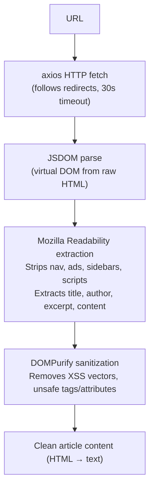

**Smart Reader** lets you feed web articles and documentation pages directly into CodeBuddy conversations without leaving your editor. It extracts clean, readable content from any URL and injects it as context for both Ask and Agent mode.

## Quick start

1. Run `CodeBuddy: Read URL` from the command palette
2. Paste a URL
3. The article opens in a webview panel with two actions:
   - **Add to Chat** — inject the article into your current conversation as context
   - **Summarize Article** — get an AI-generated summary

You can also share a URL directly in the chat input — CodeBuddy will detect it and offer to read the page.

## How it works

### Content extraction pipeline

The extraction uses the same [Readability](https://github.com/porcupinefactory/readability) algorithm that powers Firefox's Reader View. It works well on blog posts, documentation, Stack Overflow answers, GitHub READMEs, and most article-style pages.

### Context injection

When you click **Add to Chat**, the first **5,000 characters** of the extracted article are injected into the conversation context. This appears as a system-level context block that both Ask and Agent modes can reference:

- **Ask mode**: The article text is prepended to the system prompt alongside any `@`-mentioned files
- **Agent mode**: The article text is available in the agent's context window, and the agent can reference it while reasoning and using tools

### Caching

Smart Reader caches fetched articles to avoid redundant network requests:

| Parameter      | Value                     |
| -------------- | ------------------------- |
| Cache capacity | 100 articles              |
| TTL            | 24 hours                  |
| Eviction       | LRU (least recently used) |

Cached articles are stored in memory for the duration of the editor window. Restarting the editor clears the cache.

### Browsing history

Smart Reader maintains a browsing history of the last **50** URLs you've read. Access it via the webview panel's history list to quickly re-read or re-inject previous articles.

## Commands

| Command                          | Description                                             |
| -------------------------------- | ------------------------------------------------------- |
| `CodeBuddy: Read URL`            | Open a URL in Smart Reader                              |
| `CodeBuddy: Add Article to Chat` | Inject the current article into the active conversation |
| `CodeBuddy: Summarize Article`   | Generate an AI summary of the current article           |

## Supported content

Smart Reader works best with:

- Technical blog posts and tutorials
- Library and framework documentation
- Stack Overflow questions and answers
- GitHub README files and wiki pages
- News articles and long-form content

It may produce poor results on:

- SPAs that require JavaScript rendering (content loaded via client-side JS)
- Pages behind authentication walls
- PDF documents or non-HTML content
- Pages with aggressive anti-scraping measures

:::tip
For JavaScript-heavy pages that don't extract well, use CodeBuddy's [Browser Automation](/features/browser-automation/) feature instead — it runs a full Chromium browser that can render client-side content.
:::
