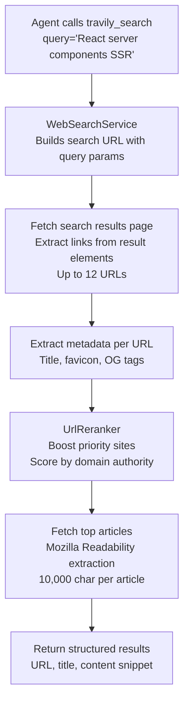

CodeBuddy can search the web and read full articles through the `travily_search` agent tool. Results are ranked by relevance, with priority given to authoritative developer documentation sites.

## Setup

Add your Tavily API key:

```json
{
  "tavily.apiKey": "tvly-..."
}
```

Get a key at [tavily.com](https://tavily.com). The free tier includes 1,000 searches/month.

## How search works



## Priority sites

URLs from these domains are boosted in ranking:

- **Official docs** — MDN, React, Node.js, Python, TypeScript, Rust, Go, Kubernetes, Docker
- **Q&A** — Stack Overflow, GitHub Discussions
- **Blogs** — Dev.to, Medium engineering blogs, Hacker News
- **References** — Wikipedia, RFC Editor

The `UrlReranker` assigns higher scores to results from priority domains, ensuring authoritative sources appear first.

## Article extraction

When the agent needs the full content of a page (not just a search snippet), the service uses [Mozilla Readability](https://github.com/mozilla/readability) to extract the article text:

- Fetches the raw HTML (5-second timeout)
- Parses with JSDOM + Readability
- Strips navigation, ads, and boilerplate
- Returns the first 10,000 characters of clean text

This is used automatically when the agent follows a link from search results.

## Metadata extraction

For each search result, the service extracts:

| Field       | Source                                                      |
| ----------- | ----------------------------------------------------------- |
| **URL**     | Link href from search results                               |
| **Title**   | `<title>` → `og:title` → `twitter:title` fallback chain     |
| **Favicon** | `<link rel="icon">` → Google favicon service fallback       |
| **Content** | Readability-extracted text (when full article is requested) |

## Settings

| Setting         | Type   | Default | Description                        |
| --------------- | ------ | ------- | ---------------------------------- |
| `tavily.apiKey` | string | —       | Tavily API key for web search tool |
